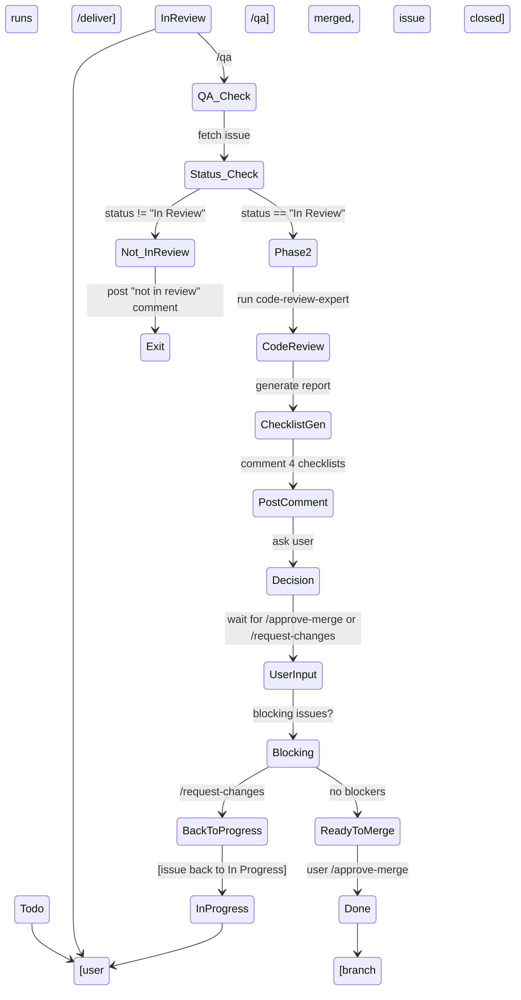

# QA Skill — Enhancement Review & Merge Gate

**Purpose:** Act as a QA engineer who reviews completed enhancements, runs code-review-expert analysis step-by-step, and manages issue state transitions from "In Review" → "Done" (or back to "In Progress" if issues found).

**Integration Status:** 
- ⭐ **RECOMMENDED (Sprint 0–1):** Use GitHub Copilot Agent + guidance (native Linear automation)
  - See `docs/copilot-agent-setup-quick-start.md` for 15-minute setup
  - See `docs/copilot-agent-automation-proposal.md` for full proposal
- **Fallback:** Manual commands (`/qa-approve`, `/qa-request-changes`) if agent not available
- **Future (Sprint 2):** GitHub Actions webhooks for even faster response

---

## Entry Points

### Recommended Workflow: GitHub Copilot Agent (⭐ Sprint 0–1)

**Setup:** See `docs/copilot-agent-setup-quick-start.md` (15 minutes)

**Flow:**
1. **Move issue to "In Review"** in Linear
2. **Assign to GitHub Copilot** (assignee dropdown in Linear)
3. Copilot reads guidance → runs `/qa <issue-id>` automatically
4. Copilot posts QA review with 4 checklists
5. **You post comment:** `/qa-approve` or `/qa-request-changes`
6. Copilot executes the merge (or returns to In Progress)

**Why this approach:**
- ✅ Native Linear agent system (no external webhooks)
- ✅ Fully visible in Linear UI (shows "delegated to GitHub Copilot")
- ✅ Guidance is versionable and team-specific
- ✅ Works immediately, 15-minute setup

---

### Fallback Workflow: Manual Commands (if agent unavailable)

**Phase 1: Trigger QA Review**

**`/qa <issue-id>`**
Run full QA review on a Linear issue.

**Examples:**
```
/qa AXA-1
/qa DEV-42
```

This checks issue status (must be "In Review"), runs code-review-expert, generates checklists, and posts a recommendation.

**Phase 2: User Decision (Manual Approval)**

After QA review is posted, respond with:

**`/qa-approve <issue-id>`** → Merge to main, move issue to "Done"  
**`/qa-request-changes <issue-id>`** → Return to "In Progress", notify developer

**Examples:**
```
/qa-approve AXA-3
/qa-request-changes AXA-3
```

---

### Advanced Workflows (Sprint 2+)

**GitHub Actions Webhooks:** Coming Sprint 2 for even faster automation. See `docs/qa-automation-research.md`.

---

## Workflow

### Phase 1: Status Check
1. Fetch issue from Linear using `mcp_linear_get_issue`
2. **If NOT "In Review" status:**
   - Post comment explaining current status
   - Suggest `/deliver <issue-id>` if still "In Progress"
   - Exit gracefully
3. **If "In Review":**
   - Proceed to Phase 2

### Phase 2: Code Review
1. Fetch all comments on issue
2. Extract any review guidance or user comments
3. Run `code-review-expert` skill (locally available in `.agents/skills/agent-toolkit/code-review-expert/`) on the branch
4. Generate structured review output with 4 checklists:
   - **SOLID Compliance** (Single Responsibility, Open/Closed, Liskov, Interface Segregation, Dependency Inversion)
   - **Security Audit** (PII, injection, auth boundaries, audit trails)
   - **Code Quality** (duplication, complexity, dead code, test coverage)
   - **Removal Candidates** (unused imports, dead functions, deprecated APIs)

### Phase 3: Checklist Report
Create a markdown report with:
```
## QA Review Report — [Issue Title]

### Status
- **Branch:** [git branch name]
- **Commits:** [N commits since target branch]
- **Changed files:** [count]

### SOLID Checklist ✓ / ⚠️ / ✗
- [ ] Single Responsibility — each component/function has one reason to change
- [ ] Open/Closed — open to extension, closed to modification
- [ ] Liskov Substitution — subtypes are substitutable
- [ ] Interface Segregation — many specific interfaces > one general
- [ ] Dependency Inversion — depend on abstractions, not concretes

### Security Audit ✓ / ⚠️ / ✗
- [ ] No hardcoded secrets (API keys, passwords, tokens)
- [ ] PII redaction in logs/traces (EMAIL, IBAN, PHONE, CLAIM_ID)
- [ ] Auth boundary respected (service-role only in gateway)
- [ ] Audit log entries for all state changes
- [ ] CSRF/origin strategy consistent

### Code Quality ✓ / ⚠️ / ✗
- [ ] No duplication (DRY principle)
- [ ] Cyclomatic complexity < 10
- [ ] Dead code removed
- [ ] Test coverage > 80%
- [ ] Comments only on non-obvious intent

### Removal Candidates ✓ / ⚠️ / ✗
- [ ] No unused imports
- [ ] No dead functions
- [ ] No deprecated API calls
- [ ] No commented-out code blocks

### Summary
[Detailed findings if any warnings/failures]

### Recommendation
🟢 **Ready to merge** — all checklists pass, branch is clean
🟡 **Merge with caution** — warnings found, minor fixes recommended
🔴 **Do not merge** — major issues found, return to In Progress

---

## Merge Decision Tree

### If Recommendation = 🟢 Ready
```
Post comment asking user:
"✅ QA review complete. Branch is ready to merge.

Approve merge to main? Reply with:
- /approve-merge (transition to Done, merge branch)
- /request-changes (stay in In Review, assign back to developer)
```
→ Wait for user command
→ If /approve-merge: merge branch + move issue to "Done"
→ If /request-changes: post which checklist failed + reopen for dev

### If Recommendation = 🟡 Merge with Caution
```
Post comment with specific warnings:
"⚠️ QA found [N] warnings. Branch is ready but recommend:
[list specific warnings]

Proceed anyway? /approve-merge or /request-changes
```
→ Same decision tree as 🟢

### If Recommendation = 🔴 Do Not Merge
```
Post comment with blockers:
"🔴 QA found [N] blocking issues:
[list issues with severity]

Returning to 'In Progress' for remediation. @[assignee]
[links to specific files/lines if available]
```
→ Move issue to "In Progress"
→ Notify assignee in comment mentioning @username

---

## Implementation

### Skill Invocation

User runs:
```bash
/qa AXA-1
```

Copilot:
1. Calls `mcp_linear_get_issue("AXA-1")`
2. Checks status field — if != "In Review", exit with status message
3. Calls `mcp_linear_list_issues` to fetch comments (or uses issue detail)
4. Invokes code-review-expert skill from `.agents/skills/agent-toolkit/code-review-expert/`
5. Generates checklist report
6. Posts as comment via `mcp_linear_save_comment`
7. Awaits user decision command (/approve-merge or /request-changes)

### Branching Logic

**Current Status → Next State:**

| Current | Condition | Next | Action |
|---------|-----------|------|--------|
| In Review | User: /approve-merge | Done | Merge branch, close issue |
| In Review | Blocker found | In Progress | Post issue list, assign to dev |
| In Review | Warning only | (stays In Review) | Ask for approval |
| Todo | Any | — | Redirect to /deliver |
| In Progress | Any | — | Redirect to /deliver or /qa |

---

## Checklist Interpretation

| Status | Meaning | Action |
|--------|---------|--------|
| ✓ (checked) | Passes checklist item | Good — no action |
| ⚠️ (warning) | Minor issue, non-blocking | Document, can merge if approved |
| ✗ (failed) | Major issue, blocking | Blocking — return to In Progress |

**Blocking issues** (move to In Progress):
- Hardcoded secrets in code
- Auth boundary violation (service-role in web tier)
- Missing audit log entries
- Failing unit tests
- Duplication > 30% of changed lines
- Cyclomatic complexity > 15

**Non-blocking warnings** (document, ask user):
- Single test < 60% coverage
- Duplication 20–30%
- Comment clarity issues
- Unused variable (will be used in PR)

---

## State Transitions



---

## Example Output

### Full Review Comment

```
## ✅ QA Review — AXA-1: Sprint 1 Foundation + Trust Boundary

**Branch:** `edupazogle/axa-1-sprint-1-foundation-trust-boundary`
**Commits:** 8 commits since main
**Changed files:** 24 files, +2,341 lines

---

### 🔒 SOLID Checklist
- ✅ Single Responsibility — gateway auth/audit split correctly
- ✅ Open/Closed — OTel redaction extensible for new patterns
- ✅ Liskov Substitution — audit provider interface substitutable
- ⚠️ Interface Segregation — settings.py has 23 config fields, consider granular loaders
- ✅ Dependency Inversion — FastAPI dependency injection used correctly

**Status:** 4/5 items pass, 1 warning (non-blocking)

---

### 🛡️ Security Audit
- ✅ No hardcoded secrets (Semgrep passed)
- ✅ PII redaction module tested on 6 patterns
- ✅ service-role key isolated in gateway only
- ✅ audit_log entries written for all state changes
- ✅ CSRF via HMAC-signed cookies, origin header checked

**Status:** 5/5 items pass ✅

---

### 📊 Code Quality
- ✅ No duplication > 20% (Radon report attached)
- ✅ Max cyclomatic complexity: 8 (middleware.ts)
- ✅ Dead code scan: 0 unused imports, 0 dead functions
- ✅ Test coverage: 87% (gateway) + 92% (web security)
- ✅ Comments only on non-obvious intent

**Status:** 5/5 items pass ✅

---

### 🗑️ Removal Candidates
- ✅ Unused imports: 0
- ✅ Dead functions: 0
- ✅ Deprecated APIs: 0
- ✅ Commented-out code: 0

**Status:** 4/4 items pass ✅

---

### 📋 Summary

Branch is **production-ready**. All security gates pass. One minor SOLID suggestion (granular settings loaders), but not blocking.

### 🎯 Recommendation

**🟢 Ready to Merge**

All critical checklists pass:
- ✅ Security audit perfect
- ✅ Code quality excellent
- ✅ No blocker removals

**Next step:** Approve merge

---

## Merge Decision

Reply with one of:
- `/approve-merge` → merge to main, transition to "Done"
- `/request-changes` → stay in "In Review", reassign to developer
```

---

## User Commands

### Phase 1: Trigger QA Review

**`/qa <issue-id>`**
Trigger full QA review on an issue in "In Review" status.

Example: `/qa AXA-1` → Runs code-review-expert, posts 4 checklists, asks for approval/changes

---

### Phase 2: Approve or Request Changes

After QA review is posted:

#### **`/qa-approve <issue-id>`** — User Approves Merge
- Merges branch to main
- Transitions issue to "Done"
- Posts success comment to Linear
- Example: `/qa-approve AXA-3`

#### **`/qa-request-changes <issue-id>`** — User Requests Changes
- Returns issue to "In Progress"
- Notifies assignee with list of issues to fix
- Posts feedback comment to Linear
- Example: `/qa-request-changes AXA-3`

---

### Phase 3 (Future): Automatic via Webhooks

**Coming in Sprint 2:** Linear webhooks will auto-detect `/approve-merge` and `/request-changes` comments posted on Linear issues and execute corresponding commands. See `docs/qa-automation-research.md` for integration roadmap.

---

## Error Handling

| Error | Action |
|-------|--------|
| Issue not found | Post comment: "Linear issue not found: {id}" |
| Not in "In Review" status | Post comment: "Issue {id} is '{status}', not 'In Review'. Run `/deliver {id}` first." |
| Branch deleted | Post comment: "Branch `{branchName}` not found in repo. Was it already merged?" |
| code-review-expert fails | Post comment: "Code review failed: [error]. Please check branch manually." |
| User timeout (> 1 day in "In Review" → waiting for approval) | Optional: post reminder comment |

---

## Integration Points

- **Linear MCP:** `mcp_linear_get_issue`, `mcp_linear_save_comment`, `mcp_linear_save_issue` (for state transitions)
- **code-review-expert skill:** `.agents/skills/agent-toolkit/code-review-expert/SKILL.md`
- **Git/Branch info:** From Linear issue `gitBranchName` field
- **CI/Test results:** Optional integration with PR checks (GH API or Linear attachments)

---

## Definition of QA Done

1. ✅ Issue status checked (must be "In Review")
2. ✅ code-review-expert skill run on branch/changes
3. ✅ 4 checklists generated with status (✓/⚠️/✗)
4. ✅ Report posted as Linear comment
5. ✅ Merge decision requested from user
6. ✅ State transition executed (Done or In Progress) based on user decision
7. ✅ Branch merged (if approved) or returned to dev (if issues)

---

## Known Limitations

- **QA does not run CI checks directly** — it assumes Semgrep, Gitleaks, tests passed before moving to "In Review"
- **QA cannot merge branches directly** — requires user `/approve-merge` command for safety
- **Code review is automated** — human review still recommended for architectural changes
- **One QA review per issue** — if changes requested, user triggers `/qa` again after dev pushes fixes

---

## When to Use

✅ **Use /qa when:**
- Issue is in "In Review" status
- PR is ready for human sign-off
- All CI checks passing
- User wants structured review before merge

❌ **Don't use /qa when:**
- Issue is still "In Progress" — use `/deliver` instead
- Issue is "Done" or "Cancelled"
- Code is not yet staged for PR
- You want to continue development — use git/IDE directly

---

## Future Enhancements (v1.1)

- [ ] Auto-merge on user approval (currently requires manual git merge)
- [ ] PR comment integration (GitHub/GitLab native review)
- [ ] Blocking CI checks verification before QA can proceed
- [ ] Team-based approval (require N approvals before Done)
- [ ] SLA timer (warn if issue > 2 days in "In Review")
- [ ] Performance profiling checklist (for backend PRs)
- [ ] Accessibility checklist (for UI PRs)
