# GDAI Agentic Cockpit — Target Architecture

> **Status:** Target architecture as of 2026-05-04. Reflects `docs/refactor_main_v3.md` v3.
> **Current sprint:** Sprint 1 — Foundation + Trust Boundary (active)
> **Next sprint:** Sprint 2 — Runtime Estate Landing (planned)
> **Authority:** For delivery sequencing, sprint acceptance criteria, and security gate definitions refer to the PRD. This document covers structure and data flow only.
> **Data model:** `db/migrations/0001–0008` applied. Next migrations: `0009–0014` per §11 of the PRD.

---

## Contents

1. [System Context (C4 L1)](#1-system-context)
2. [Container Diagram (C4 L2)](#2-container-diagram)
3. [Gateway Component Diagram (C4 L3)](#3-gateway-components)
4. [Railway Deployment Topology](#4-railway-deployment-topology)
5. [Scenario Run State Machine](#5-scenario-run-state-machine)
6. [Property Fast Track — Happy Path Flow](#6-property-fast-track-happy-path)
7. [HITL Decision Flow](#7-hitl-decision-flow)
8. [Observability Pipeline](#8-observability-pipeline)
9. [Canary Rollout Ladder](#9-canary-rollout-ladder)
10. [Database Schema (Core Tables)](#10-database-schema)
11. [Security Trust Model](#11-security-trust-model)
12. [Sprint Delivery Timeline](#12-sprint-delivery-timeline)
13. [Runtime Durability & Step Idempotency](#13-runtime-durability--step-idempotency)
14. [Eval CI Pipeline](#14-eval-ci-pipeline)
15. [Demo Replayer & LLM Narration](#15-demo-replayer--llm-narration)
16. [Scenario Builder Architecture (S8)](#16-scenario-builder-architecture-s8)
17. [Local Development Quickstart](#17-local-development-quickstart)

For per-sprint deliverables, testing plans, and review-decision scripts see [`docs/sprints/`](sprints/).

---

## 1. System Context

The cockpit is the internal control plane for AI-agent insurance pilots. It serves three personas: claims operators running HITL queues, ops engineers monitoring runtime health, and executive sponsors reviewing narrated demos. All traffic enters through a single public Next.js service.

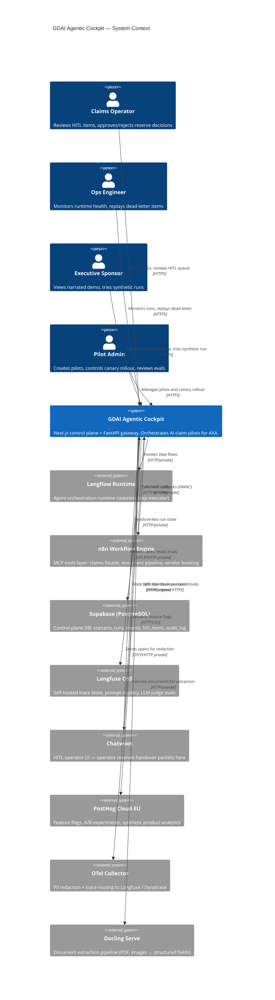

---

## 2. Container Diagram

The cockpit consists of two app services plus a private service mesh. The gateway is the trust boundary — the browser never receives internal credentials or Railway private URLs.

```mermaid
C4Container
  title GDAI Agentic Cockpit — Container Diagram (17-service MVP topology)

  Person(operator, "Claims Operator / Ops / Admin")

  Container_Boundary(public_apps, "Public Services (3)") {
    Container(web, "agentic-web", "Next.js 16, React 19", "Cockpit UI + /api/gateway/* proxy. Only public-facing app service.")
    Container(cw_web, "chatwoot-web", "Chatwoot 4.x, Rails", "HITL operator queue. Operators receive handover packets here.")
    Container(lf_web, "langfuse-web", "Langfuse OSS, Next.js", "Trace explorer, prompt registry, eval dashboard.")
  }

  Container_Boundary(private_apps, "Private App Services (8)") {
    Container(gateway, "agent-gateway", "FastAPI, Python 3.12", "Trust boundary. Auth, run FSM, orchestrator dispatch, HITL bridge, audit writer, eval runner.")
    Container(langflow, "langflow-runtime", "Langflow 1.9", "Stateless step executor. Each flow = one short reasoning step.")
    Container(n8n, "n8n", "n8n", "MCP tools layer. Hosts claims_facade, wfmcp01–04, wf006 (Docling), wferr01.")
    Container(docling, "docling-serve", "Python, Docling", "PDF/image → structured claim field extraction.")
    Container(otel_col, "otel-collector", "OTel Collector Contrib", "PII redaction processor + dual exporter (Langfuse + Dynatrace phase 6).")
    Container(cw_worker, "chatwoot-worker", "Sidekiq", "Chatwoot background job processor.")
    Container(lf_worker, "langfuse-worker", "Langfuse worker", "Async trace ingestion, eval scoring, dataset writes.")
  }

  Container_Boundary(dbs, "Database Services (6)") {
    ContainerDb(pg_main, "pg-main", "PostgreSQL 16", "Supabase-linked control plane DB. scenario_runs, events, hitl_items, audit_log, pilots, tenants.")
    ContainerDb(pg_lf, "pg-langfuse", "PostgreSQL 16", "Langfuse traces, datasets, scores, prompts.")
    ContainerDb(pg_lf2, "pg-langflow", "PostgreSQL 16", "Langflow session state and flow definitions.")
    ContainerDb(pg_n8n, "pg-n8n", "PostgreSQL 16", "n8n workflow metadata and execution logs.")
    ContainerDb(pg_cw, "pg-chatwoot", "PostgreSQL 16", "Chatwoot conversations and messages.")
    ContainerDb(ch, "clickhouse-langfuse", "ClickHouse", "High-cardinality event analytics for Langfuse.")
  }

  Container_Boundary(caches, "Cache Services (2)") {
    ContainerDb(redis_lf, "redis-langfuse", "Redis", "Langfuse worker queue and cache.")
    ContainerDb(redis_cw, "redis-chatwoot", "Redis", "Chatwoot action cable and job queue.")
  }

  Rel(operator, web, "Uses browser", "HTTPS")
  Rel(web, gateway, "Proxies /api/gateway/*", "HTTP private, bearer token")

  Rel(gateway, langflow, "POST /api/v1/run/{flow_id}", "HTTP private, API key")
  Rel(gateway, n8n, "MCP tool calls via HTTP MCP server", "HTTP private, bearer")
  Rel(gateway, pg_main, "Run state R/W", "SQL/TLS private")
  Rel(gateway, otel_col, "OTLP spans", "HTTP private :4318")
  Rel(gateway, cw_web, "POST handover packet", "HTTP private, API token")
  Rel(gateway, lf_web, "Trace deep-link + eval read", "HTTP private")

  Rel(langflow, pg_lf2, "Session state", "SQL private")
  Rel(n8n, pg_n8n, "Workflow state", "SQL private")

  Rel(otel_col, lf_web, "Redacted spans via OTLP", "HTTP private")
  Rel(lf_web, pg_lf, "Trace R/W", "SQL private")
  Rel(lf_web, ch, "Analytics events", "HTTP private")
  Rel(lf_worker, redis_lf, "Job queue", "Redis private")

  Rel(cw_web, pg_cw, "Conversation state", "SQL private")
  Rel(cw_web, redis_cw, "Action cable", "Redis private")
  Rel(cw_worker, pg_cw, "Background jobs", "SQL private")

  Rel(cw_web, gateway, "Webhook: operator decision", "HMAC-signed HTTP private")

  UpdateLayoutConfig($c4ShapeInRow="3", $c4BoundaryInRow="1")
```

---

## 3. Gateway Components

The `agent-gateway` is the single trust boundary. Nothing in `agentic-web` calls Supabase service-role, Langflow, n8n, or Chatwoot directly.

```mermaid
C4Component
  title agent-gateway — Internal Component Diagram

  Container(web, "agentic-web", "Next.js", "Cockpit UI — proxies all writes to gateway")
  Container(langflow, "langflow-runtime", "Langflow 1.9", "Stateless step executor")
  Container(n8n, "n8n", "n8n", "MCP tools layer")
  ContainerDb(pg, "pg-main", "PostgreSQL", "Control-plane DB")
  Container(otel, "otel-collector", "OTel", "PII redaction + export")
  Container(chatwoot, "chatwoot-web", "Chatwoot", "HITL operator UI")
  Container(posthog, "PostHog EU", "PostHog", "Feature flags")

  Container_Boundary(gw, "agent-gateway") {
    Component(auth, "auth.py", "FastAPI / JWT", "Cookie signing, login rate-limit, session verify, CSRF")
    Component(tenant, "tenant.py", "Pydantic", "Tenant context — injects gdai-default at MVP")
    Component(runs, "runs.py", "FastAPI", "Run create/cancel/resume FSM. Append-only events. Idempotency keys.")
    Component(lf_client, "langflow_client.py", "httpx async", "Invoke step flows. Timeout/retry/circuit breaker. Reads _signal from output.")
    Component(n8n_proxy, "n8n.py", "httpx async", "MCP proxy. Schema-validates every tool response. Idempotency key forwarding.")
    Component(hitl, "hitl.py", "FastAPI", "Opens/closes hitl_items rows. Builds Chatwoot handover packet. Resume = next-step invocation.")
    Component(audit, "audit.py", "SQLAlchemy", "Append-only audit_log writer. Hash-chain with SELECT FOR UPDATE.")
    Component(events, "events.py", "asyncio.Queue", "SSE push per run_id. 5s poll fallback. Heartbeat + backoff reconnect.")
    Component(flags, "posthog_flags.py", "posthog-python", "Server-side flag eval sticky per chatwoot_conversation_id.")
    Component(eval_runner, "eval_runner.py", "Langfuse SDK", "Runs golden-dataset eval against 3 judge rubrics. CI-triggered.")
    Component(redact, "redact.py", "re / presidio", "Source-level PII minimization before Langfuse / Chatwoot / audit export.")
    Component(settings, "settings.py", "pydantic-settings", "All config from env. No hard-coded URLs or keys.")
    Component(health, "health.py", "FastAPI", "GET /healthz — checks Supabase, Langflow, n8n, Langfuse, OTel, Chatwoot.")
  }

  Rel(web, auth, "All requests — cookie verify")
  Rel(auth, tenant, "Injects tenant context")
  Rel(runs, lf_client, "Invoke step flow")
  Rel(runs, n8n_proxy, "Tool calls with idempotency key")
  Rel(runs, hitl, "HITL signal detected")
  Rel(runs, audit, "Every state transition")
  Rel(runs, events, "Publish run events")
  Rel(runs, flags, "Select orchestrator variant")
  Rel(runs, redact, "Scrub before trace/audit write")
  Rel(lf_client, langflow, "POST /api/v1/run/{flow_id}")
  Rel(n8n_proxy, n8n, "HTTP MCP tool call")
  Rel(hitl, chatwoot, "POST handover packet")
  Rel(eval_runner, pg, "Read golden dataset")
  Rel(auth, pg, "Session / nonce store")
  Rel(audit, pg, "Append audit_log row")

  UpdateLayoutConfig($c4ShapeInRow="4", $c4BoundaryInRow="1")
```

---

## 4. Railway Deployment Topology

17 services on a WireGuard-encrypted private mesh. Only 3 expose public domains.

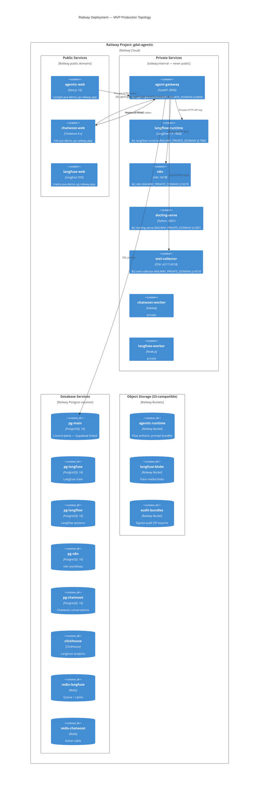

---

## 5. Scenario Run State Machine

The gateway owns all state transitions. Langflow never advances the FSM directly.

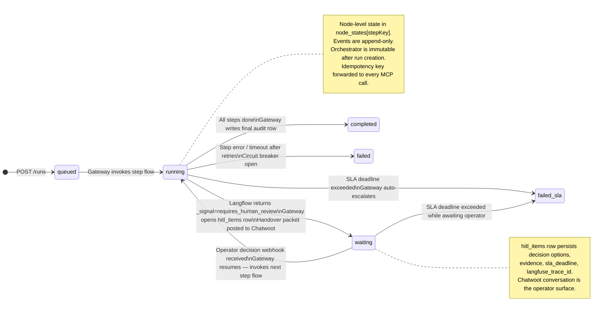

---

## 6. Property Fast Track — Happy Path

End-to-end flow for a property damage claim through the Langflow-orchestrated path.

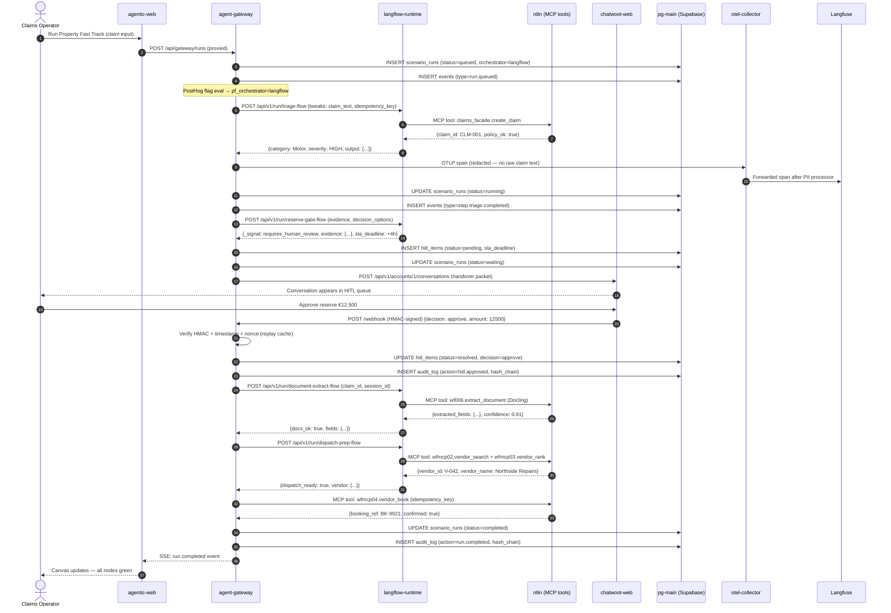

---

## 7. HITL Decision Flow

Detailed view of the pause/resume cycle with full durability guarantees.

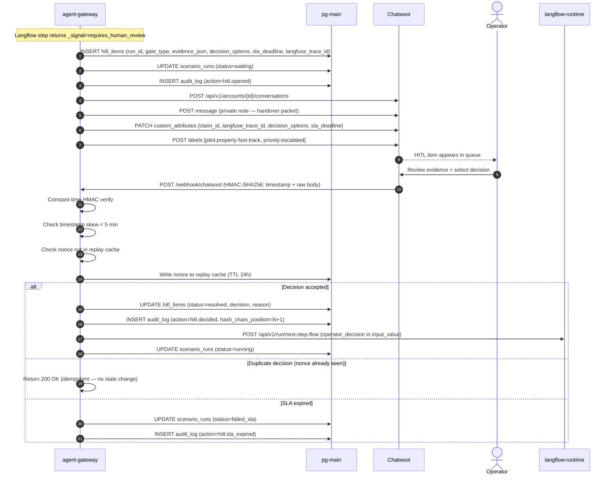

---

## 8. Observability Pipeline

All telemetry flows through the OTel collector for PII redaction before reaching Langfuse.

```mermaid
flowchart LR
  subgraph Services
    GW[agent-gateway\n@observe decorators]
    LF[langflow-runtime\nAuto-instrumented]
    N8N[n8n\nOTel community node]
  end

  subgraph OTel_Collector["otel-collector (PII redaction layer)"]
    direction TB
    RCV[OTLP receiver\n:4317 gRPC / :4318 HTTP]
    MEM[memory_limiter]
    ATTR[attributes/redact\nRemoves: email, phone, IBAN\nFrench plates, Spanish DNI/NIE]
    XFORM[transform/scrub\nOttl: replaces gen_ai.prompt\ngen_ai.completion with REDACTED]
    BATCH[batch processor]
  end

  subgraph Destinations
    LFUSE[Langfuse OSS\nSelf-hosted\n:3000]
    DT[Dynatrace\nPhase 6 only]
  end

  GW -->|OTLP/HTTP| RCV
  LF -->|OTLP/HTTP| RCV
  N8N -->|OTLP/HTTP| RCV

  RCV --> MEM --> ATTR --> XFORM --> BATCH

  BATCH -->|Basic auth\nbase64 pub:secret| LFUSE
  BATCH -.->|Phase 6\nApi-Token| DT

  LFUSE --> LF_WORKER[langfuse-worker\nAsync ingestion]
  LF_WORKER --> PG_LF[(pg-langfuse)]
  LF_WORKER --> CH[(clickhouse\nAnalytics)]

  style ATTR fill:#ffeecc
  style XFORM fill:#ffeecc
  style DT stroke-dasharray: 5 5
```

**Langfuse trace propagation to cockpit:**

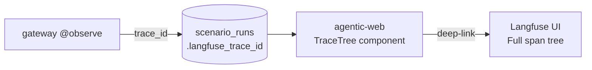

---

## 9. Canary Rollout Ladder

The `pf_orchestrator` PostHog flag controls which orchestrator handles each run. Stickiness is per `chatwoot_conversation_id`.

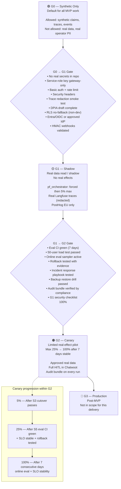

---

## 10. Database Schema

Core tables in `pg-main` (Supabase project `tsevmqftwnyzrxlpnred`). Migrations `0001–0008` applied; `0009–0014` planned.


---

## 11. Security Trust Model

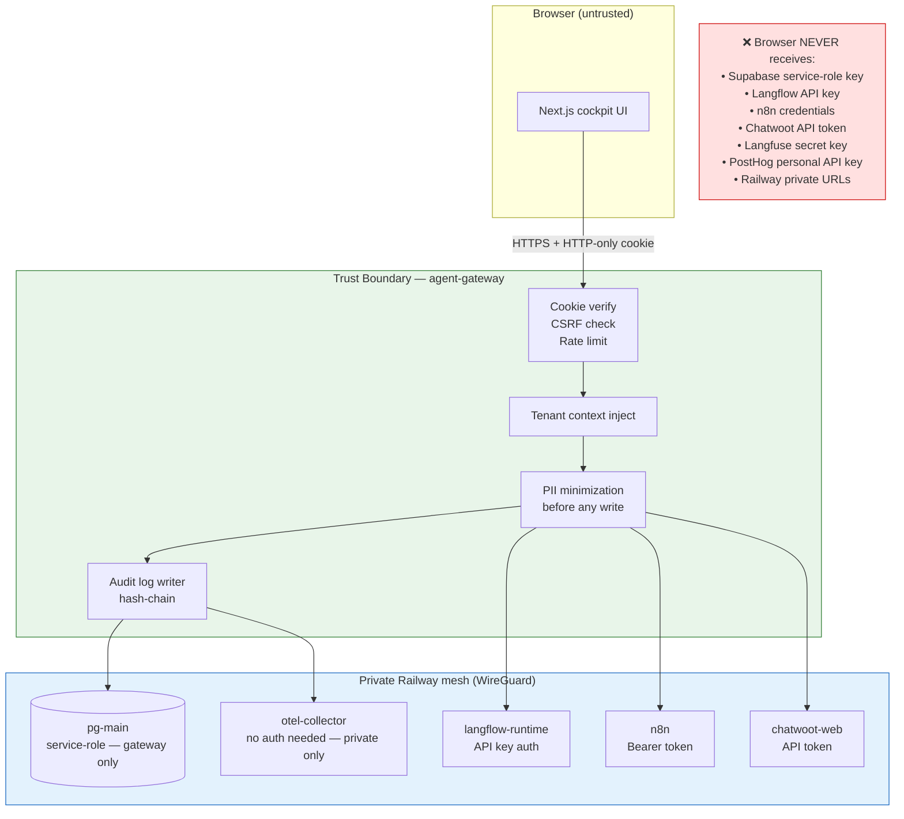

**Key security invariants:**

| Control | Where | Gate |
|---|---|---|
| No service-role key in web runtime | `settings.py` / env | G0 |
| CSRF protection on cookie-backed writes | `middleware.ts` + `auth.py` | G0 |
| Login rate limit (5 attempts) | `auth.py` | G0 |
| HMAC webhook verify + timestamp + nonce | `hitl.py` | G0/G1 |
| Source-level PII minimization | `redact.py` | G1 |
| OTel redaction as last-line defense | `otel-config.yaml` | G0+ |
| RLS no-fallback outside dev | Supabase migration | G1 |
| Audit chain hash-verification function | Migration `0009` | G0 |
| Entra/OIDC + MFA | `auth.py` | G1 |

---

## 12. Sprint Delivery Timeline

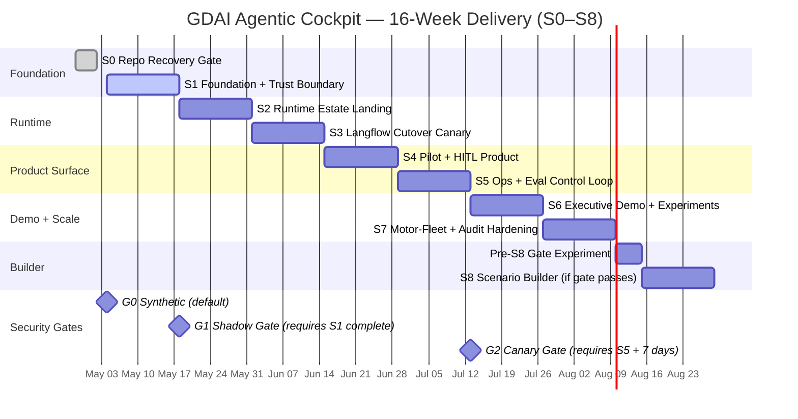

---

## 13. Runtime Durability & Step Idempotency

The gateway owns durability — Langflow runs single short stateless steps. This diagram shows what happens when Langflow dies mid-step.

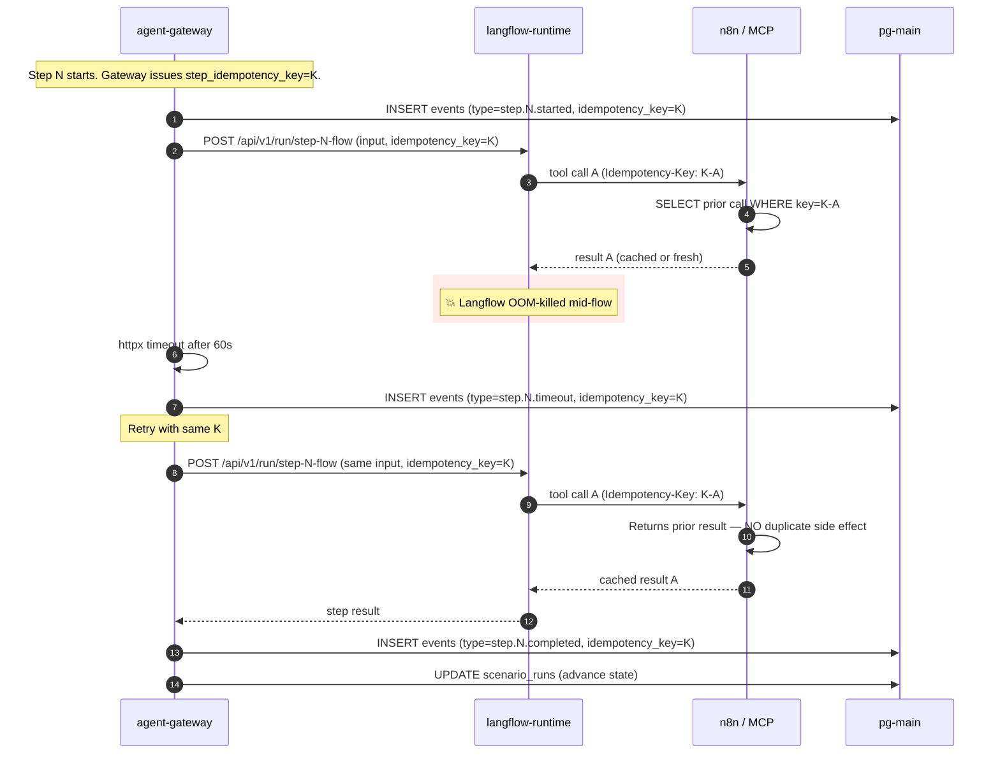

**Invariants enforced:**

- Every MCP tool call carries `Idempotency-Key: {run_id}-{step}-{tool}-{attempt_root}`.
- n8n stores key→result for 24h; duplicate keys return cached result.
- Gateway's `events` table is append-only — restart safely re-emits the timeout/completed events without rewriting history.
- LLM calls are not retried automatically; gateway records cost on first attempt and skips on retry (LLM-side caching not assumed).

---

## 14. Eval CI Pipeline

Golden-dataset evals run on every PR touching a flow or prompt. Three LLM-judge rubrics gate the merge.

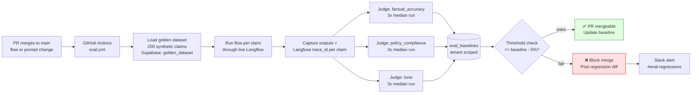

**Rubric definitions:** see `gateway/scripts/eval_runner.py` and Langfuse dataset `gdai-default/golden-property-fast-track`.

---

## 15. Demo Replayer & LLM Narration

Demo scenarios replay an existing scenario_run with cached LLM-generated narration per span.

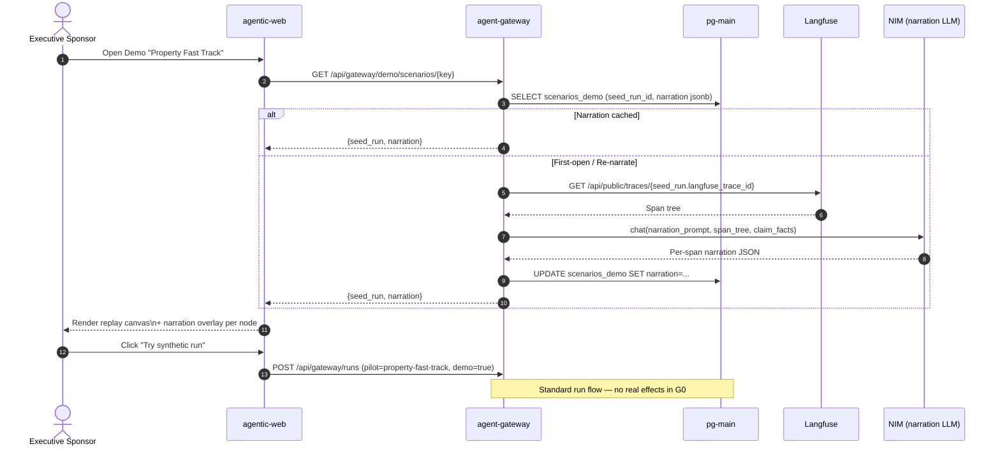

---

## 16. Scenario Builder Architecture (S8)

The Builder is a guided FSM that turns an operator's brief into a synthetic pilot. It is gated behind a pre-S8 quality experiment (E-10).

```mermaid
flowchart TB
  subgraph User["Pilot operator (browser)"]
    UI[Builder UI\nNext.js]
  end

  subgraph Gateway["agent-gateway/builder/"]
    direction TB
    API[api.py\nPOST /builder/sessions]
    FSM[session.py\nFSM: brief→plan→bundle→preview→deploy]
    NIM[nim.py\nNIM chat helper]
    PROMPTS[prompts.py\nMessage builders]
    SKILLS[skills_pack.py\nLoader: .agents/skills/* digest]
    CHECK[richness-checklist.py\n5 must-have signals]
  end

  subgraph Tools["builder/tools/"]
    WEB[web_search_insurance.py\nTavily-backed]
    LINT[bundle_lint.py\nFlow JSON validator]
    PREVIEW[preview_run.py\nDry-run against Langflow]
  end

  subgraph Outputs["Generated artifacts"]
    FLOW[flows/{pilot}.json]
    PROMPT[prompts/{pilot}/*.txt]
    SEEDS[demo seed claims]
  end

  UI --> API --> FSM
  FSM --> NIM
  NIM --> PROMPTS
  PROMPTS --> SKILLS
  FSM --> CHECK

  FSM --> WEB
  FSM --> LINT
  FSM --> PREVIEW

  PREVIEW --> FLOW
  PREVIEW --> PROMPT
  PREVIEW --> SEEDS

  FLOW -.->|G0 only| Langflow[langflow-runtime]
  PROMPT -.-> Langflow

  style Tools fill:#fff8e1
  style Outputs fill:#e8f5e9
```

**Gating:** Builder ships read-only canvas first. Deploy button enabled only at G0. Generated flows never leave G0 without manual review + risk owner approval.

---

## 17. Local Development Quickstart

For full delivery setup see `CLAUDE.md` and `.github/copilot-instructions.md`. Quick reference:

```bash
# Web cockpit (currently lives in delete/ pending S0 restoration)
source ~/.nvm/nvm.sh && nvm use 20
cd /home/mr_e/agentic/delete && PORT=3001 pnpm dev

# Python gateway
cd /home/mr_e/agentic/gateway && uv run fastapi dev --port 8000

# Langflow
langflow run --port 7860

# n8n
N8N_USER_FOLDER=~/.n8n n8n start --host 127.0.0.1 --port 5678

# Chatwoot
cd ~/chatwoot && docker compose up -d
```

Production private URLs use Railway reference variables — never hard-coded IPs:

```bash
GATEWAY_URL=http://${{ agent-gateway.RAILWAY_PRIVATE_DOMAIN }}:8000
LANGFLOW_URL=http://${{ langflow-runtime.RAILWAY_PRIVATE_DOMAIN }}:7860
N8N_BASE_URL=http://${{ n8n.RAILWAY_PRIVATE_DOMAIN }}:5678
OTEL_EXPORTER_OTLP_ENDPOINT=http://${{ otel-collector.RAILWAY_PRIVATE_DOMAIN }}:4318
```

For per-sprint deliverables, testing plans, and review-decision scripts see `docs/sprints/sprint-N-*.md`.
