# GDAI Agentic Cockpit — Target Architecture

> **Status:** Target architecture as of 2026-05-05. Reflects `docs/refactor_main_v3.md` v3 + `docs/superpowers/specs/2026-05-04-builder-rework-design.md` (Pilot Workspace rework) + `docs/superpowers/specs/2026-05-05-cockpit-surfaces-ux-design.md` (four cockpit surfaces).
> **Current sprint:** Sprint 1 — Foundation + Trust Boundary (active)
> **Next sprint:** Sprint 2 — Runtime Estate Landing (planned)
> **Authority:** For delivery sequencing, sprint acceptance criteria, and security gate definitions refer to the PRD. This document covers structure and data flow only.
> **Data model:** `db/migrations/0001–0008` applied. Next migrations: `0009–0016` (Pilot Workspace) + `0017–0022` (Cockpit Shell) per §10 + cockpit spec §9.2.
> **Pilot Workspace authority:** §16 (rewritten), §18, §19, §20 are the canonical structural reference; the builder spec is the canonical PRD for UX + copy.
> **Cockpit Shell authority:** §21, §22, §23 are the canonical structural reference; the cockpit surfaces spec is the canonical PRD for UX + copy of the four public-facing surfaces.

---

## Contents

1. [System Context (C4 L1)](#1-system-context)
2. [Container Diagram (C4 L2)](#2-container-diagram)
3. [Gateway Component Diagram (C4 L3)](#3-gateway-components)
4. [Railway Deployment Topology](#4-railway-deployment-topology)
5. [Scenario Run State Machine](#5-scenario-run-state-machine)
6. [Property Fast Track — Happy Path Flow](#6-property-fast-track-happy-path)
7. [HITL Decision Flow](#7-hitl-decision-flow)
8. [Observability Pipeline](#8-observability-pipeline)
9. [Canary Rollout Ladder](#9-canary-rollout-ladder)
10. [Database Schema (Core Tables)](#10-database-schema)
11. [Security Trust Model](#11-security-trust-model)
12. [Sprint Delivery Timeline](#12-sprint-delivery-timeline)
13. [Runtime Durability & Step Idempotency](#13-runtime-durability--step-idempotency)
14. [Eval CI Pipeline](#14-eval-ci-pipeline)
15. [Demo Replayer & LLM Narration](#15-demo-replayer--llm-narration)
16. [Pilot Workspace L0 Builder Architecture](#16-pilot-workspace-l0-builder-architecture) *(rewritten — supersedes "Scenario Builder S8")*
17. [Local Development Quickstart](#17-local-development-quickstart)
18. [Pilot Workspace IA & Staircase](#18-pilot-workspace-ia--staircase)
19. [Chat Companion (Compagnon)](#19-chat-companion-compagnon)
20. [Adapter Staircase (mocked-at-L0 → real-from-L1)](#20-adapter-staircase)
21. [Cockpit Shell — Four Public Surfaces](#21-cockpit-shell--four-public-surfaces)
22. [Business KPI Dashboard — Three Pillars](#22-business-kpi-dashboard--three-pillars)
23. [Blueprint Library — Cross-Country Asset Sharing](#23-blueprint-library--cross-country-asset-sharing)

For per-sprint deliverables, testing plans, and review-decision scripts see [`docs/sprints/`](sprints/).

---

## 1. System Context

The cockpit is the internal control plane for AI-agent insurance pilots. It serves three personas: claims operators running HITL queues, ops engineers monitoring runtime health, and executive sponsors reviewing narrated demos. All traffic enters through a single public Next.js service.

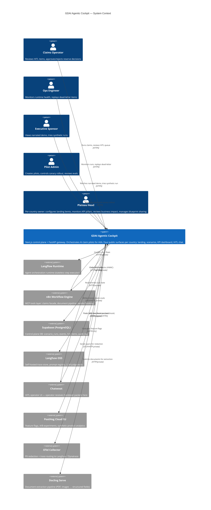

---

## 2. Container Diagram

The cockpit consists of two app services plus a private service mesh. The gateway is the trust boundary — the browser never receives internal credentials or Railway private URLs.

```mermaid
C4Container
  title GDAI Agentic Cockpit — Container Diagram (17-service MVP topology)

  Person(operator, "Claims Operator / Ops / Admin")

  Container_Boundary(public_apps, "Public Services (3)") {
    Container(web, "agentic-web", "Next.js 16, React 19", "Cockpit UI + /api/gateway/* proxy. Only public-facing app service.")
    Container(cw_web, "chatwoot-web", "Chatwoot 4.x, Rails", "HITL operator queue. Operators receive handover packets here.")
    Container(lf_web, "langfuse-web", "Langfuse OSS, Next.js", "Trace explorer, prompt registry, eval dashboard.")
  }

  Container_Boundary(private_apps, "Private App Services (8)") {
    Container(gateway, "agent-gateway", "FastAPI, Python 3.12", "Trust boundary. Auth, run FSM, orchestrator dispatch, HITL bridge, audit writer, eval runner.")
    Container(langflow, "langflow-runtime", "Langflow 1.9", "Stateless step executor. Each flow = one short reasoning step.")
    Container(n8n, "n8n", "n8n", "MCP tools layer. Hosts claims_facade, wfmcp01–04, wf006 (Docling), wferr01.")
    Container(docling, "docling-serve", "Python, Docling", "PDF/image → structured claim field extraction.")
    Container(otel_col, "otel-collector", "OTel Collector Contrib", "PII redaction processor + dual exporter (Langfuse + Dynatrace phase 6).")
    Container(cw_worker, "chatwoot-worker", "Sidekiq", "Chatwoot background job processor.")
    Container(lf_worker, "langfuse-worker", "Langfuse worker", "Async trace ingestion, eval scoring, dataset writes.")
  }

  Container_Boundary(dbs, "Database Services (6)") {
    ContainerDb(pg_main, "pg-main", "PostgreSQL 16", "Supabase-linked control plane DB. scenario_runs, events, hitl_items, audit_log, pilots, tenants.")
    ContainerDb(pg_lf, "pg-langfuse", "PostgreSQL 16", "Langfuse traces, datasets, scores, prompts.")
    ContainerDb(pg_lf2, "pg-langflow", "PostgreSQL 16", "Langflow session state and flow definitions.")
    ContainerDb(pg_n8n, "pg-n8n", "PostgreSQL 16", "n8n workflow metadata and execution logs.")
    ContainerDb(pg_cw, "pg-chatwoot", "PostgreSQL 16", "Chatwoot conversations and messages.")
    ContainerDb(ch, "clickhouse-langfuse", "ClickHouse", "High-cardinality event analytics for Langfuse.")
  }

  Container_Boundary(caches, "Cache Services (2)") {
    ContainerDb(redis_lf, "redis-langfuse", "Redis", "Langfuse worker queue and cache.")
    ContainerDb(redis_cw, "redis-chatwoot", "Redis", "Chatwoot action cable and job queue.")
  }

  Rel(operator, web, "Uses browser", "HTTPS")
  Rel(web, gateway, "Proxies /api/gateway/*", "HTTP private, bearer token")

  Rel(gateway, langflow, "POST /api/v1/run/{flow_id}", "HTTP private, API key")
  Rel(gateway, n8n, "MCP tool calls via HTTP MCP server", "HTTP private, bearer")
  Rel(gateway, pg_main, "Run state R/W", "SQL/TLS private")
  Rel(gateway, otel_col, "OTLP spans", "HTTP private :4318")
  Rel(gateway, cw_web, "POST handover packet", "HTTP private, API token")
  Rel(gateway, lf_web, "Trace deep-link + eval read", "HTTP private")

  Rel(langflow, pg_lf2, "Session state", "SQL private")
  Rel(n8n, pg_n8n, "Workflow state", "SQL private")

  Rel(otel_col, lf_web, "Redacted spans via OTLP", "HTTP private")
  Rel(lf_web, pg_lf, "Trace R/W", "SQL private")
  Rel(lf_web, ch, "Analytics events", "HTTP private")
  Rel(lf_worker, redis_lf, "Job queue", "Redis private")

  Rel(cw_web, pg_cw, "Conversation state", "SQL private")
  Rel(cw_web, redis_cw, "Action cable", "Redis private")
  Rel(cw_worker, pg_cw, "Background jobs", "SQL private")

  Rel(cw_web, gateway, "Webhook: operator decision", "HMAC-signed HTTP private")

  UpdateLayoutConfig($c4ShapeInRow="3", $c4BoundaryInRow="1")
```

---

## 3. Gateway Components

The `agent-gateway` is the single trust boundary. Nothing in `agentic-web` calls Supabase service-role, Langflow, n8n, or Chatwoot directly.

```mermaid
C4Component
  title agent-gateway — Internal Component Diagram

  Container(web, "agentic-web", "Next.js", "Cockpit UI — proxies all writes to gateway")
  Container(langflow, "langflow-runtime", "Langflow 1.9", "Stateless step executor")
  Container(n8n, "n8n", "n8n", "MCP tools layer")
  ContainerDb(pg, "pg-main", "PostgreSQL", "Control-plane DB")
  Container(otel, "otel-collector", "OTel", "PII redaction + export")
  Container(chatwoot, "chatwoot-web", "Chatwoot", "HITL operator UI")
  Container(posthog, "PostHog EU", "PostHog", "Feature flags")

  Container_Boundary(gw, "agent-gateway") {
    Component(auth, "auth.py", "FastAPI / JWT", "Cookie signing, login rate-limit, session verify, CSRF")
    Component(tenant, "tenant.py", "Pydantic", "Tenant context — injects gdai-default at MVP")
    Component(runs, "runs.py", "FastAPI", "Run create/cancel/resume FSM. Append-only events. Idempotency keys.")
    Component(lf_client, "langflow_client.py", "httpx async", "Invoke step flows. Timeout/retry/circuit breaker. Reads _signal from output.")
    Component(n8n_proxy, "n8n.py", "httpx async", "MCP proxy. Schema-validates every tool response. Idempotency key forwarding.")
    Component(hitl, "hitl.py", "FastAPI", "Opens/closes hitl_items rows. Builds Chatwoot handover packet. Resume = next-step invocation.")
    Component(audit, "audit.py", "SQLAlchemy", "Append-only audit_log writer. Hash-chain with SELECT FOR UPDATE.")
    Component(events, "events.py", "asyncio.Queue", "SSE push per run_id. 5s poll fallback. Heartbeat + backoff reconnect.")
    Component(flags, "posthog_flags.py", "posthog-python", "Server-side flag eval sticky per chatwoot_conversation_id.")
    Component(eval_runner, "eval_runner.py", "Langfuse SDK", "Runs golden-dataset eval against 3 judge rubrics. CI-triggered.")
    Component(redact, "redact.py", "re / presidio", "Source-level PII minimization before Langfuse / Chatwoot / audit export.")
    Component(settings, "settings.py", "pydantic-settings", "All config from env. No hard-coded URLs or keys.")
    Component(health, "health.py", "FastAPI", "GET /healthz — checks Supabase, Langflow, n8n, Langfuse, OTel, Chatwoot.")
  }

  Rel(web, auth, "All requests — cookie verify")
  Rel(auth, tenant, "Injects tenant context")
  Rel(runs, lf_client, "Invoke step flow")
  Rel(runs, n8n_proxy, "Tool calls with idempotency key")
  Rel(runs, hitl, "HITL signal detected")
  Rel(runs, audit, "Every state transition")
  Rel(runs, events, "Publish run events")
  Rel(runs, flags, "Select orchestrator variant")
  Rel(runs, redact, "Scrub before trace/audit write")
  Rel(lf_client, langflow, "POST /api/v1/run/{flow_id}")
  Rel(n8n_proxy, n8n, "HTTP MCP tool call")
  Rel(hitl, chatwoot, "POST handover packet")
  Rel(eval_runner, pg, "Read golden dataset")
  Rel(auth, pg, "Session / nonce store")
  Rel(audit, pg, "Append audit_log row")

  UpdateLayoutConfig($c4ShapeInRow="4", $c4BoundaryInRow="1")
```

> **Pilot Workspace addendum (S8+).** The gateway gains additional modules: `companion/` (charter, prompts, memory, compaction, tools — see §19), `pilots/` (PilotLevel FSM, promotion checklist — see §18.5), `builder/movements/` (M1–M8 logic — see §16), `runtime/l1.py … l4.py` (level orchestration), `adapters/` (staircase mock/real toggle — see §20), and `decks/` (pptx + pdf generators). Wire format adds two streaming contracts: **SSE** for chat token streams (`/api/pilots/:slug/messages`) and **WebSocket** for build-log + Langfuse span feed (`/api/pilots/:slug/stream`).

---

## 4. Railway Deployment Topology

17 services on a WireGuard-encrypted private mesh. Only 3 expose public domains.

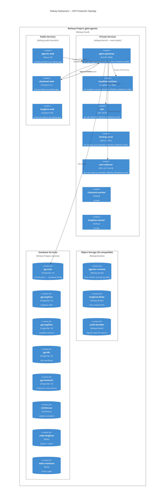

---

## 5. Scenario Run State Machine

The gateway owns all state transitions. Langflow never advances the FSM directly.

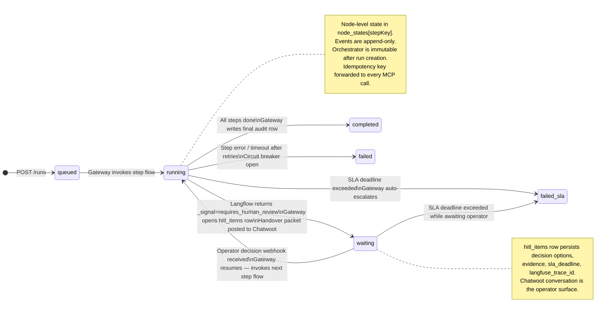

> **PilotLevel FSM (S8+).** A second FSM operates one level above `scenario_runs`: the **PilotLevel state machine** governs `L0 → L1 → L2 → L3 → L4` transitions. Each transition is gated by a checklist (see §18.5) and writes a `level_history` row. At L1+, every individual run uses the `scenario_runs` FSM above (the per-level run FSM); at L0 there are no runs — the user composes artifacts via the eight movements (§16). See §18 + §19 for the full Pilot Workspace contract.

---

## 6. Property Fast Track — Happy Path

End-to-end flow for a property damage claim through the Langflow-orchestrated path.

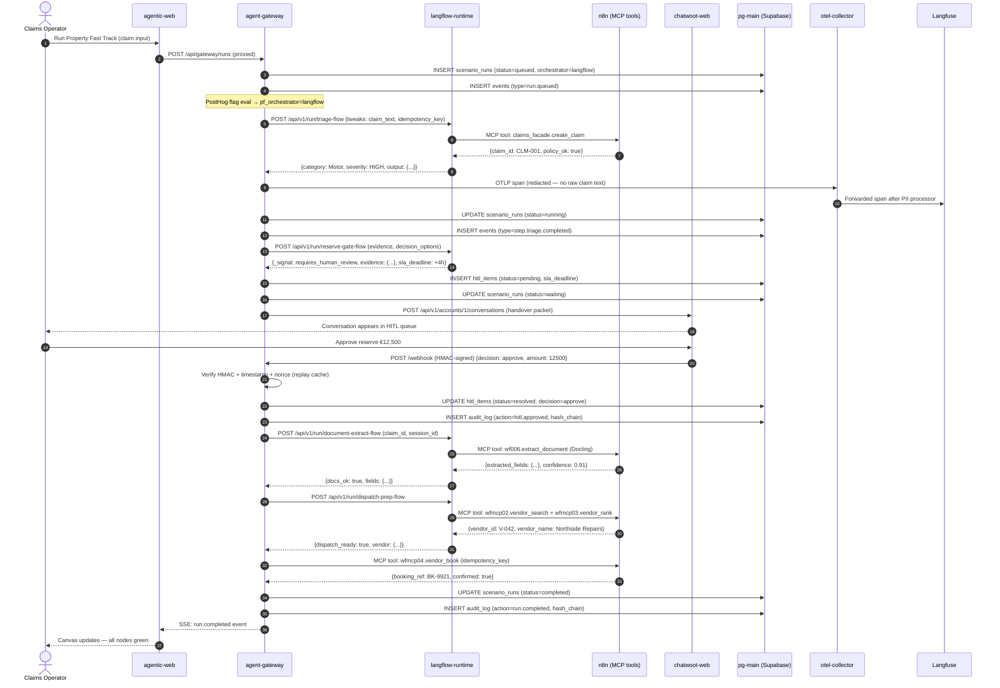

---

## 7. HITL Decision Flow

Detailed view of the pause/resume cycle with full durability guarantees.

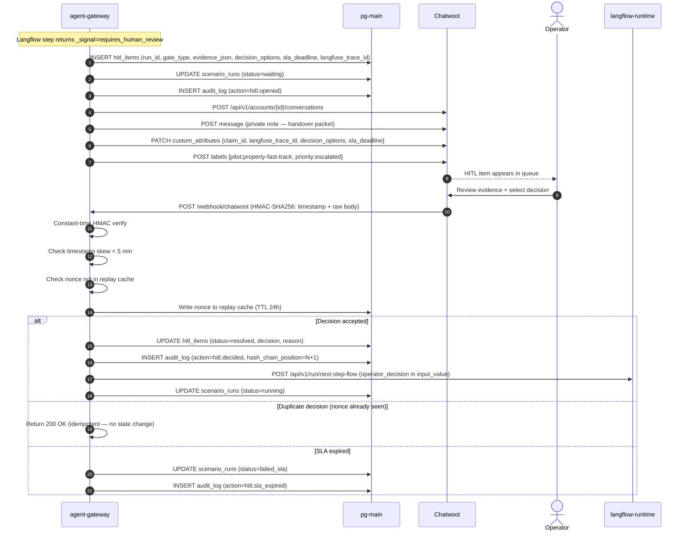

---

## 8. Observability Pipeline

All telemetry flows through the OTel collector for PII redaction before reaching Langfuse.

```mermaid
flowchart LR
  subgraph Services
    GW[agent-gateway\n@observe decorators]
    LF[langflow-runtime\nAuto-instrumented]
    N8N[n8n\nOTel community node]
  end

  subgraph OTel_Collector["otel-collector (PII redaction layer)"]
    direction TB
    RCV[OTLP receiver\n:4317 gRPC / :4318 HTTP]
    MEM[memory_limiter]
    ATTR[attributes/redact\nRemoves: email, phone, IBAN\nFrench plates, Spanish DNI/NIE]
    XFORM[transform/scrub\nOttl: replaces gen_ai.prompt\ngen_ai.completion with REDACTED]
    BATCH[batch processor]
  end

  subgraph Destinations
    LFUSE[Langfuse OSS\nSelf-hosted\n:3000]
    DT[Dynatrace\nPhase 6 only]
  end

  GW -->|OTLP/HTTP| RCV
  LF -->|OTLP/HTTP| RCV
  N8N -->|OTLP/HTTP| RCV

  RCV --> MEM --> ATTR --> XFORM --> BATCH

  BATCH -->|Basic auth\nbase64 pub:secret| LFUSE
  BATCH -.->|Phase 6\nApi-Token| DT

  LFUSE --> LF_WORKER[langfuse-worker\nAsync ingestion]
  LF_WORKER --> PG_LF[(pg-langfuse)]
  LF_WORKER --> CH[(clickhouse\nAnalytics)]

  style ATTR fill:#ffeecc
  style XFORM fill:#ffeecc
  style DT stroke-dasharray: 5 5
```

**Langfuse trace propagation to cockpit:**

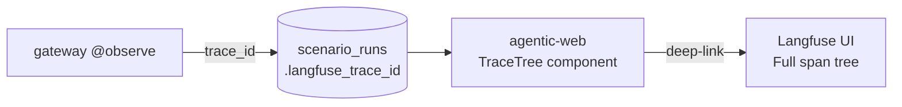

> **Per-pilot Langfuse projects (S8+).** Each pilot gets its own Langfuse project named `gdai-pilot-{slug}` (created during ship-overlay phase 1, §16.2). The companion is traced in a dedicated cross-pilot project `gdai-cockpit-companion`. Every companion turn records `{prompt_keys, prompt_versions}` for full reproducibility. See §19.4 for the prompt registry.

---

## 9. Canary Rollout Ladder

The `pf_orchestrator` PostHog flag controls which orchestrator handles each run. Stickiness is per `chatwoot_conversation_id`.

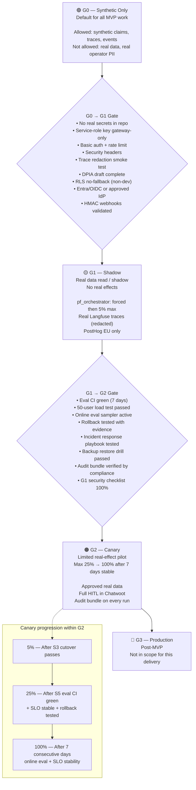

---

## 10. Database Schema

Core tables in `pg-main` (Supabase project `tsevmqftwnyzrxlpnred`). Migrations `0001–0008` applied; `0009–0016` planned (Pilot Workspace, see §19.3).

**Pilot Workspace migrations (S8):**

```
db/migrations/
  0009_pilots.sql            -- pilot, level_history
  0010_chat_threads.sql      -- chat_thread, chat_message, compaction_memo
  0011_pilot_artifacts.sql   -- pilot_artifact (kind enum spans every Movement output)
  0012_open_concerns.sql     -- open_concern (per pilot, persists L0→L4)
  0013_pilot_runs.sql        -- pilot_run (L1+), pilot_cohort_run (L2+)
  0014_pilot_promotions.sql  -- promotion_checklist + signoffs
  0015_decks_artifacts.sql   -- generated_deck, generated_memo (Storage refs)
  0016_companion_costs.sql   -- per-thread token + euro accumulators, pilot_daily_cost
```

Every table: `tenant_id text not null references tenants(id)` + RLS policy in same migration.

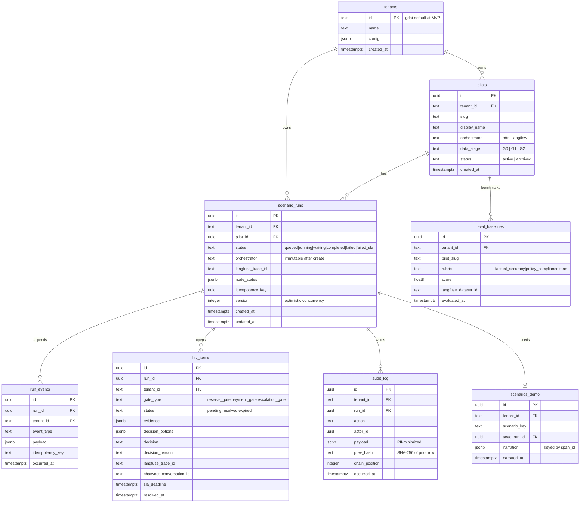

---

## 11. Security Trust Model

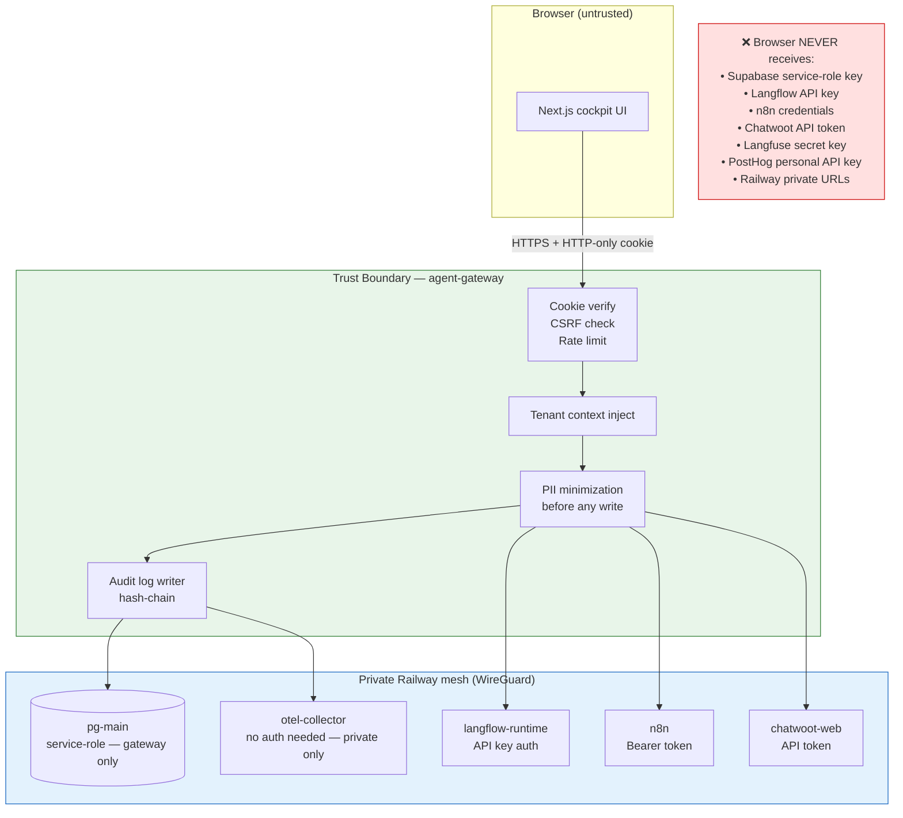

**Key security invariants:**

| Control | Where | Gate |
|---|---|---|
| No service-role key in web runtime | `settings.py` / env | G0 |
| CSRF protection on cookie-backed writes | `middleware.ts` + `auth.py` | G0 |
| Login rate limit (5 attempts) | `auth.py` | G0 |
| HMAC webhook verify + timestamp + nonce | `hitl.py` | G0/G1 |
| Source-level PII minimization | `redact.py` | G1 |
| OTel redaction as last-line defense | `otel-config.yaml` | G0+ |
| RLS no-fallback outside dev | Supabase migration | G1 |
| Audit chain hash-verification function | Migration `0009` | G0 |
| Entra/OIDC + MFA | `auth.py` | G1 |

---

## 12. Sprint Delivery Timeline

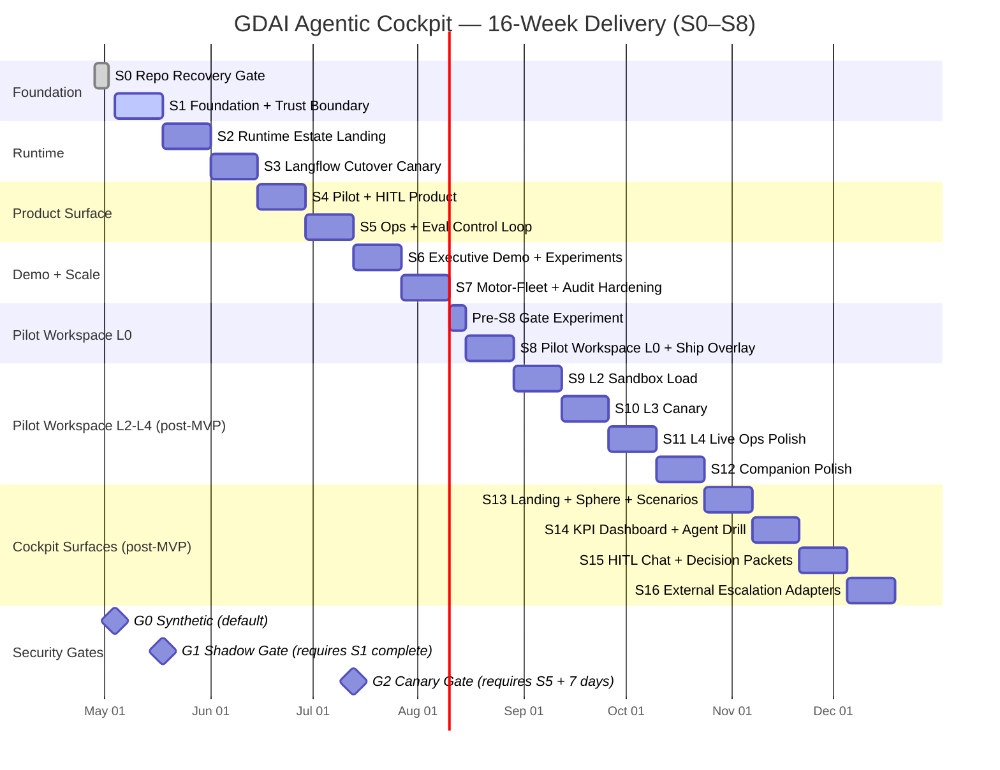

S0–S8 are MVP scope; S9–S12 are post-MVP Pilot Workspace L2-L4; S13–S16 are post-MVP cockpit surfaces. The cockpit shell shell (top bar, tabs, country selector) ships with S8 as the wrapper for the Pilot Workspace. The four surfaces ship incrementally S13–S16.

---

## 13. Runtime Durability & Step Idempotency

The gateway owns durability — Langflow runs single short stateless steps. This diagram shows what happens when Langflow dies mid-step.

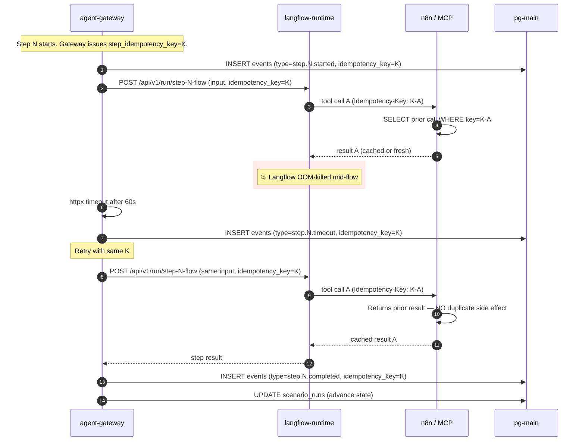

**Invariants enforced:**

- Every MCP tool call carries `Idempotency-Key: {run_id}-{step}-{tool}-{attempt_root}`.
- n8n stores key→result for 24h; duplicate keys return cached result.
- Gateway's `events` table is append-only — restart safely re-emits the timeout/completed events without rewriting history.
- LLM calls are not retried automatically; gateway records cost on first attempt and skips on retry (LLM-side caching not assumed).

> **Pilot Workspace addendum.** L1+ runs flow through the same idempotency-key pattern. The companion-driven build (ship overlay, §16.2) issues a per-phase idempotency key so a partial ship that crashes mid-`wire` can be resumed from the last successful phase without duplicating ElevenLabs agents, Twilio messaging services, or Salesforce metadata records. Cancel mid-build triggers explicit rollback (§16.2 final paragraph) — narrated by the companion.

---

## 14. Eval CI Pipeline

Golden-dataset evals run on every PR touching a flow or prompt. Three LLM-judge rubrics gate the merge.

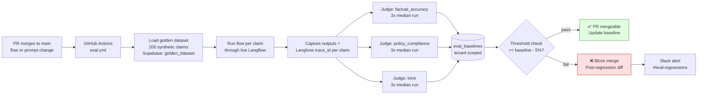

**Rubric definitions:** see `gateway/scripts/eval_runner.py` and Langfuse dataset `gdai-default/golden-property-fast-track`.

---

## 15. Demo Replayer & LLM Narration

Demo scenarios replay an existing scenario_run with cached LLM-generated narration per span.

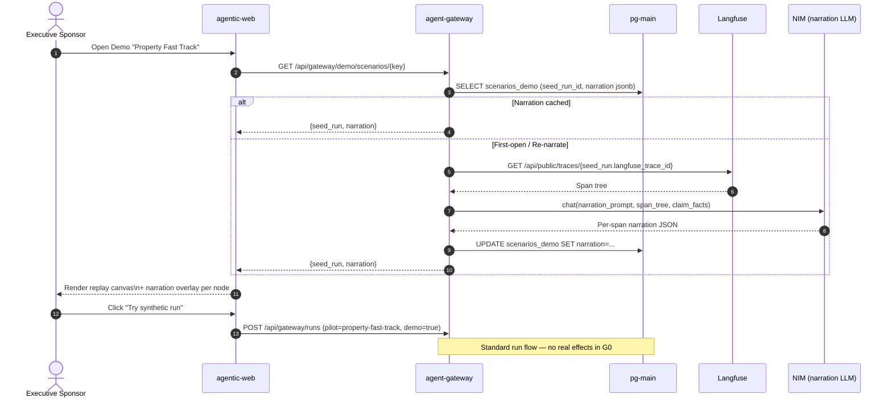

---

## 16. Pilot Workspace L0 Builder Architecture

> **Supersedes the original "Scenario Builder S8" FSM** (`intake → research → plan → approve → build → lint → preview → deploy`). The S8 Builder is now the **L0 view of a Pilot Workspace** at `/pilots/:slug/build`, structured as **eight composition movements** with a persistent chat companion. Authority: `docs/superpowers/specs/2026-05-04-builder-rework-design.md`.

The L0 builder turns a business-user brief into a real, shippable pilot through a guided eight-movement composition flow. The companion (§19) drives composition; the user accepts/rejects diffs. At Movement VIII the user clicks **Generate & ship to L1**, which fires the **ship overlay** — a six-phase real-artifact build (provisioning → composition → lint → wire → anchor → verify) producing a live pilot at L1.

```mermaid
flowchart TB
  subgraph User["Business user (browser)"]
    UI[/pilots/:slug/build\nNext.js + RSC + SSE]
    CHAT[ChatRail\npersistent thread, L0→L4]
  end

  subgraph Movements["Eight Movements (L0 centre pane)"]
    direction TB
    M1[I — Personas + As-Is Journey]
    M2[II — Research / Reality-check\ncited regulator + market lookups]
    M3[III — Plan + HITL Gates\ncost-of-error per gate]
    M4[IV — Business Case\nROI band + sensitivity]
    M5[V — Synth Seed Live]
    M6[VI — Charter\nrules + integration contracts]
    M7[VII — Rehearsal\nflow + simulated HITL + KPIs]
    M8[VIII — Summary\nfull bundle review + ship CTA]
    M1 --> M2 --> M3 --> M4 --> M5 --> M6 --> M7 --> M8
  end

  subgraph Gateway["agent-gateway/"]
    direction TB
    COMP[companion/\ncharter • prompts • memory • compaction\ntools §2.5]
    PILOTS[pilots/\nfsm.py • promotion.py]
    BUILDER[builder/movements/\nM1–M8 logic]
    SHIP[builder/ship.py\n6-phase orchestrator]
    ADAPT[adapters/\nbase.py — staircase toggle\nelevenlabs • twilio • guidewire\nsalesforce • n8n • tow]
    DECKS[decks/\npptx + pdf generators]
  end

  subgraph Persistence["Supabase + Storage"]
    DB[(pilots • level_history\nchat_thread • chat_message\npilot_artifact • compaction_memo\nopen_concern • generated_deck)]
    STORE[Storage: uploads,\ngenerated decks/memos]
  end

  subgraph External["External services"]
    LF[Langfuse Prompts +\nTraces — per-pilot project]
    LANGFLOW[Langflow 1.9 runtime]
    N8N[n8n MCP tools]
    EL[ElevenLabs L1+]
    TW[Twilio L1+]
    GW[Guidewire sandbox L1+]
    SF[Salesforce sandbox L1+]
  end

  UI --> Movements
  CHAT <-->|SSE token stream\nWebSocket span feed| COMP
  Movements --> BUILDER
  BUILDER --> COMP
  COMP --> ADAPT
  COMP --> DECKS
  PILOTS --> DB
  COMP --> DB
  BUILDER --> STORE
  M8 -->|Generate & ship to L1| SHIP
  SHIP --> LANGFLOW
  SHIP --> N8N
  SHIP --> EL
  SHIP --> TW
  SHIP --> GW
  SHIP --> SF
  SHIP --> LF
  SHIP --> ADAPT
  ADAPT --> EL & TW & GW & SF & N8N

  classDef new fill:#10b981,stroke:#065f46,color:#fff
  classDef modified fill:#f59e0b,stroke:#92400e,color:#fff
  classDef existing fill:#6b7280,stroke:#1f2937,color:#fff
  class Movements,COMP,PILOTS,SHIP,DECKS new
  class BUILDER,ADAPT modified
  class LF,LANGFLOW,N8N,DB,STORE existing
```

### 16.1 Eight movements — outputs

| # | Movement | Artifact kinds produced |
|---|---|---|
| I | Personas + As-Is Journey | `persona`, `journey_node`, `tools_inventory` |
| II | Research / Reality-check | `citation` (binding/context), `reality_check_item` |
| III | Plan + HITL Gates | `flow_node`, `hitl_gate` (cost €), `creative_ai_step` |
| IV | Business Case | `business_case`, `sensitivity_scenario`, `capability_investment`, `generated_deck` |
| V | Synth Seed | `synth_seed_manifest`, `edge_case_decision`, generated rows in test schema |
| VI | Charter | `rule`, `integration_contract`, `agreement`, `tension_resolution`, `compliance_memo` |
| VII | Rehearsal | `flow_visualization`, `simulated_hitl_payload`, `kpi`, `eval_rubric_proposal` |
| VIII | Summary | `summary_snapshot`, `observability_bundle`, `executive_summary.pdf`, `recommended_l1_scenarios` |

### 16.2 Ship overlay — six phases

| # | Phase | Operations | Real/mock |
|---|---|---|---|
| 1 | Provisioning | Create per-pilot Langfuse project + register prompts + create synth seed schema + snapshot artifacts | Real |
| 2 | Composition | Generate `flow.json` (Langflow), n8n workflow set, ElevenLabs agent spec, Twilio templates, Salesforce metadata diff, Guidewire MCP route table | Real artifacts |
| 3 | Lint | Capability-manifest check, egress allowlist, secret scan, RGPD Art. 22 conformance, AI Act Art. 50 disclosure, anti-PII regex | Real |
| 4 | Wire | Deploy Langflow flow to runtime, deploy n8n workflows, create real ElevenLabs agent, create Twilio messaging service, wire Guidewire + Salesforce sandbox connections, open egress allowlist | Real APIs from L1 |
| 5 | Anchor | Compute `bundle_sha`, sign with project key, write `provenance.json`, anchor hash in `audit_external_anchor`, write `pilot_version` | Real |
| 6 | Verify | Healthcheck every component, run one synthetic claim end-to-end, confirm Langfuse trace + audit row | Real |

Total ≈ 50–60 s. Lines stream at 6–8 lines/s for human readability. Mid-build cancel rolls back every created agent/workflow/connection (companion narrates each rollback step). On success, the staircase top-bar segment 2 fills (L1) and `/pilots/:slug/test` opens with the L1 first-arrival hero.

### 16.3 Pre-S8 gate (kept from original)

Gated behind a pre-S8 quality experiment: five diverse pilot briefs run end-to-end through Plan → Synth → Charter → Rehearsal → Lint → Ship to a sandbox project. Pass criteria: ≥ 4/5 produce valid bundles, ≥ 4/5 pass lint, ≥ 4/5 ship-overlay verify, **0** policy violations, average session cost ≤ €5.

### 16.4 Replaced primitives

| Old (pre-rework) | New |
|---|---|
| `BuilderState` enum (`intake → … → deploy`) | Movement I–VIII (companion-driven, user-accepted) |
| `/builder` standalone page | `/pilots/:slug/build` inside Pilot Workspace |
| One-shot deploy at G0 | Ship-overlay six-phase build to L1 (real APIs) |
| `richness-checklist.py` (5 signals) | Movement-specific completeness checks + Movement VIII full lint re-run |
| Read-only canvas at Builder | `<RunCanvas>` reused across L1/L2/L3/L4 |

---

## 17. Local Development Quickstart

For full delivery setup see `CLAUDE.md` and `.github/copilot-instructions.md`. Quick reference:

```bash
# Web cockpit (currently lives in delete/ pending S0 restoration)
source ~/.nvm/nvm.sh && nvm use 20
cd /home/mr_e/agentic/delete && PORT=3001 pnpm dev

# Python gateway
cd /home/mr_e/agentic/gateway && uv run fastapi dev --port 8000

# Langflow
langflow run --port 7860

# n8n
N8N_USER_FOLDER=~/.n8n n8n start --host 127.0.0.1 --port 5678

# Chatwoot
cd ~/chatwoot && docker compose up -d
```

Production private URLs use Railway reference variables — never hard-coded IPs:

```bash
GATEWAY_URL=http://${{ agent-gateway.RAILWAY_PRIVATE_DOMAIN }}:8000
LANGFLOW_URL=http://${{ langflow-runtime.RAILWAY_PRIVATE_DOMAIN }}:7860
N8N_BASE_URL=http://${{ n8n.RAILWAY_PRIVATE_DOMAIN }}:5678
OTEL_EXPORTER_OTLP_ENDPOINT=http://${{ otel-collector.RAILWAY_PRIVATE_DOMAIN }}:4318
```

For per-sprint deliverables, testing plans, and review-decision scripts see `docs/sprints/sprint-N-*.md`.

---

## 18. Pilot Workspace IA & Staircase

> **Authority:** Design spec §1, §6 (motion/icon/density). This section is the structural reference; the spec is canonical for UX copy and component-by-component layout.

### 18.1 Primary noun — Pilot

The product's primary noun is **Pilot**. Everything else is a facet of a pilot.

```
Pilot {
  id            uuid
  slug          text                    -- 'motor-fnol-tow' | 'pft' | …
  domain        text                    -- 'motor-fnol' | 'property' | 'underwriting' | 'fraud' | …
  level         text                    -- 'L0' | 'L1' | 'L2' | 'L3' | 'L4'
  level_history jsonb                   -- [{level, entered_at, exited_at, signed_by, ac_passed}]
  version       text                    -- semver, bumps on each L0 ship
  owner         uuid                    -- business user
  facilitator   uuid | null             -- GDAI partner, optional
  chat_thread   uuid                    -- one per pilot, persistent
  language      text                    -- 'fr' | 'en' | 'de' | 'es' | 'it'
  tenant_id     text                    -- 'gdai-default' at MVP
  created_at    timestamptz
  updated_at    timestamptz
}
```

A pilot is created the moment the user lands on `/pilots/new` and sends the first chat message — immediately persisted as a draft.

### 18.2 Routes

| Route | Purpose | Phase |
|---|---|---|
| `/pilots` | Index — every pilot grouped by level | shell |
| `/pilots/new` | Step 0 chat hero | L0 entry |
| `/pilots/:slug` | Redirect to current-level route | resolver |
| `/pilots/:slug/build` | L0 — eight movements | L0 |
| `/pilots/:slug/build/:movement` | Deep-link (`i` … `viii`) | L0 |
| `/pilots/:slug/test` | L1 — solo-test canvas | L1 |
| `/pilots/:slug/sandbox` | L2 — synthetic load | L2 |
| `/pilots/:slug/canary` | L3 — canary cockpit | L3 |
| `/pilots/:slug/live` | L4 — live ops | L4 |
| `/pilots/:slug/timeline` | Cross-level audit timeline | any |
| `/pilots/:slug/decks` | Generated artifacts (decks, memos, status updates) | any |

### 18.3 Workspace anatomy

Four chrome elements present on **every level**. Only the centre pane swaps by level.

```
┌─ TOP BAR · 56 px ────────────────────────────────────────────────────┐
│ AXA · Cockpit / Pilots / motor-fnol-tow   [STAIRCASE: ●─●─○─○─○]    │
│                                              L0  L1 L2 L3 L4         │
│                                            v0.4.2 · saved 12s · ⌘K  │
├──────────────┬─────────────────────────────────────┬─────────────────┤
│ LEFT RAIL    │ CENTRE — phase-aware                │ RIGHT RAIL      │
│ 320 px       │  L0 → eight movements               │ 380 px (chat)   │
│              │  L1 → solo-test live canvas         │ Always present  │
│ Phase-spec   │  L2 → sandbox load aggregates       │ One thread per  │
│ navigation   │  L3 → canary cockpit                │ pilot, persists │
│              │  L4 → live ops cockpit              │ L0 → L4         │
└──────────────┴─────────────────────────────────────┴─────────────────┘
```

| Chrome | Constant | Notes |
|---|---|---|
| Top-bar height | 56 px | Includes staircase |
| Left-rail width | 320 px | Same across L0→L4; content swaps |
| Right-rail (chat) width | 380 px collapsed → up to 560 px | User-draggable, persisted in `user_prefs` |
| Centre min-width | ~ 960 px | Below this, left rail collapses to 56-px icon strip |

### 18.4 Staircase indicator (new UX primitive)

A 5-segment indicator in the top bar. Per-segment states:

| State | Visual |
|---|---|
| **future** | Faint outline |
| **current** | AXA blue solid + label |
| **completed** | Azur with date hover |
| **promotion-pending** | Warning amber pulse |
| **rolled-back** | Error red, reason on hover |

Behaviour: click *completed* → time-travel to read-only history; click *current* → no-op; click *future* → promotion checklist tooltip ("3 of 5 ready"). The staircase is the visual answer to *"the user always knows where the pilot is on its way to production."*

### 18.5 Promotion dialog

Each `L → L+1` transition is a **dialog within the workspace** — never a navigation. Contents:

- The promotion checklist (per-level ACs from spec §10 / sprint docs)
- Live ✓ / ✗ / pending indicators
- Signoff field (operator name + free-text "what changed")
- `Promote to L{N+1}` button (only enabled when all green)
- `Save & ask companion` button (asks the chat to draft a status update for blockers)

Promotion writes a `level_history` row, bumps `pilot.level`, animates one staircase segment forward, and the companion auto-posts an opening message at the new level.

### 18.6 Cross-level invariants

Six things hold *identically* at L0–L4. Never break:

1. **One workspace shell** — top bar with staircase, left rail, centre pane, right rail (chat)
2. **One persistent chat thread** per pilot, growing memory with explicit compaction memos
3. **One companion** with continuity of identity, voice, stance
4. **One open-concerns panel** that survives across levels (concerns can be added at any level)
5. **One audit trail** — every action at every level writes to the same `audit_log`
6. **One progressive-disclosure pattern** — Tier 1 → Tier 2 → Tier 3 → Tier 4 (chat) at every screen

### 18.7 Motion / icon / density rules (load-bearing)

Every screen must conform to design spec §6:

- **Don't-say list (companion):** `Langflow / n8n / MCP / embedding / vector store / FSM / OPA / Rego / capability manifest` are forbidden in user-visible companion strings.
- **Icon library:** Lucide canonical set (e.g., `shield-check` for HITL gate, `gavel` for binding rule, `sparkles` for AI step, `plug-zap` for tool node, `swords` for tension, `flag-triangle-right` for reality-check, `factory` for synth seed). One icon per concept across the entire product.
- **Motion tokens:** every animation bound to `--motion-instant | --motion-snap | --motion-narrate | --motion-reveal | --motion-build`. `prefers-reduced-motion: reduce` clamps every motion token to 0.
- **Density rules per screen:** ≤ 5 visible primary KPIs; exactly 1 *halo* element (the moment-of-attention); progressive disclosure default Tier 1 collapsed.
- **Accessibility:** every Tier-1 card has `aria-label` matching FR or EN copy; focus rings 2 px solid `--axa-blue` with 2 px offset, animated in at 140 ms; chat rail + build-log are `aria-live="polite"`; status uses icon + colour, never colour alone.

### 18.8 PRD-vs-build_plan scope split (MVP)

| Decision | MVP (S8) | Deferred |
|---|---|---|
| Pilot data model + routes | ✓ full schema | — |
| Top-bar + staircase UX | ✓ full design | — |
| Workspace shell every level | ✓ shell + L0 fully detailed | L1+ shell content beyond first-arrival |
| L0 — 8 movements | ✓ every screen, copy, components | — |
| L0 → L1 ship overlay | ✓ full | — |
| L1 first-arrival | ✓ first-arrival + interactions (S4 reframe) | further L1 polish, history, comparisons |
| L1 promotion dialog | ✓ checklist content for L1 → L2 only | L2/L3/L4 promotion dialog detail |
| L2 sandbox-load | architecture only here | full UI in S9 |
| L3 canary cockpit | architecture only here | full UI in S10 |
| L4 live ops | architecture only here (S5 lays foundation) | full UI in S11 |

---

## 19. Chat Companion (Compagnon)

> **Authority:** Design spec §2. The chat companion is the *primary* product surface. The screens are scaffolds the companion fills.

### 19.1 Persona

| | |
|---|---|
| **Working name** | "Compagnon" (rename in brand review pass) |
| **Role** | Senior agentic-pilot specialist with deep insurance expertise (claims, underwriting, fraud, compliance, ops). Multi-language (FR primary for AXA EU, EN/DE/ES/IT supported). |
| **Surface** | Business-only. Never says *Langflow / n8n / MCP / embedding / vector store / FSM / OPA / Rego / capability manifest* unsolicited. |
| **Engine** | Behind the scenes composes Langflow flows, n8n workflows, ElevenLabs agents, Twilio templates, Salesforce metadata, Guidewire MCP calls, synth datasets, evals — surfaces only outcomes. |
| **Tone** | Direct, opinionated, infinitive verbs (FR: *"Composons le persona avant le plan"*; EN: "Let's compose the persona before the plan"). FR vouvoiement. No exclamation marks. Never sycophantic, never "Great question!" |
| **Stance** | Honest, finds solutions, **highlights risks before they bite**, says "I don't know" when it doesn't, **pushes back when the user is wrong** with reasoning + a citation when possible. |

### 19.2 Authority matrix

| Action | Companion can | Companion must ask |
|---|---|---|
| Edit any artifact in the centre pane | ✓ as a *proposed diff* the user accepts/rejects | — |
| Run research, fetch citations | ✓ autonomously | — |
| Generate synth data | ✓ autonomously, batches of 10 streamed live | — |
| Compose / modify a Langflow flow, n8n workflow | ✓ during **L0 only** | — |
| Generate management deck / compliance memo / status update | ✓ autonomously, drops into `/pilots/:slug/decks` | — |
| Deploy / ship to L1 | ✗ | Requires user CTA on the ship overlay |
| Promote L1→L2, L2→L3, L3→L4 | ✗ | Requires checklist signoff in promotion dialog |
| Write to production data, real customer records | ✗ | Never. Out of scope at every level. |
| Invent a citation when research returns nothing | ✗ | Must say "research pending — I don't have a source for this" |
| Override a regulatory finding (ACPR, RGPD, AMF, EU AI Act) | ✗ | Must escalate to user with the regulatory text quoted |

### 19.3 Memory model

**One persistent chat thread per pilot, lifetime = pilot lifetime.** The thread is the *primary* memory; structured artifacts are the *referenced* memory.

Schema (migrations 0010 + 0011):

```sql
chat_thread (
  id uuid pk, pilot_id uuid fk, opened_at, last_active_at,
  total_tokens int, total_cost_eur numeric(10,4), message_count int,
  active_compaction_id uuid fk
);

chat_message (
  id uuid pk, thread_id uuid fk,
  role text check (role in ('user','companion','system','tool')),
  content jsonb,                -- markdown or structured
  attachments jsonb,            -- uploaded files refs
  citations jsonb,              -- {url, snippet, retrieved_at}
  tools_called jsonb,           -- spans
  langfuse_trace_id text, ts timestamptz,
  tokens_in int, tokens_out int, cost_eur numeric(10,4)
);

pilot_artifact (              -- structured memory the companion references
  id uuid pk, pilot_id uuid fk,
  kind text check (kind in (
    'persona','journey_node','tools_inventory',
    'citation','reality_check_item',
    'flow_node','hitl_gate','creative_ai_step',
    'business_case','sensitivity_scenario','capability_investment',
    'synth_seed_manifest','edge_case_decision',
    'rule','integration_contract','agreement','tension_resolution',
    'flow_visualization','simulated_hitl_payload','kpi','eval_rubric_proposal',
    'summary_snapshot','observability_bundle','recommended_l1_scenarios',
    'generated_deck','generated_memo','status_update',
    'compaction_memo'
  )),
  version int, content jsonb,
  parent_id uuid fk, retired_at timestamptz,
  created_by text check (created_by in ('companion','user')),
  signed_off_by uuid, signed_off_at timestamptz,
  tenant_id text not null references tenants(id)
);
-- RLS: same as other tenant-scoped tables
```

**Self-compaction:** when a thread crosses ~ 120k tokens, the companion produces a `compaction_memo` artifact and a *new chapter* starts referencing the memo. Compaction is **visible** — the user sees a chip "↻ next chapter — summary of 230 messages." The user can open, edit, or delete the memo.

**Multimodal uploads** (PDF / PPTX / DOCX / images / audio) → Supabase Storage, parsed via Docling, embeddings to `pgvector`, structured extraction proposed to the user as artifact diffs. Audio → Whisper transcription, then treated as text.

### 19.4 Prompt architecture (Langfuse Prompts)

Three layers, all versioned:

```
[BASE]              Companion Charter — persona, voice, authority,
                    refusal patterns, output expectations
                    (~ 2.5k tokens, version-locked per pilot at creation)
  +
[LEVEL OVERLAY]     L0_BUILD / L1_SOLO_TEST / L2_SANDBOX_LOAD /
                    L3_CANARY / L4_LIVE
                    (~ 1k tokens; level-specific goals + tools)
  +
[STEP OVERLAY](L0)  STEP1_PERSONAS … STEP8_SUMMARY
                    (~ 500-1500 tokens each; step-specific mission)
  +
[CONTEXT]           Thread (or compaction memo + recent messages),
                    retrieved relevant artifacts, current centre-pane
                    state, recent Langfuse traces (L1+), user input + uploads
```

Level and step overlays are **swappable mid-thread** — companion's identity stays via `[BASE]`; mission updates as the pilot climbs. Langfuse tracks which prompt versions were active for every turn.

Registry keys:

```
companion/charter/v1                — base persona (§19.1)
companion/level/L0/v1               — L0 build mission overlay
companion/level/L1/v1               — L1 first-arrival + live narration
companion/level/L2/v1               — L2 sandbox-load analyst
companion/level/L3/v1               — L3 canary watcher
companion/level/L4/v1               — L4 live-ops on-call
companion/step/I/v1 … VIII/v1       — Movement-specific overlays (8)
companion/tool/parse_upload/v1      — multimodal upload parsing
companion/tool/generate_deck/v1     — pptx generator
companion/tool/generate_memo/v1     — compliance/risk/incident memo
companion/eval/factual/v1           — LLM judge (factual accuracy)
companion/eval/policy/v1            — LLM judge (policy compliance + audience principle)
companion/eval/tone/v1              — LLM judge (customer tone)
```

### 19.5 Tool surface

**Core (always):** `read_artifact`, `write_artifact`, `propose_diff`, `delete_artifact`, `list_artifacts`, `read_thread`, `read_compaction_memos`.

**Research (L0; L1+ for retrospective questions):**
- `web_search_insurance` — allowlisted domains (ACPR, FFA, EIOPA, regulator domains, AXA Group docs). Returns `(text, url, snippet, retrieved_at)`.
- `corpus_search` — AXA internal docs (S7).
- `regulator_lookup` — ACPR / EIOPA / RGPD / EU AI Act article fetcher with article-level anchors.

**Composition (L0):**
- `propose_persona`, `propose_journey_step`
- `compute_business_case` — volumes + cost-of-error gates → ROI band + sensitivity table
- `seed_synth_dataset` — drives Movement V live generation
- `propose_flow_topology` — produces Movement VII flow
- `lint_capability_manifest` — OPA-style policy check

**Generation (ship overlay):**
- `generate_n8n_workflow` — real n8n JSON (validated via `n8n-mcp`)
- `generate_langflow_flow` — `flow.json`
- `generate_elevenlabs_agent`, `generate_twilio_template`, `generate_salesforce_metadata`, `generate_guidewire_route_table`
- `generate_pptx_deck`, `generate_compliance_memo`, `generate_status_update`

### 19.6 Per-thread budget + cost accounting

- `chat_thread.total_tokens`, `chat_thread.total_cost_eur` accumulators.
- Hard pause when per-thread budget cap hit (configurable in `/admin/budgets`).
- Daily roll-up `pilot_daily_cost` for budget reporting.
- Companion narrates spend in plain language only when asked (never proactively unless > 80 % budget).

### 19.7 Streaming + real-time

- **Chat token streaming**: SSE. Anthropic streaming response proxied through gateway, with per-tool-call narration injected as separate SSE events.
- **Langfuse span feed (L1+ live narration)**: WebSocket. Gateway subscribes to Langfuse webhooks → broadcasts to subscribed pilot channels.
- **Build-log streaming (ship overlay)**: WebSocket. Each build operation emits an event consumed by `<BuildLog>` and `<LiveDiagram>`.
- **Synth seed streaming (Movement V)**: SSE. One event per record generated.

### 19.8 Per-pilot Langfuse project

Each pilot gets its own Langfuse project, named `gdai-pilot-{slug}`. The companion itself is traced in a dedicated cross-pilot project `gdai-cockpit-companion`. Each companion turn records `{prompt_keys, prompt_versions}` in the trace → reproducible.

---

## 20. Adapter Staircase (mocked-at-L0 → real-from-L1)

> **Authority:** Design spec §1, §8.4. The realism staircase is the load-bearing technical pattern that lets L0 iterate cheaply while L1+ runs against real APIs without code changes.

### 20.1 Principle

Every external integration is reached through a **typed adapter** with two interchangeable behaviours, toggled by `pilot.level`:

- **L0 — mocked behaviour.** The adapter contract is real (same TypeScript types, same Pydantic models), but the *behaviour* returns deterministic stubs (canned responses, in-process delays, recorded audio). No external network call.
- **L1+ — real behaviour.** The adapter dispatches to the real sandbox or production API. Same contract, same types.

The mock/real boundary lives in the adapter layer alone. **No call site of any adapter knows whether it's mocked.** Promoting a pilot from L0 to L1 is a single `pilot.level` flip — the ship overlay (§16.2) does the wiring.

### 20.2 Adapter inventory

| Adapter | L0 (mocked) | L1+ (real) | Auth | Owner |
|---|---|---|---|---|
| **ElevenLabs** | Static MP3 from Supabase Storage | Real agent via `POST /v1/convai/agents`, real call via `POST /v1/calls` | API key (Vault) | GDAI platform team |
| **Twilio** | UI shows fake SMS toast | Real Twilio sandbox: `POST /Messages.json` with OSM map URL | Account SID + auth token (Vault) | GDAI platform team |
| **Guidewire MCP** | n8n stub returns canned policy JSON | Real Guidewire ClaimCenter sandbox: `POST /pc/v8/policy/{policyNumber}` via MCP wrapper | OAuth2 client-creds | IT-Sécurité (AXA FR) |
| **Salesforce** | n8n stub posts to mock URL | Real SF sandbox: REST `POST /services/data/v60.0/sobjects/Case` | OAuth2 connected app | IT-CRM |
| **Tow dispatch** | n8n choreography w/ realistic delays | Real provider API (TBD per region) | TBD | Ops Lyon |
| **Anthropic / OpenAI** | Real | Real | API key | GDAI platform |

### 20.3 Adapter base contract

```python
# gateway/src/gateway/adapters/base.py
class StaircaseAdapter(Protocol):
    """All adapters expose the same surface; behaviour switches on pilot.level."""

    async def call(self, *, pilot: Pilot, payload: AdapterPayload) -> AdapterResult: ...
    async def healthcheck(self) -> HealthcheckResult: ...

def make_adapter(kind: AdapterKind, level: PilotLevel) -> StaircaseAdapter:
    """Factory: returns the mocked or real implementation based on level."""

---

## 21. Cockpit Shell — Four Public Surfaces

> **Authority:** `docs/superpowers/specs/2026-05-05-cockpit-surfaces-ux-design.md` — canonical UX + copy. This section covers structure and data flow only.

### 21.1 Architecture

The cockpit shell is the **cross-pilot, cross-country wrapper** around the Pilot Workspace. It provides four public surfaces per country:

| Surface | Route | Purpose |
|---|---|---|
| **Landing** | `/:country/` | Per-country executive bento — configurable module grid |
| **Scenarios** | `/:country/scenarios` | Pilot catalog — filterable, per-country |
| **Business KPIs** | `/:country/kpis` | Three-pillar governance dashboard |
| **HITL Chat** | `/:country/chat` (slide-over) | Country-level companion thread |

The shell consists of four chrome elements present on every surface:

```
┌─ TopBar ───────────────────────────────────────────────────┐
│ brand · [Landing] [Scenarios] [KPIs] · [country ▼] · ⌘K │
├─ CentrePane ───────────────────────────────────────────────┤
│ surface-aware, scrollable, 48 px padding                    │
├─ SphereZone · 180 px ──────────────────────────────────────┤
│ [sphere companion · 130px] · nudge text                    │
└────────────────────────────────────────────────────────────┘
```

### 21.2 Per-country routing & data isolation

Each country is a separate Supabase tenant. The gateway resolves `:country` → `tenant_id` via the `countries` table. All subsequent queries are scoped to that tenant. RLS policies enforce tenant isolation.

```
GET /api/countries                    → list accessible countries
GET /api/:country/landing             → bento config + module data
PUT /api/:country/landing/config      → update bento layout
GET /api/:country/scenarios           → pilot catalog (filterable)
GET /api/:country/kpis                → aggregated KPI dashboard
GET /api/:country/chat/thread         → country-level chat thread
POST /api/:country/chat/messages      → companion message (SSE stream)
```

### 21.3 Sphere companion

A persistent 130×130 px circular companion always visible in the sphere zone. Click toggles a 6-action radial menu (3 left, 3 right, spring-eased, staggered 50 ms delays). Actions are contextual per surface. "Open chat" is always the bottom-right action. A companion nudge line below the sphere rotates every 30 s with contextual suggestions.

The sphere is a visual container for real functionality — chat access, quick navigation, and companion interaction. The video/rendering layer is the "delight" surface; the value is one-click access to the companion from anywhere.

### 21.4 Tab bar

Three segments: Landing · Scenarios · KPIs. Active segment has a 2 px AXA-blue underline that slides 240 ms on switch. Centre pane cross-fades (240 ms opacity). URL reflects active tab via `history.pushState`. Chat is not a tab — accessed via sphere or slide-over.

### 21.5 Bento configuration

Each country's landing page is a configurable 12-column CSS Grid of modules (KPI hero strip, active pilots grid, HITL queue snapshot, savings tracker, etc.). Configuration is stored as JSON in `countries.bento_config` and persisted via `PUT /api/:country/landing/config`. The companion can propose a bento during onboarding.

### 21.6 Database migrations (additive)

```
0017_countries.sql       — countries (slug, display_name, language, tenant_id, bento_config)
0018_country_users.sql    — user ↔ country access with role
0019_blueprints.sql       — cross-country shared assets
0020_chat_threads_country.sql — country-level chat threads
0021_kpi_snapshots.sql    — daily materialized KPI snapshots for sparklines
0022_notification_prefs.sql — per-user notification preferences
```

---

## 22. Business KPI Dashboard — Three Pillars

> **Authority:** Cockpit surfaces spec §5. This section covers data flow and materialization.

### 22.1 Three-pillar model

The KPI dashboard organises governance around three balancing forces:

| Pillar | Primary KPIs | Data source |
|---|---|---|
| **Business** | Savings to date, projected annual, avg cost/claim, ROI % | `pilot.total_savings_eur`, cost accumulators, companion projections |
| **Operational** | Auto-resolve %, claims processed, median latency, HITL queue depth, operator load | `pilot_run` counts, Langfuse traces, `open_concerns` |
| **Quality** | Eval pass %, factual/policy/tone scores, gates passing | Langfuse eval scores, gate pass/fail from `pilot_run` |

### 22.2 KPI materialization

KPIs are computed from Langfuse traces + Supabase pilot data + cost accumulators. To keep the dashboard responsive (≤ 500 ms load), daily KPIs are materialized into `kpi_snapshots` via a cron job (every 6 h). Real-time KPIs (HITL queue depth, currently-running pilots) are live-queried. Sparklines read from snapshots.

Real-time updates flow via WebSocket: when a pilot's state changes, the gateway broadcasts a `kpi_update` event to the country's WebSocket channel. The frontend tweens the affected KPI number inline (600 ms eased count-up).

### 22.3 Agent-level drill-down

From any pillar, "Per-pilot breakdown" expands a sortable table of per-pilot KPIs. Clicking a pilot navigates to that pilot's workspace. From the per-pilot view, "Agent-level analysis" renders the pilot's agent topology (reused from the builder spec canvas) with per-node pass rates, latencies, costs, and the last 5 run traces. Clicking a node opens an inspector panel with full Langfuse trace access.

### 22.4 Business-impact measurement

Beyond technical KPIs, the companion generates daily business-impact insights surfaced below the three pillars: cost avoidance (€ caught by gates), time returned to operators (hours saved), regulatory safety margin (% above legal minimums), and customer experience proxy (NPS prediction delta).

---

## 23. Blueprint Library — Cross-Country Asset Sharing

> **Authority:** Cockpit surfaces spec §7.4. This section covers the sharing architecture.

### 23.1 Sharing model

Countries are sovereign — each has its own data, pilots, and KPIs. The blueprint library is an **opt-in** sharing mechanism for reusable assets:

| Asset type | What's shared |
|---|---|
| **Agent** | Langflow flow JSON + companion prompt overlay + eval rubric |
| **Flow** | n8n workflow JSON + tool configuration template |
| **Synth data** | Synthetic dataset manifest + generation parameters |
| **Dashboard config** | Bento layout JSON + KPI threshold settings |

### 23.2 Architecture

```
┌─ France ──────────┐     ┌─ Blueprint Library ─┐     ┌─ Deutschland ────┐
│                    │     │                      │     │                    │
│  Share agent ─────┼────→│  blueprint_assets     │←────┼── Browse          │
│  "fraud-detection"│     │  · agent_id           │     │  · Preview        │
│                    │     │  · sharing_country    │     │  · Import ──→ draft│
│                    │     │  · version            │     │                    │
│                    │     │  · compatibility_tags │     │                    │
└────────────────────┘     └──────────────────────┘     └────────────────────┘
```

### 23.3 Import flow

When a country imports a blueprint, the companion gate-checks it against the importing country's regulatory context. Incompatible items are flagged before import. The import creates a draft pilot (for agent/flow blueprints) or adds the asset to the country's library (for synth data/dashboard configs).

### 23.4 Database

```sql
blueprint_assets (
  id uuid pk,
  sharing_country_id uuid references countries(id),
  kind text check (kind in ('agent','flow','synth_data','dashboard_config')),
  name text, description text,
  version int,
  content jsonb,
  compatibility_tags text[],
  usage_count int default 0,
  tenant_id text not null references tenants(id),
  created_at, updated_at
);

blueprint_imports (
  id uuid pk,
  blueprint_id uuid references blueprint_assets(id),
  importing_country_id uuid references countries(id),
  imported_by uuid,
  status text check (status in ('previewed','imported','rejected','adapted')),
  companion_check_result jsonb,
  created_pilot_id uuid,
  tenant_id text not null references tenants(id),
  created_at
);
```

### 23.5 External escalation adapter layer (future)

The HITL chat is architected for external tool escalation (Teams, Salesforce, ServiceNow) via a typed adapter interface. At PoC launch, the adapter is a **no-op** — all communication stays in the cockpit. When a country configures external credentials and flips a feature flag, the adapter activates without code changes.

```python
class ExternalNotificationAdapter(ABC):
    async def push_decision_packet(self, packet: DecisionPacket) -> str: ...
    async def receive_external_reply(self, payload: dict) -> ChatMessage: ...
    async def check_delivery_status(self, external_id: str) -> DeliveryStatus: ...
```
    if level == "L0":
        return MOCK_REGISTRY[kind]()
    return REAL_REGISTRY[kind]()
```

### 20.4 Cost accounting per adapter

Each adapter knows its pricing and reports cost per call. The gateway aggregates to `pilot_run.cost_eur` (per run), `pilot_cohort_run.cost_eur` (per cohort), `chat_thread.total_cost_eur` (companion-driven cost), and rolls up to `pilot_daily_cost` for `/admin/budgets`.

### 20.5 Audit + provenance per adapter

Every adapter call writes a row to `audit_log` with `actor='companion' | 'user' | 'system'`, the inputs (PII-redacted), the outputs (PII-redacted), and the `pilot_id + level + run_id` context. At L1+ ship time, every shipped pilot version has `bundle_sha` anchored in `audit_external_anchor` (reusing Sprint 7 anchor pattern). Provenance chain: `pilot → version → bundle_sha → anchor`.

### 20.6 Demo-mode contingency

If outbound is blocked at demo time (R-03 in spec §10.2), a `demo-mode` PostHog feature flag falls back the relevant adapters to recorded runs (mocked behaviour with real-shaped traces). The companion narrates the fallback honestly: *"Outbound is blocked; I'm replaying a recorded call from yesterday with the same flow."*

---
