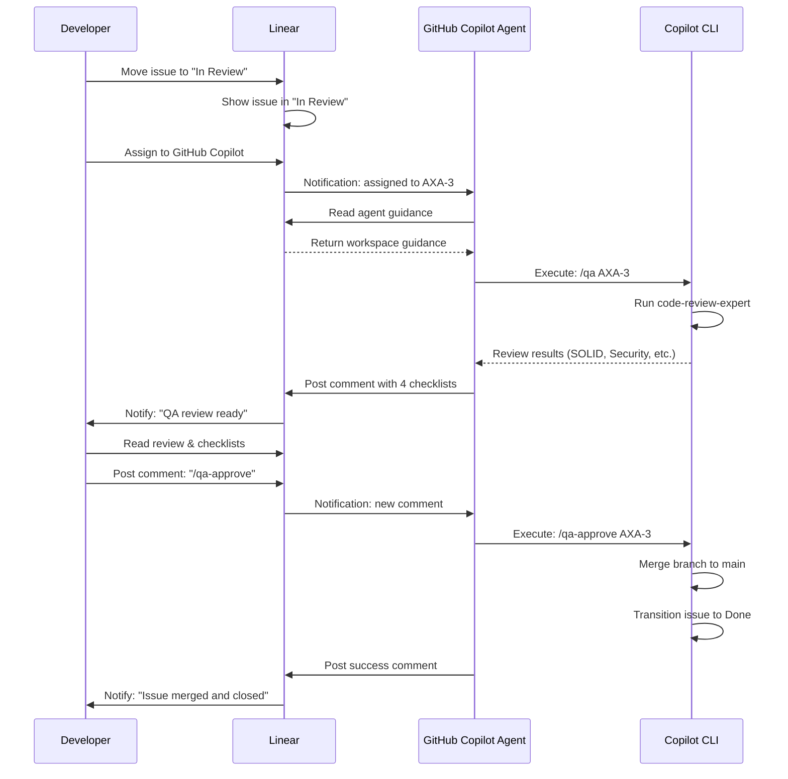

# GitHub Copilot Agent Automation Proposal

**Date:** May 4, 2026  
**Solution:** Use GitHub Copilot Agent (assignable in Linear) to automatically run QA and merge workflows

---

## How It Works (High Level)

```
Issue moved to "In Review" status
         ↓
Assign issue to: GitHub Copilot (agent)
         ↓
Copilot agent receives "guidance" instructions
         ↓
Copilot runs: /qa <issue-id> (code review)
         ↓
QA review posted with recommendation
         ↓
User posts: "/qa-approve" comment on issue
         ↓
Copilot detects comment (via polling or webhook)
         ↓
Copilot executes: /qa-approve <issue-id>
         ↓
Branch merged, issue → Done
```

---

## Linear AI Agents Architecture

### What Are Agents?

From Linear's documentation:

> "Agents, also known as **app users**, behave similar to other users in a workspace. They can be @-mentioned, delegated issues through assignment, create and reply to comments, collaborate on projects and documents."

**Key capabilities:**
- ✅ Assignable to issues (triggers delegation)
- ✅ Can be @-mentioned in comments
- ✅ Can create/reply to comments
- ✅ Can take actions on issues (update status, add labels, etc.)
- ✅ Receive **Agent Guidance** — instructions to follow when working on issues
- ✅ Can be tracked in activity feed and Insights

### Agent vs. Human Assignee

**Standard assignment:** Developer is responsible for issue completion

**Agent delegation:** 
- Human remains the primary assignee (responsible)
- Agent is added as additional contributor (takes action on your behalf)
- Can change/remove agent anytime

---

## Proposed Workflow

### Option A: Agent-Driven QA (Recommended)

**Setup:**
1. Assign GitHub Copilot agent to team (already showing in your screenshot!)
2. Write agent guidance at workspace/team level
3. Configure automation to assign Copilot to issues moving to "In Review"

**Flow:**

```
Developer:  Creates PR, moves issue to "In Review"
                         ↓
Linear:     Auto-assigns GitHub Copilot agent
                         ↓
Copilot:    Receives guidance, runs:
            /qa <issue-id>
                         ↓
Copilot:    Posts QA review with 4 checklists
                         ↓
Developer:  Reads review, posts comment: "/qa-approve"
                         ↓
Copilot:    Monitors comment (polling or webhook)
                         ↓
Copilot:    Executes: /qa-approve <issue-id>
                         ↓
Result:     Branch merged, issue → Done
```

**Advantages:**
- ✅ Native Linear agent system (no external webhooks needed yet)
- ✅ Clear visual assignment (shows "GitHub Copilot" on issue)
- ✅ Guidance is transparent and editable
- ✅ Activity feed shows all agent actions
- ✅ Works with Linear's existing delegation model
- ✅ Can scale to other automations (docs generation, code review, etc.)

---

## Implementation Steps

### Step 1: Write Agent Guidance

**Location:** `Settings > Agents > Additional guidance` (workspace-level)

**Guidance content:**

```markdown
# GitHub Copilot Agent Guidance

## QA Review Protocol

When assigned to an issue in "In Review" status:

1. **Trigger QA review:**
   - Run: `/qa <issue-id>`
   - This runs code-review-expert and posts structured checklists
   
2. **Monitor for approval:**
   - Watch for user comment with `/qa-approve` or `/qa-request-changes`
   - If user is away > 24h, post: "@assignee QA review ready for approval"
   
3. **Execute user decision:**
   - `/qa-approve` → merge branch + close issue
   - `/qa-request-changes` → return to In Progress + notify dev

## Instructions to Follow

- Always run full code review before asking for approval
- Use 4 checklists: SOLID, Security, Code Quality, Removals
- If blockers found: recommend "request-changes", do not auto-merge
- If green: ask user for explicit approval (no silent merges)
- Post clear, professional comments with actionable feedback
- Tag assignee when waiting for feedback

## Team Conventions

- Branch naming: `<team>/<issue-id>-<slug>` (e.g., `axa/axa-3-sprint-0`)
- PR title must include issue ID
- Commits should reference issue ID for audit trail
- All merges to `main` must have passing CI + security checks
```

### Step 2: Configure Auto-Assignment

**Option A: Manual Assignment (Simplest)**
- When dev moves issue to "In Review", they manually assign: GitHub Copilot
- Copilot receives notification + guidance
- Copilot runs `/qa` immediately

**Option B: Automation Rule (Future)**
- Create workflow rule: "When status → In Review, assign to GitHub Copilot"
- Requires Linear's automation API (may not be GA yet)

### Step 3: Enable Copilot Agent (if not already enabled)

Assuming GitHub Copilot is already showing in your workspace (as in screenshot):

1. Go to `Settings > Applications`
2. Verify "GitHub Copilot" is listed and installed
3. Check it has access to your team
4. If not present: install via Linear's apps marketplace

### Step 4: Testing

**Test workflow:**

1. Create test issue in Linear
2. Move to "In Review"
3. Manually assign to GitHub Copilot
4. Copilot should:
   - Receive notification
   - Read guidance
   - Execute `/qa <issue-id>`
   - Post review comment

---

## Architecture Diagram

```
┌─────────────────────────────────────────────────────────────┐
│                    Linear Workspace                          │
├─────────────────────────────────────────────────────────────┤
│                                                               │
│  ┌──────────────────────┐         ┌─────────────────────┐  │
│  │  Issue: AXA-3        │         │  Agent Guidance     │  │
│  │  Status: In Review   │         │  (Workspace-level)  │  │
│  │  Assignee: Eduardo   │ ◄──────► │  ├─ QA Protocol    │  │
│  │  Agent: Copilot      │         │  ├─ Code review    │  │
│  │                      │         │  └─ Merge approval  │  │
│  └──────────────────────┘         └─────────────────────┘  │
│           ▲                                                   │
│           │ (triggers agent)                                │
│           │                                                  │
│  ┌────────┴─────────────────────────────────────────┐      │
│  │  GitHub Copilot Agent                            │      │
│  │  ├─ Monitors assigned issues                     │      │
│  │  ├─ Reads guidance on each action                │      │
│  │  ├─ Can @-mention, comment, assign, update      │      │
│  │  └─ Activity logged in issue feed                │      │
│  └────────┬─────────────────────────────────────────┘      │
│           │                                                  │
│           ├─► /qa <issue-id>                               │
│           │   (runs code-review-expert)                    │
│           │                                                 │
│           ├─► Monitors comments for:                       │
│           │   - /qa-approve                                │
│           │   - /qa-request-changes                        │
│           │                                                 │
│           └─► /qa-approve <issue-id>                       │
│               (merges + closes)                            │
│                                                             │
└─────────────────────────────────────────────────────────────┘
              │
              └──► GitHub (Copilot CLI)
                   - Executes git merge
                   - Updates issue state
```

---

## Comparison: Webhook vs. Agent-Based

| Aspect | Webhooks | Agent-Based |
|--------|----------|------------|
| **Setup** | External bridge service | Linear native + guidance |
| **Trigger** | HTTP POST from Linear | Issue assignment + guidance |
| **Monitoring** | Listens for webhook events | Agent polling + notifications |
| **Visibility** | Requires GH Actions logs | Visible in Linear activity feed |
| **Latency** | <30 seconds | Immediate (on assignment) |
| **Infrastructure** | Custom service + Railway | None (Linear native) |
| **Complexity** | Medium-High | Low-Medium |
| **Reliability** | 99% (GHA SLA) | Depends on Copilot polling |
| **Native to Linear** | No (external) | Yes (built-in) |

**Recommendation:** Start with **Agent-Based** because:
- ✅ No external infrastructure
- ✅ Native Linear feature
- ✅ Already have Copilot agent in workspace
- ✅ Simpler to configure (guidance + assignment)
- ✅ All activity tracked in Linear UI

---

## Workflow Diagram: Agent Assignment → QA → Merge



---

## Key Advantages of Agent-Based Approach

### 1. **Native Linear Integration**
   - No webhooks to configure
   - No external service to run
   - Uses Linear's built-in agent system

### 2. **Clear Assignment Model**
   - Issue shows "Assigned to Eduardo" (human responsible)
   - Issue shows "Delegated to GitHub Copilot" (agent takes action)
   - Perfect alignment with your workflow

### 3. **Guidance-Driven Behavior**
   - All agent instructions in one place (workspace guidance)
   - Team-specific guidance can override workspace defaults
   - Easy to update instructions without code changes

### 4. **Full Visibility**
   - Activity feed shows all agent actions
   - Comments appear as "GitHub Copilot" contributor
   - Can filter views by "Delegate" to see agent involvement
   - Insights can measure agent automation

### 5. **Extensible**
   - Same agent can handle other automations:
     - Generate PR summaries
     - Create release notes
     - Suggest code improvements
   - One agent, many tasks (all guided by instructions)

---

## Phase 1 Implementation (This Sprint)

### Minimal Setup
1. **Write guidance** (30 min)
   - Copy template above into `Settings > Agents > Additional guidance`
   - Customize for your team

2. **Manual assignment workflow** (immediate)
   - When issue → "In Review", manually assign GitHub Copilot
   - Copilot reads guidance, runs `/qa`
   - Works end-to-end

3. **Test on AXA-3** (next issue in review)
   - Assign Copilot to AXA-3
   - Copilot runs `/qa AXA-3`
   - Review results
   - Post `/qa-approve AXA-3`
   - Verify merge works

### Time Investment
- **Guidance writing:** 30 min
- **Testing:** 15 min
- **Total:** ~45 min to have full automation working

---

## Phase 2 Enhancement (Sprint 2)

### Auto-Assignment Rule
Once you're comfortable with agent:

**Create automation rule:**
- Trigger: Issue status changes to "In Review"
- Action: Automatically assign to GitHub Copilot
- Result: Zero manual steps, fully automated

**Config location:** `Settings > Team > Workflow` (or via API)

---

## Potential Challenges & Solutions

| Challenge | Solution |
|-----------|----------|
| **Copilot doesn't detect guidance** | Verify agent installation, reinstall if needed |
| **Polling is slow** | Linear can offer webhook events for agents (future feature) |
| **Comment parsing fails** | Add explicit regex patterns in guidance for `/qa-approve` |
| **Merge fails due to CI** | Guidance can specify "wait for CI before merge" rule |
| **Multiple agents assigned** | Limit to one primary automation agent per issue |

---

## Recommended Next Steps

1. **Today/Sprint 0:**
   - Write agent guidance in Linear workspace settings
   - Test on next issue moving to "In Review"
   - Verify `/qa` and `/qa-approve` work

2. **Sprint 1:**
   - Gather feedback on agent behavior
   - Refine guidance based on real QA cycles
   - Document edge cases

3. **Sprint 2:**
   - Add auto-assignment rule
   - Monitor automation coverage via Insights
   - Scale to other agent tasks

---

## Comparison to Previous Research

**vs. Option 1 (Manual Commands):**
- ✅ Slightly less manual (assign once, everything happens)
- ✅ More visible (shows "delegated to Copilot" on issue)
- ✅ Native Linear feature
- ⚠️ Slightly more setup (write guidance)

**vs. Option 2 (GitHub Actions Webhooks):**
- ✅ No external infrastructure
- ✅ No GitHub Actions workflow config
- ✅ Native Linear system
- ⚠️ Depends on Copilot polling (not immediate)
- ⚠️ Requires Copilot agent to work properly

**vs. Option 3 (Custom Bridge Service):**
- ✅ No service to run
- ✅ No DevOps/monitoring overhead
- ✅ Cost-free
- ⚠️ Less immediate latency

---

## Conclusion

**GitHub Copilot Agent is the ideal solution for your use case** because:

1. It's already available in your Linear workspace
2. It uses Linear's native agent system (designed for this)
3. Agent guidance provides clear, versionable instructions
4. Minimal setup (one guidance doc + issue assignments)
5. Full activity tracking in Linear UI
6. Foundation for other automation tasks

**Recommended execution:**
- Implement guidance today (30 min)
- Test on next "In Review" issue
- Scale with auto-assignment rules in Sprint 2
