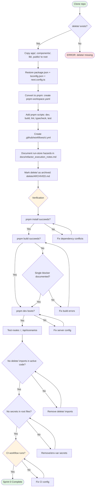

# Sprint 0 — Repo Recovery Gate

**Duration:** Week 0, target 2-4 working days  
**Persona promise:** An engineer can clone the repo, run the cockpit locally, and see the actual active project shape.  
**Depends on:** Initial migration set (0001–0008) applied to Supabase project `tsevmqftwnyzrxlpnred`; `delete/` directory containing the prototype Next.js app.

---

## Why This Sprint Exists

The runnable Next.js prototype currently lives under `delete/app`, `delete/components`, and `delete/lib`. Root directories (`app/`, `components/`, `lib/`, `public/`) do not exist. The gateway scaffold (`gateway/`) is missing. Infrastructure templates (`infra/railway.json`, `otel/otel-config.yaml`) are absent. CI has no active workflow definitions. This creates a **critical gap (G-01)** where every downstream delivery task assumes a monorepo structure that doesn't exist yet. Sprint 0 resolves this by restoring the prototype to the active repo root, establishing a CI baseline, documenting known run-store hazards, and marking `delete/` as archived source rather than active runtime.

---

## Scope Summary

### In Scope

- Restore selected assets from `delete/` to root:
  - `app/` — Next.js App Router pages and layouts
  - `components/` — UI component library (shadcn/ui + custom)
  - `lib/` — server/client utilities, run-store, Supabase client
  - `public/` — static assets
  - `package.json` — dependencies and scripts
  - `tsconfig.json` — TypeScript configuration
  - `next.config.ts` — Next.js build configuration
- Convert package workflow from npm to **pnpm**
- Add pnpm scripts:
  - `pnpm dev` — local dev server
  - `pnpm build` — production build
  - `pnpm lint` — ESLint via `next lint`
  - `pnpm typecheck` — TypeScript strict mode check
  - `pnpm test` — Vitest unit test runner
  - `pnpm test:visual` — placeholder for Playwright visual/a11y tests (no-op until S4)
- Add CI skeleton (`.github/workflows/ci.yml`):
  - Typecheck job
  - Lint job
  - Build job
  - Placeholder security job (gitleaks + dependency audit; no blocking gates yet)
- Add local smoke test documentation (in `README.md` or `docs/local-dev.md`)
- Identify and document run-store hazards:
  - Event delete/reinsert behavior (violates append-only semantics)
  - Missing orchestrator persistence (orchestrator selection not stored on run creation)
  - Missing optimistic concurrency (no version checks for concurrent updates)
  - Direct n8n dispatch without gateway mediation (trust boundary violation)
- Create `docs/refactor_execution_notes.md` with S0 decisions and known constraints
- Mark `delete/` as archived source (add `delete/ARCHIVED.md` warning)

### Out of Scope

- Gateway runtime implementation (`gateway/app/main.py`)
- Railway deployment (template, services, buckets)
- Langflow flow authoring (`flows/property-fast-track.json`)
- UI redesign or new components
- Migration 0009+ (runtime safety, HITL bridge, audit anchoring)
- Supabase service-role security hardening (comes in S1)
- Real authentication/authorization (comes in S1+)
- Contract tests, integration tests, e2e tests (skeleton only; full pyramid in S1+)

---

## Implementation Diagram



---

## Technical Implementation

### File Restoration

Copy from `delete/` to repo root (preserve structure):

```bash
# From repo root /home/mr_e/agentic
cp -r delete/app ./
cp -r delete/components ./
cp -r delete/lib ./
cp -r delete/public ./
cp delete/package.json ./
cp delete/tsconfig.json ./
cp delete/next.config.ts ./
```

### Package Manager Migration

Create `pnpm-workspace.yaml` at root:

```yaml
packages:
  - '.'
```

Update `package.json` scripts:

```json
{
  "name": "gdai-agentic-cockpit",
  "version": "0.1.0",
  "private": true,
  "scripts": {
    "dev": "next dev",
    "build": "next build",
    "start": "next start",
    "lint": "next lint",
    "typecheck": "tsc --noEmit",
    "test": "vitest",
    "test:visual": "echo 'Playwright visual/a11y tests placeholder — implemented in S4'"
  }
}
```

Install dependencies:

```bash
pnpm install
```

### CI Skeleton

Create `.github/workflows/ci.yml`:

```yaml
name: CI

on:
  push:
    branches: [main, develop]
  pull_request:
    branches: [main, develop]

jobs:
  typecheck:
    runs-on: ubuntu-latest
    steps:
      - uses: actions/checkout@v4
      - uses: pnpm/action-setup@v3
        with:
          version: 8
      - uses: actions/setup-node@v4
        with:
          node-version: 20
          cache: 'pnpm'
      - run: pnpm install --frozen-lockfile
      - run: pnpm typecheck

  lint:
    runs-on: ubuntu-latest
    steps:
      - uses: actions/checkout@v4
      - uses: pnpm/action-setup@v3
        with:
          version: 8
      - uses: actions/setup-node@v4
        with:
          node-version: 20
          cache: 'pnpm'
      - run: pnpm install --frozen-lockfile
      - run: pnpm lint

  build:
    runs-on: ubuntu-latest
    steps:
      - uses: actions/checkout@v4
      - uses: pnpm/action-setup@v3
        with:
          version: 8
      - uses: actions/setup-node@v4
        with:
          node-version: 20
          cache: 'pnpm'
      - run: pnpm install --frozen-lockfile
      - run: pnpm build
        env:
          NEXT_PUBLIC_SUPABASE_URL: ${{ secrets.NEXT_PUBLIC_SUPABASE_URL }}
          NEXT_PUBLIC_SUPABASE_ANON_KEY: ${{ secrets.NEXT_PUBLIC_SUPABASE_ANON_KEY }}

  security:
    runs-on: ubuntu-latest
    steps:
      - uses: actions/checkout@v4
      - name: Gitleaks scan
        uses: gitleaks/gitleaks-action@v2
        env:
          GITHUB_TOKEN: ${{ secrets.GITHUB_TOKEN }}
      - uses: pnpm/action-setup@v3
        with:
          version: 8
      - uses: actions/setup-node@v4
        with:
          node-version: 20
          cache: 'pnpm'
      - run: pnpm install --frozen-lockfile
      - run: pnpm audit --audit-level=moderate
```

### Run-Store Risk Documentation

Create `docs/refactor_execution_notes.md`:

```markdown
# Refactor Execution Notes — Sprint 0

## Run-Store Hazards Identified

### H-01: Event Delete/Reinsert
**Location:** `lib/server/run-store.ts` line ~240  
**Issue:** Child events are deleted and reinserted on status changes, violating append-only audit semantics.  
**Risk:** Lost callback data, audit trail gaps, race conditions.  
**Resolution:** S1 migration 0009 will add `events` table with idempotency keys and append-only constraint.

### H-02: Missing Orchestrator Persistence
**Location:** `lib/server/run-store.ts` — orchestrator field not used  
**Issue:** Orchestrator selection (n8n vs Langflow) is not persisted on `scenario_runs` at creation time.  
**Risk:** Replay/retry may use wrong runtime.  
**Resolution:** S1 will add immutable `orchestrator` column and default logic.

### H-03: Missing Optimistic Concurrency
**Location:** All `run-store.ts` update functions  
**Issue:** No version checking for concurrent updates to `scenario_runs.status` or `node_states`.  
**Risk:** Lost updates, inconsistent state, duplicate side effects.  
**Resolution:** S1 will add `updated_at` timestamp checks and retry logic.

### H-04: Direct n8n Dispatch
**Location:** `lib/server/run-store.ts` line ~180  
**Issue:** Client-facing API routes directly call n8n with anon-key context.  
**Risk:** Service-role key exposure, no audit trail, no retry/timeout strategy.  
**Resolution:** S1 gateway will own all orchestrator dispatch; Next.js routes proxy to gateway.

## Known Constraints

- `delete/` prototype uses Next.js 14; root app will use Next.js 16 (App Router stable).
- Service-role key is currently in client-bundle scope (to be removed in S1).
- No RLS enforcement on `scenario_runs` or `events` in local dev (hardcoded `gdai-default` tenant).
- Legacy route `/scenario/[scenarioKey]` preserved for S0/S1; removal decision deferred to S4 review.

## S0 Decisions

| Decision | Rationale |
|---|---|
| Keep `delete/` as archive for one sprint | Safer rollback if restoration breaks critical paths. Remove in S1. |
| pnpm over npm/yarn | Faster installs, better monorepo support, Railway compatible. |
| No gateway in S0 | Gateway trust boundary is S1 deliverable; S0 focuses on repo shape. |
| CI skeleton vs full pyramid | Full contract/integration/e2e tests require gateway API contracts (S1+). |
```

### Archive Marker

Create `delete/ARCHIVED.md`:

```markdown
# ARCHIVED — Prototype Source Only

This directory contains the original Next.js prototype app. **It is not the active runtime.**

Active code has been restored to the repository root:
- `app/` — Next.js pages
- `components/` — UI components
- `lib/` — server/client utilities
- `public/` — static assets

**Do not import from this directory in active code.** CI will fail if `delete/` imports are detected.

This archive will be removed after Sprint 1 completion.
```

### Local Dev Documentation

Add to `README.md` (or create `docs/local-dev.md`):

```markdown
## Local Development Quickstart

### Prerequisites

- Node.js 20 LTS
- pnpm 8+
- Supabase CLI (optional, for migration work)

### Setup

1. Clone the repository:
   ```bash
   git clone <repo-url>
   cd agentic
   ```

2. Install dependencies:
   ```bash
   pnpm install
   ```

3. Configure environment variables (create `.env.local`):
   ```bash
   NEXT_PUBLIC_SUPABASE_URL=https://tsevmqftwnyzrxlpnred.supabase.co
   NEXT_PUBLIC_SUPABASE_ANON_KEY=<anon-key>
   SUPABASE_SERVICE_ROLE_KEY=<service-role-key>  # Server-side only; remove from client in S1
   ```

4. Start the dev server:
   ```bash
   pnpm dev
   ```

5. Open the cockpit at `http://localhost:3000`.

### Smoke Tests

- **Home page:** `http://localhost:3000/` should show the pilot shell and sidebar.
- **Scenarios API:** `curl http://localhost:3000/api/scenarios` should return `{"scenarios": [...]}`.
- **Legacy route:** `http://localhost:3000/scenario/property-fast-track` should render (pending S1 gateway).

### Known Limitations (S0)

- No gateway runtime — `/api/scenarios/[id]/start` will fail (implemented in S1).
- Service-role key in client scope — will be removed in S1 trust boundary work.
- No authentication — anonymous access allowed in local dev.
- Run-store has known hazards — see `docs/refactor_execution_notes.md`.
```

---

## Testing Plan

### Unit Tests (Vitest)

Sprint 0 establishes the test runner but does not require full coverage. Minimum:

- `lib/utils.test.ts` — utility function smoke tests (e.g., `cn()`, date formatters)
- `lib/server/run-store.test.ts` — placeholder test that imports run-store without errors

Run:
```bash
pnpm test
```

### Integration Tests

None in S0. Integration tests require gateway contracts (S1+).

### Contract Tests

None in S0. API contracts defined in S1 when gateway routes are implemented.

### E2E Tests

None in S0. Playwright visual/a11y tests planned for S4.

### Lint & Typecheck

Must pass in CI:

```bash
pnpm lint      # ESLint — no errors, warnings allowed if <10
pnpm typecheck # TypeScript strict mode — zero errors
```

### Build Test

Must succeed or have a single documented blocker:

```bash
pnpm build
# Expected output: .next/ directory created, no fatal errors
# Allowed blocker: missing NEXT_PUBLIC_SUPABASE_URL (documented in CI secrets setup)
```

### Fresh Clone Test (Failure Test)

Simulates a new engineer joining the project:

```bash
# From a clean directory (not the existing clone)
git clone <repo-url> agentic-fresh
cd agentic-fresh
pnpm install
pnpm build
pnpm dev
# Navigate to http://localhost:3000 and verify home page renders
```

**Pass criteria:** Install succeeds without requiring `delete/node_modules`.

### Missing Supabase Env Vars Test (Failure Test)

Test graceful degradation when Supabase credentials are missing:

```bash
# Remove .env.local or unset env vars
unset NEXT_PUBLIC_SUPABASE_URL
unset NEXT_PUBLIC_SUPABASE_ANON_KEY
pnpm dev
# Navigate to http://localhost:3000
```

**Pass criteria:** App boots with a controlled error message (e.g., "Supabase not configured") or seed fallback, not a crash.

### Import from delete/ Test (Failure Test)

Ensure no active code imports from `delete/`:

```bash
# Grep for delete/ imports in active code
grep -r "from ['\"].*delete/" app/ components/ lib/ --exclude-dir=node_modules
```

**Pass criteria:** Zero matches. CI should fail if `delete/` imports detected.

### Bundle Security Test (Failure Test)

Verify service-role key is not in client bundle:

```bash
pnpm build
# Search .next/static for service-role key pattern
grep -r "eyJhbGciOiJIUzI1NiIsInR5cCI6IkpXVCJ9" .next/static/ || echo "PASS: No service-role key in bundle"
```

**Pass criteria:** No service-role key found in `.next/static/` (though this is a known S0 issue, documented for S1 fix).

---

## Sprint Review / Decision Gate

### Demo Script

This is a live terminal demonstration for stakeholders. Perform these steps in order:

1. **Fresh clone:**
   ```bash
   cd ~
   git clone <repo-url> agentic-demo
   cd agentic-demo
   ```

2. **Install dependencies:**
   ```bash
   pnpm install
   # Show successful install output (< 2 minutes)
   ```

3. **Start dev server:**
   ```bash
   pnpm dev
   # Show dev server logs: "ready on http://localhost:3000"
   ```

4. **Open cockpit shell:**
   - Navigate to `http://localhost:3000` in browser
   - Show: Pilot shell renders, sidebar visible, no crash
   - Navigate to `/api/scenarios`
   - Show: JSON response with scenario list

5. **Show CI skeleton:**
   ```bash
   cat .github/workflows/ci.yml
   # Explain: typecheck, lint, build, security jobs
   ```

6. **Show run-store risk documentation:**
   ```bash
   cat docs/refactor_execution_notes.md
   # Highlight: H-01 through H-04 hazards, S1 resolution plan
   ```

7. **Show delete/ archive marker:**
   ```bash
   cat delete/ARCHIVED.md
   # Explain: prototype source only, not active runtime
   ```

8. **Show no delete/ imports:**
   ```bash
   grep -r "from ['\"].*delete/" app/ components/ lib/ || echo "PASS: No delete/ imports"
   ```

9. **Show build success:**
   ```bash
   pnpm build
   # Show .next/ directory created
   ```

10. **Show CI passing:**
    - Open GitHub Actions UI
    - Show: Latest CI run on `main` is green (or explain documented blocker)

### Definition of Done Table

| Criterion | Status | Evidence |
|---|---|---|
| `pnpm install` succeeds from repo root | ✅ / ❌ | Terminal output or CI log |
| `pnpm build` succeeds or has single documented blocker | ✅ / ❌ | `.next/` directory exists OR issue ID in `refactor_execution_notes.md` |
| Root app starts locally (`pnpm dev`) | ✅ / ❌ | Dev server log shows port 3000 ready |
| `/` route renders | ✅ / ❌ | Browser screenshot or manual verification |
| `/api/scenarios` returns 200 | ✅ / ❌ | `curl http://localhost:3000/api/scenarios` output |
| `delete/` is not imported by active code | ✅ / ❌ | `grep` result shows zero matches |
| No secrets in root files (except `.env.local`) | ✅ / ❌ | Gitleaks CI job passes |
| Fresh clone without `delete/node_modules` installs | ✅ / ❌ | Fresh clone test passes |
| Missing Supabase env vars produce controlled error | ✅ / ❌ | Failure test shows error message, not crash |
| Build fails if code imports from `delete/` | ✅ / ❌ | Failure test simulates import, verifies CI failure |
| CI skeleton file exists (`.github/workflows/ci.yml`) | ✅ / ❌ | File present in repo |
| Run-store hazards documented | ✅ / ❌ | `docs/refactor_execution_notes.md` contains H-01 through H-04 |
| `delete/ARCHIVED.md` marker present | ✅ / ❌ | File present with warning text |

### Readiness for Sprint 1

Sprint 0 enables Sprint 1 to proceed if:

- [ ] Root app is runnable (checkmark table above is 100% green OR single blocker documented)
- [ ] CI baseline exists (even if not all jobs are blocking yet)
- [ ] Run-store hazards are named and scheduled for S1 resolution
- [ ] `delete/` is clearly marked as archived (no confusion about active vs prototype code)
- [ ] No regression: legacy prototype functionality is preserved in restored root app

---

## Acceptance Criteria

Per `docs/refactor_main_v3.md` §8 Sprint 0:

| ID | Criterion | Verification |
|---|---|---|
| AC-01 | `pnpm install` succeeds from repo root | Run `pnpm install` from fresh clone |
| AC-02 | `pnpm build` succeeds or has a documented single blocker with issue ID | Run `pnpm build`; if fails, check `refactor_execution_notes.md` for blocker |
| AC-03 | Root app starts locally | Run `pnpm dev`, verify `http://localhost:3000` is reachable |
| AC-04 | `/` and legacy `/scenario/[scenarioKey]` render from restored root app | Manual browser check or curl test |
| AC-05 | `delete/` is no longer imported by active code | `grep -r "delete/" app/ components/ lib/` returns zero matches |
| AC-06 | No secrets are introduced to root files | Gitleaks CI scan passes; service-role key only in `.env.local` (gitignored) |

---

## Failure Tests

Per `docs/refactor_main_v3.md` §8 Sprint 0:

| ID | Failure Test | Expected Behavior | Verification |
|---|---|---|---|
| FT-01 | Fresh clone without `delete/node_modules` | `pnpm install` still succeeds | Clone to new directory, run `pnpm install` |
| FT-02 | Missing Supabase env vars | Produce controlled local error or seed fallback (not crash) | Unset `NEXT_PUBLIC_SUPABASE_URL`, start dev server |
| FT-03 | Build with code importing from `delete/` | Build fails or CI job fails | Add test import `import x from '../delete/lib/utils'`, run `pnpm build` |

---

## Linked SQL Todos

**Note:** Sprint 0 is the recovery gate that *enables* the todo flow to begin. No SQL todos are directly tied to S0 deliverables because the `todos` table workflow starts in Sprint 1 when the gateway and structured task tracking are in place.

If using `session.db` todos table for personal tracking during S0:

```sql
-- Example S0 todos (not required, optional engineer workflow)
INSERT INTO todos (id, title, description, status) VALUES
  ('s0-restore-app', 'Restore app/ from delete/', 'Copy delete/app to root, verify no regressions', 'done'),
  ('s0-restore-components', 'Restore components/ from delete/', 'Copy delete/components to root', 'done'),
  ('s0-restore-lib', 'Restore lib/ from delete/', 'Copy delete/lib to root', 'done'),
  ('s0-pnpm-migration', 'Convert to pnpm', 'Create pnpm-workspace.yaml, update package.json scripts', 'done'),
  ('s0-ci-skeleton', 'Add CI skeleton', 'Create .github/workflows/ci.yml with typecheck/lint/build/security', 'done'),
  ('s0-runstore-audit', 'Document run-store hazards', 'Create refactor_execution_notes.md with H-01 through H-04', 'done'),
  ('s0-archive-marker', 'Mark delete/ as archived', 'Create delete/ARCHIVED.md', 'done');
```

---

## What's Deferred

Not in Sprint 0 — implemented in later sprints:

| Deferred Item | Target Sprint | Reference |
|---|---|---|
| Gateway runtime (`gateway/app/main.py`) | S1 | `docs/refactor_main_v3.md` §8 Sprint 1 |
| Railway template (`infra/railway.json`) | S2 | `docs/refactor_main_v3.md` §8 Sprint 2 |
| OTel collector config (`otel/otel-config.yaml`) | S2 | `docs/refactor_main_v3.md` §8 Sprint 2 |
| Langflow flow authoring (`flows/property-fast-track.json`) | S3 | `docs/refactor_main_v3.md` §8 Sprint 3 |
| Migration 0009 (runtime safety: `events` table, audit anchoring) | S1 | `docs/refactor_main_v3.md` §11 Migrations |
| Migration 0010+ (HITL bridge, PostHog schema, demo schema) | S3-S6 | `docs/refactor_main_v3.md` §11 Migrations |
| Contract tests for `/api/gateway/*` | S1 | Requires gateway contracts to be defined |
| Integration tests (run-store + gateway) | S1-S2 | Requires gateway API to exist |
| Playwright visual/a11y tests | S4 | `docs/refactor_main_v3.md` §8 Sprint 4 |
| Real authentication (Entra/OIDC) | S1+ (G1 gate) | `docs/refactor_main_v3.md` §5 G1 Shadow Gate |
| RLS enforcement (no `gdai-default` fallback) | S1+ (G1 gate) | `docs/refactor_main_v3.md` §5 G1 Shadow Gate |
| PII redaction (OTel processor) | S2+ (G1 gate) | `docs/refactor_main_v3.md` §5 G1 Shadow Gate |
| HITL operator queue UI | S4 | `docs/refactor_main_v3.md` §8 Sprint 4 |
| Demo narration view | S6 | `docs/refactor_main_v3.md` §8 Sprint 6 |
| Motor-fleet pilot | S7 | `docs/refactor_main_v3.md` §8 Sprint 7 |
| Scenario builder | S8 | `docs/refactor_main_v3.md` §8 Sprint 8 |

---

## Critical User Questions / Experiments

Per `docs/refactor_main_v3.md` §8 Sprint 0:

| Question ID | Question | Options | Decision Owner | Decision Deadline |
|---|---|---|---|---|
| Q-S0-01 | Which parts of the prototype are sacred visual language vs replaceable implementation detail? | A) Keep all UI components as-is; B) Redesign with new design system in S4; C) Hybrid: preserve layout/nav, refresh components incrementally | Product + Design | Before S4 UI work begins |
| Q-S0-02 | Should the legacy route `/scenario/[scenarioKey]` remain permanently redirected or be removed after S4? | A) Keep legacy route as permanent alias; B) Remove after S4 gateway cutover; C) Deprecate with 301 redirect for 6 months then remove | Product + Ops | S4 review |
| Q-S0-03 | Is the team comfortable keeping `delete/` as an archive for one sprint, or should it be removed immediately after restoration? | A) Keep `delete/` until S1 completes (safer rollback); B) Remove `delete/` immediately after S0 (cleaner repo) | Engineering Lead | S0 review |

### Experiment E-01 (Linked to S0)

Per `docs/refactor_main_v3.md` §12:

| ID | Question | Success Criterion | Verification |
|---|---|---|---|
| E-01 | Can the prototype be restored without importing from `delete/`? | Root app builds and no active imports from `delete/` | `grep -r "delete/" app/ components/ lib/` returns zero matches AND `pnpm build` succeeds |

**Result:** [To be filled after S0 completion]

---

## References

- **Source PRD:** `docs/refactor_main_v3.md` §8 Sprint 0 (lines 463-540)
- **Architecture:** `docs/architecture.md`
- **Repo conventions:** `CLAUDE.md`
- **Security gates:** `docs/refactor_main_v3.md` §5
- **Demo standards:** `docs/refactor_main_v3.md` §9
- **Experiments register:** `docs/refactor_main_v3.md` §12

---

**Status:** Draft — pending S0 execution  
**Last updated:** 2026-05-04  
**Next review:** After S0 demo at sprint review
