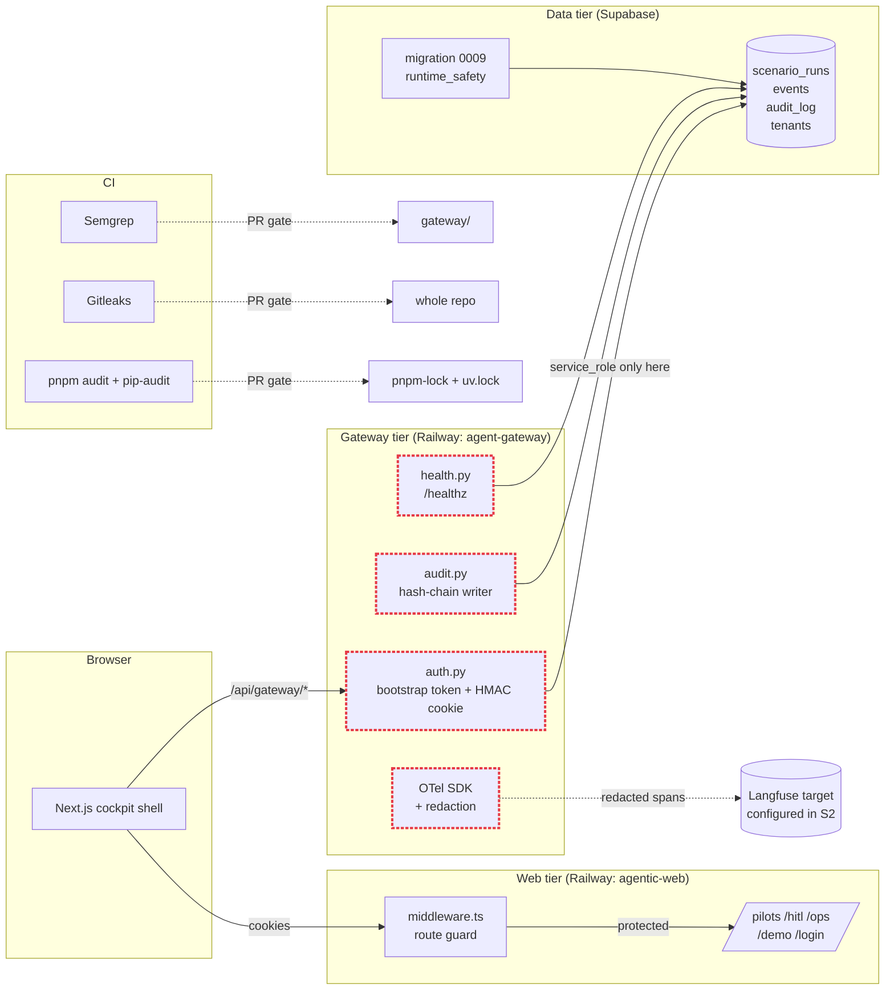

# Sprint 1 — Foundation + Trust Boundary

**Duration:** Weeks 1-2
**Persona promise:** An operator can log into the cockpit shell on staging, and an engineer can verify the gateway trust boundary and first redacted trace.
**Depends on:** Sprint 0 done (`pnpm dev` runs cockpit, CI green, `delete/` archived).

---

## Why This Sprint Exists

Sprint 0 restored a runnable Next.js prototype, but the cockpit still calls Supabase directly with a `service_role` key in the web runtime, which is the most critical security debt in the codebase. There is no Python gateway, no auth perimeter, no audit-chain verification, and no observability. Sprint 1 stands up the **trust boundary** that all subsequent sprints depend on:

- The web tier becomes a thin shell with route protection only.
- A new `gateway/` (FastAPI Python 3.12) becomes the **only** holder of the Supabase service-role key, the only writer to `audit_log`, and the only emitter of OTel traces.
- Migration `0009_runtime_safety.sql` hardens the audit chain (row lock, chain verification function), constrains `orchestrator` enum, adds idempotency keys, and introduces the `failed_sla` status.
- CI gains real security gates (Semgrep, Gitleaks, dependency audit) so we cannot regress.

After this sprint, every new endpoint goes through the gateway, and we have evidence (a redacted Langfuse trace) that the boundary works.

---

## Scope Summary

### In Scope

**Web (Next.js):**
- `RailwayShell` layout with `SidebarNav`, `WorkspaceSwitcher`, top-bar.
- Routes with non-deceptive empty states:
  - `/pilots` — "No pilots yet. Sprint 4 will add creation."
  - `/hitl` — "Queue empty. Connect a pilot in S4."
  - `/ops` — "Ops dashboards land in S5."
  - `/demo` — "Demo replay lands in S6."
  - `/pilots/[id]/experiments` — placeholder.
  - `/login` — bootstrap-token form.
- `middleware.ts` for route protection (cookie-based, redirect to `/login`).
- Security headers: CSP, X-Frame-Options, Referrer-Policy, Permissions-Policy.
- 404, 500, error boundary pages.
- Skip link, ARIA landmarks, visible focus base styles.
- Token contrast audit (record results in `docs/a11y-baseline.md`).

**Gateway (FastAPI Python 3.12, in `gateway/`):**
- `pyproject.toml` (uv-managed), `Dockerfile`, `.python-version`.
- `src/gateway/`:
  - `main.py` — FastAPI app, middleware stack.
  - `tenant.py` — extracts `tenant_id` from cookie/header, fallback `gdai-default` only in dev.
  - `auth.py` — bootstrap-token login, HMAC-signed cookie, rate limit on `/auth/operator-login`.
  - `health.py` — `/healthz` aggregating dependency probes.
  - `audit.py` — append-only writes to `audit_log` with hash-chain.
  - `events.py` — append-only writes to `events` table.
  - `settings.py` — pydantic-settings reading env (no secrets in code).
- Endpoints:
  - `GET /healthz` → `{ ok, deps: { supabase, langflow, n8n } }`.
  - `POST /auth/operator-login` → sets `gdai-session` cookie.
  - `POST /auth/logout` → clears cookie.
  - `GET /version` → git SHA + build time.
- CSRF/origin strategy: same-site cookie + origin allowlist for cookie-backed writes.
- Structured error envelope: `{ code, message, request_id, hint? }`.

**Run-store and DB:**
- Migration `0009_runtime_safety.sql`:
  - Add `failed_sla` to `scenario_runs.status` enum.
  - `CHECK (orchestrator IN ('n8n','langflow'))`.
  - Add missing indexes: `(tenant_id, status)`, `(tenant_id, created_at desc)`.
  - Audit chain hardening: `FOR UPDATE` row lock on tip read, `chain_position bigint` column, `verify_audit_chain(tenant_id)` function returning `(ok bool, broken_at uuid)`.
  - `event_idempotency` table or `events.idempotency_key uuid unique nulls distinct`.
- Refactor `lib/server/run-store.ts` toward append-only event writes (no event delete/reinsert).
- Service-role key removed from Next.js runtime; only set in gateway service environment.
- Document tenant fallback as **dev-only** in `gateway/src/gateway/tenant.py`.

**Observability/Security:**
- OTel SDK initialized in gateway (`opentelemetry-instrumentation-fastapi`).
- Langfuse self-host config target documented in `docs/observability.md` (deployment lands in S2).
- Redaction allowlist module stub at `gateway/src/gateway/redaction.py` with `EMAIL`, `IBAN`, `PHONE`, `CLAIM_ID` patterns.
- CI security jobs (block on PR):
  - **Semgrep** with OWASP rule pack.
  - **Gitleaks** scan on full history.
  - **`pnpm audit --prod`** + **`uv run pip-audit`**.
- React/Next patched versions pinned (`react@19.0.x`, `next@16.x` lockfile).
- Threat-model skeleton at `docs/security/threat-model.md` (STRIDE table for trust boundary).
- Data-flow register skeleton at `docs/security/data-flow.md`.

### Out of Scope

- Langflow runtime (S3).
- n8n migration (S3).
- Real Pilot/HITL UI (S4).
- Full Entra/OIDC (deferred — see CUQ below).
- Langfuse self-host deployment (S2).
- Live trace dashboards (S2).

---

## Implementation Diagram



The dashed red border marks the **trust boundary**: only the gateway holds the Supabase service-role key and writes to `audit_log`. The Next.js tier no longer sees that key after this sprint.

---

## Technical Implementation

### Migration 0009 — Runtime Safety

`db/migrations/0009_runtime_safety.sql`. Idempotent. Apply via `supabase db push`.

```sql
-- 0009_runtime_safety.sql
do $$ begin
  if not exists (select 1 from pg_type t join pg_enum e on t.oid=e.enumtypid
                 where t.typname='scenario_run_status' and e.enumlabel='failed_sla') then
    alter type scenario_run_status add value 'failed_sla';
  end if;
end $$;

alter table scenario_runs
  drop constraint if exists scenario_runs_orchestrator_check,
  add constraint scenario_runs_orchestrator_check
    check (orchestrator in ('n8n','langflow'));

create index if not exists idx_scenario_runs_tenant_status
  on scenario_runs(tenant_id, status);
create index if not exists idx_scenario_runs_tenant_created
  on scenario_runs(tenant_id, created_at desc);

alter table events
  add column if not exists idempotency_key uuid;
create unique index if not exists ux_events_idempotency
  on events(tenant_id, idempotency_key)
  where idempotency_key is not null;

alter table audit_log
  add column if not exists chain_position bigint;

create or replace function verify_audit_chain(p_tenant text)
  returns table(ok boolean, broken_at uuid) language plpgsql as $$
declare prev_hash text; cur record;
begin
  prev_hash := null;
  for cur in
    select id, prev_hash as stored_prev, payload_hash, hash
    from audit_log where tenant_id = p_tenant order by chain_position
  loop
    if (prev_hash is null and cur.stored_prev is not null) or
       (prev_hash is not null and cur.stored_prev <> prev_hash) then
      return query select false, cur.id; return;
    end if;
    prev_hash := cur.hash;
  end loop;
  return query select true, null::uuid;
end $$;
```

### Gateway Auth (bootstrap token)

`gateway/src/gateway/auth.py` — accept `OPERATOR_BOOTSTRAP_TOKEN` env var, exchange for HMAC-signed cookie. Rate limit 5 attempts/minute per IP via `slowapi`.

### Health endpoint

```python
@app.get("/healthz")
async def healthz() -> HealthResponse:
    deps = {
        "supabase": await probe_supabase(),
        "langflow": "not_configured",
        "n8n": "not_configured",
    }
    ok = all(v in ("ok", "not_configured") for v in deps.values())
    return HealthResponse(ok=ok, deps=deps)
```

### Redaction allowlist

`gateway/src/gateway/redaction.py` — regex-based replacement before any span attribute is set. Covered by unit tests with PII fixtures.

---

## Testing Plan

**Unit (Vitest + pytest):**
- `verify_audit_chain` returns `(true, null)` on clean chain.
- Cookie HMAC roundtrip valid; tampered cookie rejected.
- Redaction replaces `EMAIL/IBAN/PHONE` patterns with `<REDACTED:TYPE>`.
- Idempotency key collision returns the existing event, not a duplicate.

**Integration:**
- Apply migration to local Supabase, verify chain function on seeded rows.
- Gateway hits Supabase via service-role; web-tier env has no service-role key (test fails if `SUPABASE_SERVICE_ROLE_KEY` is set in `agentic-web` env).

**Contract:**
- `/healthz` schema: `{ok: bool, deps: {supabase: str, langflow: str, n8n: str}}`.
- `/auth/operator-login` returns 200 + `Set-Cookie`; 429 after 5 failures.

**E2E (Playwright):**
- Logged-out `/pilots` → redirected to `/login`.
- Successful login → returned to `/pilots` with shell rendered.
- Tab-only keyboard reach skip link → main → sidebar → content.

**Failure tests:**
- 5 bad logins → 6th rate-limited (HTTP 429).
- Missing/invalid cookie cannot POST to a write endpoint.
- Cross-origin POST rejected by CSRF/origin guard.
- Tamper one `audit_log` row → `verify_audit_chain` returns `(false, <id>)`.
- Seed a fake AWS key in test fixture branch → Gitleaks blocks PR.

**Lint/typecheck/build:**
- `pnpm lint`, `pnpm typecheck`, `pnpm build` all green.
- `cd gateway && uv run ruff check && uv run mypy && uv run pytest` all green.

---

## Acceptance Criteria

| # | Criterion | Evidence |
|---|---|---|
| AC-01 | Logged-out access to `/pilots` redirects to `/login` | Playwright E2E |
| AC-02 | Login sets HTTP-only cookie and returns to intended route | Playwright E2E |
| AC-03 | Gateway `/healthz` returns the documented JSON shape | Contract test |
| AC-04 | First synthetic gateway request produces a redacted Langfuse/OTel trace | Manual screenshot in PR |
| AC-05 | Semgrep, Gitleaks, dependency audit run in CI | Green CI run on PR |
| AC-06 | `verify_audit_chain('gdai-default')` returns `(true, null)` | psql output |
| AC-07 | No direct service-role key in web runtime | `env | grep` on agentic-web service |
| AC-08 | WCAG baseline: no obvious focus traps; axe smoke on `/login`+`/pilots` | axe-core report |

---

## Sprint Review / Decision Gate

### Demo Script (10 min)

1. Open `/pilots` while logged out → redirected to `/login`. **(persona: operator)**
2. Login with bootstrap token → cockpit shell appears with five routes and empty states.
3. Open `https://gateway.../healthz` in a new tab → show JSON.
4. From a terminal, hit a synthetic gateway endpoint with PII in the body → open Langfuse, show the trace with `<REDACTED:EMAIL>` in span attributes. **(failure path: PII never reaches Langfuse)**
5. Open the latest CI run, show Semgrep / Gitleaks / audit jobs green.
6. In psql, run `select * from verify_audit_chain('gdai-default');` — show `(true, null)`. Then update one row's `payload_hash`, re-run, show `(false, <id>)`.
7. **Decision ask:** Bootstrap token vs Entra/OIDC for G0? Minimum role matrix? Trace-redaction allowlist contents?

### Definition of Done

- All AC-01..AC-08 demonstrated.
- All failure tests green in CI.
- `supabase migration list --linked` shows 0009 applied.
- `docs/refactor_main_v3.md` §12 updated if any decision shifted.
- Threat-model and data-flow register skeletons committed.

### Readiness for Sprint 2

- ✅ Gateway is the only writer to `audit_log` and `events`.
- ✅ Cookie auth works end-to-end.
- ✅ OTel SDK exporting (target Langfuse self-host comes online in S2).
- ✅ CI security gates active.

---

## Critical User Questions / Experiments

- Is bootstrap-token login acceptable for G0 demos, or should Entra/OIDC be pulled into S1?
  - Default: bootstrap token now, Entra/OIDC by S5. Document the choice if it changes.
- What is the minimum role matrix needed before G1 — `operator/viewer/admin/senior-review` or smaller?
- Which trace fields are useful enough to keep after redaction? (proposal: `claim_id` allowed once it's anonymised; `email/iban/phone` always redacted)
- Does the cockpit shell make sense to a non-engineer without explanatory placeholder prose?

---

## What's Deferred to Later Sprints

| Item | Sprint |
|---|---|
| Langfuse self-host deployment | S2 |
| Real Pilot CRUD endpoints | S4 |
| Full Entra/OIDC | S5 |
| Live ops dashboards | S5 |
| 25%+ rollout governance | S5 |

---

## References

- `docs/refactor_main_v3.md` §6 (Sprint 1) and §11 (Railway template).
- `.agents/skills/agentic-cockpit/SKILL.md` — wire format and run-store.
- `.agents/skills/supabase/SKILL.md` — migration discipline.
- `.agents/skills/otel/SKILL.md` — redaction rules.
