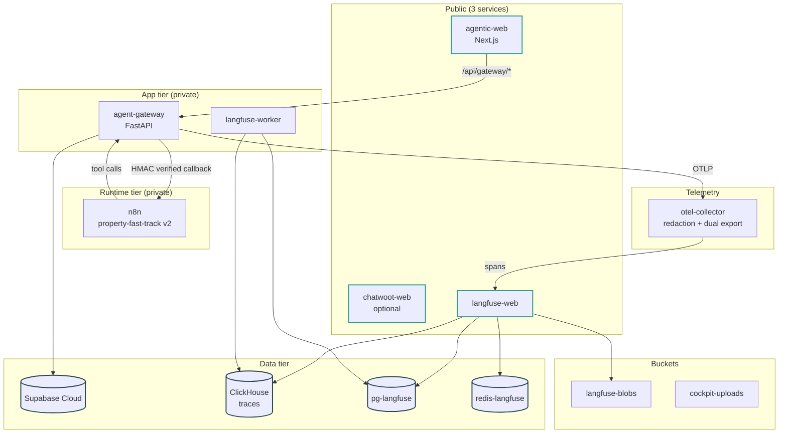

# Sprint 2 — Runtime Estate Landing

**Duration:** Weeks 3-4
**Persona promise:** An admin can verify that the runtime estate is healthy, backed up, observable, and still running the existing n8n path before Langflow is introduced.
**Depends on:** Sprint 1 done (gateway live with auth + audit chain + OTel).

---

## Why This Sprint Exists

Sprint 1 produced a healthy local + staging gateway that talks to Supabase, but every other piece of the 17-service Railway topology is still imaginary. Before we cut traffic to Langflow in Sprint 3 we need a **deployed estate** with: real services, real reference variables, real backups, real metrics, and the legacy n8n property-fast-track path running end-to-end through the new gateway. The "control" path must be solid before we layer the canary.

This sprint deliberately **does not** introduce Langflow runtime traffic. We move HMAC callbacks to the gateway, add dependency-health checks, run a k6 baseline through n8n, and prove the platform is operable.

---

## Scope Summary

### In Scope

**Infrastructure (Railway):**
- Railway project `gdai-cockpit-staging` provisioned.
- `infra/railway.json` template with the S2 subset of the 17-service map:
  - **Public:** `agentic-web`, `chatwoot-web` (optional this sprint, see CUQ).
  - **Private:** `agent-gateway`, `n8n`, `pg-supabase`(reference only — Supabase Cloud), `langfuse-web`, `langfuse-worker`, `clickhouse`, `redis-langfuse`, `redis-chatwoot` (if Chatwoot lands).
  - **Buckets:** `langfuse-blobs`, `cockpit-uploads`.
- Reference variables for private URLs (`${{ Service.RAILWAY_PRIVATE_DOMAIN }}`).
- Health checks on every deployed service.
- Railway runbook (`docs/runbooks/railway-bootstrap.md`) with bootstrap order and rollback.

**Runtime:**
- Keep existing n8n property-fast-track path as **control** (no behaviour change).
- Move HMAC callback handler to the gateway:
  - `POST /callbacks/n8n/{flow}` with HMAC verification, timestamp window check (≤5 min skew), and dedup against `events.idempotency_key`.
- Add dual-write compatibility back to the legacy web route only if measurement shows we still need it (default: cut over).
- Gateway dependency health probes:
  - `supabase` (existing).
  - `n8n` (`GET /healthz` proxy).
  - `langfuse` (`GET /api/public/health`).
  - `otel-collector` (gRPC ping).
  - `chatwoot` (if configured).
- Gateway draining behaviour (SIGTERM → drain in-flight callbacks → exit) where Railway supports it.
- Callback queue / dead-letter table:
  - `db/migrations/0010_callback_queue.sql` adds `callback_queue` (pending/processing/dead) and `callback_dead_letter`.

**Observability:**
- OTel collector deployed (`otel/otel-config.yaml`) with redaction processor and dual exporter (Langfuse OTLP + future Dynatrace).
- Langfuse self-host smoke: tracer can write a span; UI shows it.
- Prometheus/Grafana **or** Railway metrics dashboard baseline (one is enough; pick whichever is faster).
- PostHog flag smoke in **synthetic mode** — flag client wired, evaluation logs only, no real flag yet.

**Backups:**
- Supabase backup runbook (`docs/runbooks/backup-supabase.md`) — daily PITR + on-demand snapshot.
- Railway Postgres (Langfuse + Chatwoot if present) backup scripts in `infra/backup/`.
- ClickHouse backup plan (logical dump to `langfuse-blobs/backups/`).
- Bucket retention policy: 30-day lifecycle on `cockpit-uploads`, 90-day on `langfuse-blobs/backups/`.
- Restore drill **plan** committed (full execution lands in S5/S7).

**Testing:**
- k6 baseline through n8n path at **10 concurrent users**, 5-minute steady, report committed to `infra/perf/k6-s2-baseline.json`.
- Contract tests for gateway health/auth/callback endpoints (pact-style schema tests).
- Webhook signature test harness in `gateway/tests/test_webhook_hmac.py` covering valid, expired, tampered.

### Out of Scope

- Langflow runtime traffic (S3).
- Pilot view (S4).
- Eval CI (S5).
- Builder (S8).
- Full restore drill execution (S5/S7).
- Production-ready Dynatrace exporter (configured but not credentialled).

---

## Implementation Diagram



---

## Technical Implementation

### `infra/railway.json` skeleton

Manifest declares each service with its image/build, env (with `${{ secret(64) }}` for new secrets, `${{ Service.RAILWAY_PRIVATE_DOMAIN }}` for cross-refs), volumes, and healthcheck. See `.agents/skills/railway/SKILL.md` for the canonical pattern.

### HMAC callback handler

`gateway/src/gateway/callbacks/n8n.py`:

```python
@router.post("/callbacks/n8n/{flow}")
async def n8n_callback(flow: str, request: Request, x_signature: str = Header(...),
                       x_timestamp: str = Header(...)) -> dict:
    body = await request.body()
    verify_hmac(body, x_signature, x_timestamp, settings.N8N_HMAC_SECRET, max_skew=300)
    idem_key = uuid.UUID(request.headers["X-Idempotency-Key"])
    if await events.exists(idempotency_key=idem_key):
        return {"deduped": True}
    await events.append(...)  # one row, atomic
    return {"ok": True}
```

`verify_hmac` checks timestamp window first, then constant-time HMAC compare. Rejected signatures write an `audit_log` row tagged `WEBHOOK_REJECTED`.

### Migration 0010 — callback queue

```sql
create table if not exists callback_queue (
  id uuid primary key default gen_random_uuid(),
  tenant_id text not null references tenants(id),
  source text not null,
  payload jsonb not null,
  status text not null default 'pending'
    check (status in ('pending','processing','done','dead')),
  attempts int not null default 0,
  next_attempt_at timestamptz default now(),
  created_at timestamptz default now()
);
create index if not exists idx_callback_queue_ready
  on callback_queue(status, next_attempt_at) where status = 'pending';

create table if not exists callback_dead_letter as
  select * from callback_queue where false;
```

### OTel collector config (`otel/otel-config.yaml`)

Pipeline: `receivers: [otlp]` → `processors: [redaction, batch]` → `exporters: [otlphttp/langfuse, otlphttp/dynatrace]`. Redaction processor enforces the allowlist from S1.

---

## Testing Plan

**Unit:**
- HMAC verification: valid, expired (>5 min), tampered body, tampered timestamp.
- Idempotency dedup returns `{deduped: true}` for repeat key.
- Health probe degradation: n8n returns 503 → `/healthz.deps.n8n == "degraded"`.

**Integration:**
- Apply migration 0010, insert one callback, claim it, mark done.
- Trigger `wf002v2` from staging, walk callback through gateway, see one (and only one) `events` row.

**Contract:**
- `/healthz` shape unchanged from S1, dep set expanded.
- `/callbacks/n8n/{flow}` returns 200/`{ok:true}` on first call, 200/`{deduped:true}` on replay, 401 on bad HMAC, 400 on stale timestamp.

**Performance (k6):**
- 10 VUs, 5 min ramp, property-fast-track via n8n. Report p50, p95, p99 latency, error rate. Commit JSON.

**Failure tests:**
- Stop n8n service in Railway → `/healthz.deps.n8n` becomes `degraded` within 30 s, recovers on restart.
- Replay same callback (same idempotency key) twice → only one state transition.
- Tampered HMAC → 401 + `audit_log.WEBHOOK_REJECTED` row.
- Stale timestamp (10 min old) → 400 + audit row.
- Backup script with missing creds → exits non-zero with clear stderr (no silent skip).

---

## Acceptance Criteria

| # | Criterion | Evidence |
|---|---|---|
| AC-01 | All S2 services `Active` with healthchecks green | `railway service status --all --json` |
| AC-02 | Gateway `/healthz` reports degradation accurately | Manual probe + screenshot |
| AC-03 | n8n property-fast-track control path completes end-to-end | One full run trace in Langfuse |
| AC-04 | HMAC callback through gateway writes one event + one audit row | psql query result |
| AC-05 | OTel redaction test passes with email/IBAN/phone fixtures | pytest output |
| AC-06 | k6 n8n baseline report committed | `infra/perf/k6-s2-baseline.json` exists |
| AC-07 | Backup scripts run in dry-run mode | runbook execution log |
| AC-08 | Langfuse UI shows traces with redacted attributes | screenshot |

---

## Sprint Review / Decision Gate

### Demo Script (12 min)

1. Open Grafana / Railway metrics dashboard. **(persona: ops engineer)**
2. Trigger property-fast-track via existing n8n path through cockpit (or curl the gateway).
3. Open the resulting Langfuse trace; show `orchestrator=n8n:wf002v2` and redacted attributes.
4. In Railway dashboard, stop the n8n service. Refresh `/healthz` and watch `n8n: degraded` appear within 30 s. Restart it. Watch recovery.
5. Replay the last webhook (re-curl with same `X-Idempotency-Key`); show `{deduped: true}` and only one event row in psql.
6. Show the k6 baseline JSON and the dry-run output of the Supabase backup script.
7. **Decision ask:** Is 17-service isolation acceptable for MVP budget, or test 14-service cost-down? Which alerts page a human vs only show in Ops? Does Chatwoot belong in this estate now, or wait for S4 HITL UI?

### Definition of Done

- All AC-01..AC-08 demonstrated.
- All failure tests green in CI.
- Migrations local == remote (`supabase migration list --linked`).
- Runbooks committed: `railway-bootstrap.md`, `backup-supabase.md`, restore plan.
- `docs/refactor_main_v3.md` §12 updated for any topology choice that drifts from the canonical 17-service map.

### Readiness for Sprint 3 (Langflow Cutover Canary)

- ✅ Gateway-mediated callbacks are the only path n8n uses to write back state.
- ✅ Dependency health surfaces tell us when Langflow can come online.
- ✅ Idempotency keys flow through events — pre-requisite for the S3 step-idempotency proof.
- ✅ k6 baseline gives us the comparison number for "Langflow p95 ≤ 2× n8n p95".

---

## Critical User Questions / Experiments

- Is 17-service isolation acceptable for MVP budget and operations, or should a 14-service cost-down topology be tested?
  - Default: ship the canonical 17-service plan. Cost-down decision deferred to G1 readiness review.
- Which alerts should page a human vs only appear in Ops?
- Does Chatwoot belong in the first staging estate, or can in-cockpit HITL lead until S4?
  - Default: Chatwoot stub-only this sprint; full deploy in S4 alongside HITL UI.

---

## What's Deferred

| Item | Sprint |
|---|---|
| Langflow runtime + flows | S3 |
| Real Pilot UI | S4 |
| Live ops charts and dead-letter replay UI | S5 |
| Restore drill execution (full) | S5/S7 |
| 50/200 user load tests | S5/S7 |
| Dynatrace exporter credentials | Post-G1 |

---

## References

- `docs/refactor_main_v3.md` §6 (Sprint 2), §11 (Railway template).
- `.agents/skills/railway/SKILL.md`.
- `.agents/skills/otel/SKILL.md`.
- `.agents/skills/langfuse/SKILL.md`.
