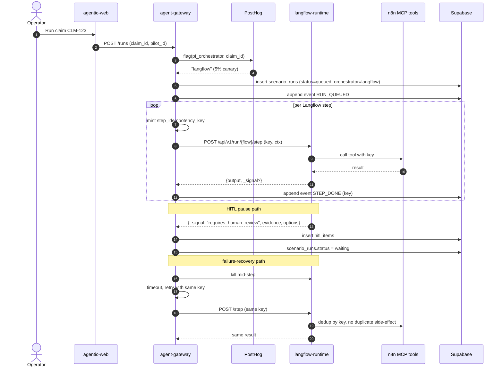

# Sprint 3 — Langflow Cutover Canary

**Duration:** Weeks 5-6
**Persona promise:** The same property-fast-track journey can run through Langflow safely, with rollback, checkpoint proof, and no duplicate side effects.
**Depends on:** Sprint 2 (estate live, n8n path is the control, k6 baseline committed).

---

## Why This Sprint Exists

Sprint 2 proved we can run the property-fast-track journey through n8n end-to-end with audit, redaction, and idempotency. Sprint 3 is the **first time Langflow sees real traffic** — but only behind a feature flag at ≤ 5%. The two questions this sprint answers:

1. **Can the gateway-owned durable FSM survive Langflow being restarted mid-step without producing duplicate side effects?** (the step-idempotency proof — replaces the obsolete checkpoint spike)
2. **Which HITL signal pattern, triage model, and session-context approach should ship as the production default?** Each is genuinely uncertain, so we deliver **two implementations side by side** for each spike and let the user pick at the review.

Out of bounds: 25%+ rollout. That requires Eval CI (S5).

---

## Scope Summary

### In Scope

**Langflow flow + prompts:**
- `flows/property-fast-track.json` authored from the v2 n8n node graph. Each node is a **single short stateless step** (see §15 of refactor_main_v3.md).
- Prompt files in `prompts/property-fast-track/`:
  - `triage-preflight.txt`
  - `reserve-gate.txt`
  - `document-extract.txt`
  - `document-review.txt`
  - `dispatch-prep.txt`
  - `dispatch-confirm.txt`
- Prompt registry endpoint in gateway: `GET /prompts/{name}/{version}` returning `(text, sha256)`. Langflow flows fetch by version, not floating tag.
- Langflow API key/auth enabled (`LANGFLOW_AUTH_AUTO_LOGIN=false`).
- Flow deployment via `lfx push` in CI **or** documented manual bootstrap (`docs/runbooks/langflow-deploy.md`).

**Gateway orchestration:**
- `gateway/src/gateway/runs.py` — `create_run`, `cancel_run`, `resume_run`. Owns the FSM `queued → running → (waiting → running)* → (completed | failed | failed_sla)`.
- `gateway/src/gateway/clients/langflow_client.py` — wraps `POST /api/v1/run/{flow_id}` with timeout, retry, and idempotency-key forwarding.
- `gateway/src/gateway/clients/n8n.py` — MCP proxy. All side-effecting tool calls receive `step_idempotency_key` header.
- `gateway/src/gateway/posthog_flags.py` — server-side flag selection. Sticky per `claim_id`. Deterministic fallback to `n8n` when PostHog unavailable.
- `gateway/src/gateway/hitl.py` — durable ReserveGate bridge. Reads `_signal: "requires_human_review"` from Langflow step output, writes `hitl_items` row, suspends the run. Resume = next-step invocation by gateway with full context restored.
- `gateway/src/gateway/events.py` — append-only events with idempotency keys (extended from S1).
- MCP timeout/retry/circuit breaker (per-tool budgets in `gateway/src/gateway/clients/policy.py`).
- Pydantic schemas for every MCP tool response. Schema mismatch → `failed` with explicit event, not silent.
- Idempotency around every side-effecting tool call.

**Rollout:**
- PostHog flag `pf_orchestrator`:
  - default `n8n`
  - `langflow` for explicit forced-session header (dev/QA)
  - **5% max** by end of sprint, sticky per `claim_id`.
- Auto-rollback rule: if Langflow error rate > 5× n8n baseline for 10 min → flag flips back to 100% n8n + audit event. (Manual override only.)
- No 25% rollout until S5 Eval CI is green.

**Durability — the step-idempotency proof:**
- Each Langflow flow node is one short stateless step.
- Gateway issues `step_idempotency_key` per step and forwards it to all MCP calls.
- **Test scenario:** kill Langflow mid-step (during `DocumentExtract`); gateway times out, retries with same key, expects no duplicate n8n vendor call, no double LLM charge, no second `hitl_item`.
- **50 trials** required before flag enablement at 5%.
- No native Langflow pause/resume. Resume is the next-step invocation by the gateway.

### A/B Spikes (deliver both, demo at review — DO NOT pre-decide)

| # | Spike | Option A | Option B | Decision criterion |
|---|---|---|---|---|
| 1 | HITL signal pattern | Custom `RequiresHumanReview` component (`HitlGate`) emitting `{_signal, evidence, options, sla_deadline}` | Built-in `StructuredOutput` component returning a JSON contract `{requires_review: bool, ...}` parsed by gateway | Reliability across model swaps + author ergonomics in Langflow canvas |
| 2 | Triage model choice | `gemini-2.5-flash` (fast, cheap; needs StructuredOutput guard for hallucination) | `gpt-4o` and `claude-sonnet-4-6` baseline (slower, costlier; accuracy unknown until measured) | Hallucination rate on 50-claim golden set; cost/latency budget |
| 3 | Session context | Implicit Agent conversation memory (works per experiment) | Explicit `Message History` built-in component (more controllable; not yet validated) | Deterministic replay + clean Langfuse traces |

For each spike: small flow per option, golden-set run, side-by-side Langfuse trace screenshots, **1-page recommendation memo** in `docs/spikes/s3-XX.md`. **No silent default.**

### Out of Scope

- 25% or 100% rollout (S5+).
- Real pilot UI (S4).
- Full Eval CI (S5).
- Parallel-execution optimisations (post-G1).
- Motor-fleet (S7).

---

## Implementation Diagram



---

## Technical Implementation

### Step idempotency

Every gateway → Langflow step call carries headers:

```
X-Step-Idempotency-Key: <uuid v4 deterministic per (run_id, step_index, attempt_seed)>
X-Run-Id: <uuid>
X-Step-Index: <int>
```

The gateway derives `step_idempotency_key = sha256(run_id || step_index || attempt_seed)[0:16]` once and reuses it across retries. n8n MCP tools dedup on this key in `events.idempotency_key`.

### HITL bridge (Option A — `RequiresHumanReview` component)

Custom Langflow component emits structured signal. Gateway parses:

```python
def maybe_pause(step_output: dict, run_id: UUID, step_index: int):
    if step_output.get("_signal") != "requires_human_review":
        return None
    return hitl.create_pause(
        run_id=run_id,
        step_index=step_index,
        evidence=step_output["evidence"],
        options=step_output["options"],
        sla_deadline=step_output["sla_deadline"],
    )
```

### HITL bridge (Option B — `StructuredOutput` parsing)

Built-in Langflow `StructuredOutput` returns:

```json
{ "requires_review": true, "evidence": {...}, "options": [...], "sla_deadline": "..." }
```

Gateway parses with a Pydantic model. Same `hitl.create_pause` outcome, different signal contract.

Both options must pass the same failure tests (mismatched schema, missing fields, model swap from `gemini-2.5-flash` to `gpt-4o`).

### Auto-rollback

`gateway/src/gateway/rollout/auto_rollback.py` polls error-rate every 60 s. If `langflow_error_rate / n8n_baseline > 5` for 10 consecutive samples, posts to PostHog admin API to set rollout to 0%, writes `audit_log.AUTO_ROLLBACK`.

---

## Testing Plan

**Unit:**
- Step-idempotency-key derivation is stable across attempts.
- Pydantic schemas reject malformed MCP responses.
- Auto-rollback trigger arithmetic.

**Integration:**
- 50-trial kill-and-retry loop on `DocumentExtract` step. Assert: 0 duplicate vendor calls, 0 duplicate LLM spend, 0 duplicate `hitl_items`.
- HITL pause and resume preserves full step context across gateway restart.
- Flag client falls back to `n8n` when PostHog returns 5xx (deterministic).

**Contract:**
- Prompt registry: `GET /prompts/triage-preflight/v1` returns `{text, sha256}`.
- Langflow client: timeout → retry → circuit open after N failures → recovery on probe success.

**Performance:**
- Forced-Langflow run completes end-to-end on synthetic claim.
- Langflow p95 latency ≤ 2× n8n S2 baseline (or remediation plan).

**Failure tests:**
- n8n MCP router returns 500 → retry/circuit behaviour observed.
- MCP response schema mismatch → rejected, retried or failed with clear event.
- Langflow unavailable → new runs stay on n8n or queue per flag state.
- PostHog unavailable → deterministic fallback to `n8n`.
- Duplicate HITL approval → ignored after first accepted decision (idempotent).
- LLM hallucination on triage step (forced via fault-injection prompt) → StructuredOutput rejection caught, run flagged for HITL.

---

## Acceptance Criteria

| # | Criterion | Evidence |
|---|---|---|
| AC-01 | Forced Langflow run completes end-to-end | Langfuse trace + run row |
| AC-02 | Langfuse trace shows named nodes and child MCP spans | Screenshot |
| AC-03 | ReserveGate pauses and resumes via gateway | hitl_items row + resume event |
| AC-04 | Killing Langflow at ReserveGate and mid-DocumentExtract: gateway retries with idempotency key; **0 duplicate external effects across 50 trials** | Test report committed |
| AC-05 | Broken MCP router opens circuit and recovers | Failure-test log |
| AC-06 | Langflow p95 ≤ 2× n8n p95 baseline OR explicit remediation plan exists | k6 comparison |
| AC-07 | Both A/B spikes deliver working flows + recommendation memos | `docs/spikes/s3-*.md` |
| AC-08 | 5% rollout enabled only after AC-01..AC-07 + user picks for each spike at review | PR + audit row |

---

## Sprint Review / Decision Gate

### Demo Script (15 min)

1. Start a Langflow-forced property run. **(persona: ops engineer / pilot owner)**
2. Show the Langfuse trace event stream — named nodes, MCP child spans.
3. Pause at ReserveGate via the HITL signal pattern (show whichever Option you'll demo first).
4. Kill the Langflow service mid-DocumentExtract. Show gateway timeout, retry with same `X-Step-Idempotency-Key`, and one final result. Then `select count(*) from events where idempotency_key = '...'` → 1.
5. Compare side-by-side one n8n trace and one Langflow trace.
6. Break one MCP router (set `n8n_url` to a sink). Show circuit-breaker open in `/healthz`, other tools still functional.
7. **A/B presentation** — for each of 3 spikes:
   - Option A flow + Langfuse trace.
   - Option B flow + Langfuse trace.
   - Hallucination rate / cost / latency table.
   - Recommendation memo.
   - **Operator picks the production default. No silent default.**
8. **Decision ask:** Approve picks for HITL signal, triage model, session context? Approve flag enablement at 5%?

### Definition of Done

- All AC-01..AC-08 demonstrated.
- 3 spike memos committed.
- Migrations local == remote.
- `pf_orchestrator` flag exists in PostHog with safety guards (max 5%, auto-rollback rule active).
- `docs/refactor_main_v3.md` §9 updated to lock the chosen options.

### Readiness for Sprint 4 (Pilot + HITL Product Surface)

- ✅ Gateway can drive a complete claim through Langflow.
- ✅ HITL signal contract is locked.
- ✅ Step-idempotency proven empirically.
- ✅ Flag client + auto-rollback ready to gate pilot UI exposure.

---

## Critical User Questions / Experiments

- Does Langflow create visible product/operator value, or only platform optionality?
- Which node failures should auto-retry vs require HITL?
- Acceptable latency penalty for better observability/control flow?
- Prompt registry runtime fetching vs CI-bundled immutable artifacts? (proposal: bundle for prod, registry for dev/QA)
- HITL signal: custom component vs StructuredOutput — which is more robust under model changes?
- Triage model: which gives best accuracy/cost/latency at G1?

---

## What's Deferred

| Item | Sprint |
|---|---|
| Real pilot UI (`/pilots/[id]`, MetroCanvas live, HitlInlineCard) | S4 |
| Eval CI + golden dataset | S5 |
| 25%+ rollout governance | S5 |
| Demo replayer + narration | S6 |
| Motor-fleet pilot | S7 |

---

## References

- `docs/refactor_main_v3.md` §6 (Sprint 3), §15 (durability architecture).
- `.agents/skills/langflow/runtime/SKILL.md`.
- `.agents/skills/langflow/hitl-resume/SKILL.md`.
- `.agents/skills/langflow/flows-api/SKILL.md`.
- `.agents/skills/posthog/SKILL.md`.
- `.agents/skills/n8n/n8n-mcp-tools-expert/SKILL.md`.
