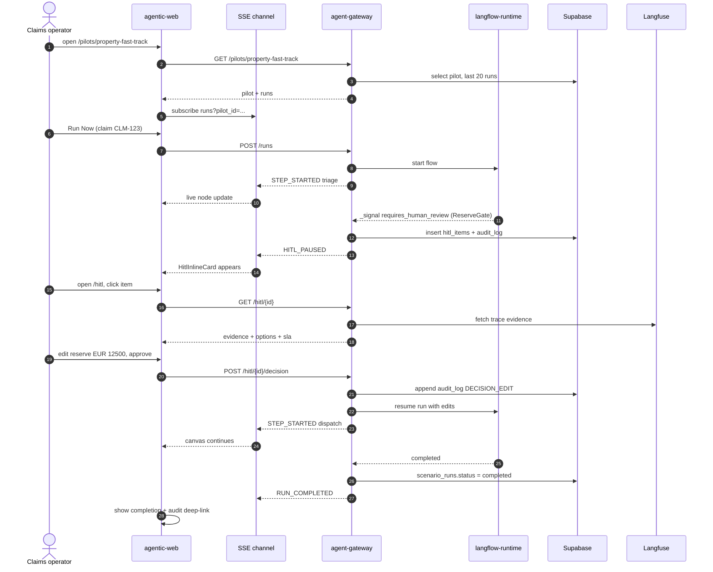

# Sprint 4 — Pilot + HITL Product Surface

**Duration:** Weeks 7-8
**Persona promise:** A claims operator can create/open a pilot, run a claim, inspect evidence, approve/edit/reject a HITL decision, and see an audit confirmation.
**Depends on:** Sprint 3 (Langflow cutover canary done; HITL signal contract locked; step-idempotency proven).

---

## Why This Sprint Exists

Sprint 3 made the platform technically capable of running claims end-to-end through Langflow with HITL pause/resume — but only via curl and Langfuse. Sprint 4 is the **first sprint a non-engineer can use**. Real claims operators need to: see pilots, click "Run Now", watch a live MetroCanvas as steps execute, get the HITL inline card when a decision is required, and resolve it with full evidence. Without this, all the runtime work in S3 is invisible.

This sprint also locks **WCAG 2.1 AA** as a hard gate for every UI route added now or later — the cockpit must be operable by keyboard alone and pass an axe-core scan with zero critical violations.

---

## Scope Summary

### In Scope

**Routes:**
- `/pilots` — list of pilots (cards), create pilot button (admin role only).
- `/pilots/[pilotId]` — pilot detail, last 20 runs, MetroCanvas live mode, KPI strip, "Run Now" CTA.
- `/hitl` — queue table for the operator: `received_at`, `claim_id`, `pilot`, `sla_remaining`, `priority`, `assigned_to`.
- `/hitl/[itemId]` (via drawer or page) — full evidence, options, decision form, audit summary.
- Legacy `/scenario/[scenarioKey]` redirect to `/pilots/[pilotId]?run=...`.

**Components (in `components/`):**
- `PilotCard`, `PilotForm` (create/edit).
- `KPIStrip` — runs/min, p95 latency, error rate, HITL pending count.
- `VariantBadge`, `CohortBadge` — surfaces PostHog flag selection.
- `MetroCanvas` **live mode** — SVG node graph, accepts SSE updates, keyboard-navigable.
- `TraceTree`, `TraceSpan` — collapsible Langfuse trace view, deep-link to Langfuse.
- `HitlInlineCard` — appears on pilot detail when a HITL is pending for that run.
- `HitlQueueTable` — virtualised list, priority sort.
- `HitlDetail` — evidence panel + decision form (approve / edit / reject + required reason).
- `SlaTimer` — countdown, colour shifts at 50% / 80%.
- `CostBadge`, `LatencyBadge` — right-aligned chips.
- Skeletons + empty states for every loading/empty path.

**Gateway endpoints:**
- `POST /pilots` (admin), `GET /pilots`, `GET /pilots/{id}`, `PATCH /pilots/{id}`.
- `GET /hitl?status=pending&pilot=...` with priority sort.
- `GET /hitl/{id}` — full evidence + audit context.
- `POST /hitl/{id}/decision` — `{decision: approve|edit|reject, reason, edits?}` writes `audit_log` + resumes Langflow run via `gateway.runs.resume`.
- **True SSE stream** — `GET /streams/runs?pilot_id=...`:
  - Single connection per browser tab.
  - Run-ID multiplexing (one connection, many run topics).
  - Heartbeat every 15 s.
  - Backoff reconnect on the client.
  - **5 s polling fallback** when SSE unavailable.

**Accessibility (HARD GATE for this sprint and forward):**
- WCAG 2.1 AA on every new route.
- Keyboard navigation for `MetroCanvas` (arrow keys to move focus between nodes, Enter to open span detail).
- `aria-live="polite"` for run/HITL updates.
- Non-color-only status labels (icon + text + colour).
- Mobile drawer < 920 px viewport.
- iPad landscape usability target (1024×768).
- Axe-core CI job blocks PR on any **critical** violation.

**Data:**
- "Save as canonical demo run" button on `/pilots/[id]?run=...`. Writes `scenarios_demo.seed_run_id` for use in S6 replayer.
- Audit-chain migration **must be active** before any HITL decision counts as done — verified in test setup.

### Out of Scope

- Ops charts / dashboards (S5).
- Eval CI (S5).
- Demo narration / replayer (S6).
- Motor-fleet pilot (S7).
- Senior-review role (CUQ; default to single `operator` role for MVP).

---

## Implementation Diagram



---

## Technical Implementation

### SSE channel design

Single connection. Server sends events of shape:

```
event: run.step.started
data: {"run_id":"...","step":"triage","at":"2026-..."}

event: hitl.paused
data: {"run_id":"...","item_id":"...","sla_deadline":"..."}
```

Client library (`lib/client/sse.ts`) holds one `EventSource`, multiplexes by `run_id`, exposes `subscribeToRun(id)` returning observable. Reconnect backoff: 1 s → 2 → 4 → 8 → max 30 s. After 3 failed reconnects, switches to 5 s polling against `GET /runs/{id}/events?since=...`.

### HITL decision endpoint

```python
@router.post("/hitl/{item_id}/decision")
async def hitl_decide(item_id: UUID, body: DecisionBody, op: Operator = Depends(current_op)):
    item = await hitl.get(item_id, tenant=op.tenant)
    if item.status != "pending":
        raise HTTPException(409, "already-resolved")
    async with hitl.lock(item_id):  # advisory lock
        await audit.append(kind=f"DECISION_{body.decision.upper()}",
                            actor=op.id, payload={"reason": body.reason, "edits": body.edits})
        await hitl.resolve(item_id, body)
        await runs.resume(item.run_id, with_edits=body.edits)
    return {"ok": True}
```

The advisory lock guarantees the "two operators decide the same item, one wins" failure test.

### Canonical snapshot

Button on the run detail panel calls `POST /scenarios/demo/canonicalize` with `{run_id}`. Writes `scenarios_demo.seed_run_id = <run_id>` (insert or update by `(tenant_id, scenario_key)`).

---

## Testing Plan

**Unit:**
- SSE multiplex: messages for run A do not surface on run-B subscriber.
- HITL decision rejects when item already resolved.
- Sla timer crosses thresholds at 50% / 80%.
- KPI strip aggregates correctly across 0, 1, many runs.

**Integration:**
- Operator login → create pilot → run claim → reach HITL → decide → run completes.
- Audit chain: every decision produces a row; `verify_audit_chain` returns clean.

**Contract:**
- `/streams/runs` payload schemas for every event type.
- `/hitl/{id}/decision` returns 409 on duplicate decide, 401 unauthenticated, 422 on missing reason.

**E2E (Playwright):**
- Full happy path including SSE updates.
- Mobile (375 px) drawer opens, no focus trap.
- Keyboard-only operator reaches Run Now, opens HITL, decides.

**Failure tests:**
- Gateway restarts during a run → client shows `reconnecting` and resumes.
- Force SSE 5xx → fallback polling activates within 10 s.
- Empty HITL queue shows useful empty state with CTA.
- Missing trace → `TraceTree` shows recoverable empty state, not blank UI.
- Two operators decide same HITL item → one wins, second sees `409 already-resolved`.
- Mobile drawer: open/close + escape, no focus trap.

**Accessibility:**
- Axe-core scan on all new routes — **0 critical** violations (CI gate).
- Keyboard-only test recorded as Playwright trace.

---

## Acceptance Criteria

| # | Criterion | Evidence |
|---|---|---|
| AC-01 | Operator can create a pilot and run property-fast-track | E2E |
| AC-02 | MetroCanvas live mode updates as steps progress | Demo screenshot |
| AC-03 | TraceTree updates live with new spans | Demo screenshot |
| AC-04 | HITL queue shows the pending item with priority | E2E |
| AC-05 | Operator can approve, edit, and reject in separate test cases | 3 separate E2E |
| AC-06 | Audit row exists for every decision with reason | psql query |
| AC-07 | Canonical snapshot writes `scenarios_demo.seed_run_id` | Demo + DB row |
| AC-08 | Axe reports zero critical violations on sprint routes | CI artifact |
| AC-09 | Keyboard-only user can reach and operate core actions | Playwright trace |

---

## Sprint Review / Decision Gate

### Demo Script (15 min)

1. **(persona: claims operator)** Login. Open `/pilots`. Create or open Property Fast Track pilot.
2. Click **Run Now**. Watch the MetroCanvas light up step by step. TraceTree on the right populates live.
3. Run pauses at ReserveGate. `HitlInlineCard` shows on the pilot detail.
4. Open `/hitl`. Item is at the top with SLA timer. Click it.
5. Inspect evidence panel (synthetic claim, photos, telematics if applicable).
6. Edit reserve from EUR 9 800 → EUR 12 500, write reason "vehicle damage exceeds initial estimate", approve.
7. Return to pilot view. Canvas resumes. Run completes.
8. Click trace deep-link → Langfuse opens with the full trace.
9. In psql: `select kind, payload->>'reason' from audit_log where run_id = '...' order by chain_position;` → expected sequence.
10. Click **Save as canonical**. Show row in `scenarios_demo`.
11. Tab through the entire flow with keyboard only. **(failure path: a11y)**
12. **Decision ask:** Can an operator decide an HITL in <60 s? Is evidence sufficient? Should edit/reject require senior-review now or later?

### Definition of Done

- All AC-01..AC-09 demonstrated.
- All failure tests green in CI.
- Axe job blocking on `main` branch.
- Migrations local == remote.
- `docs/refactor_main_v3.md` §12 updated.

### Readiness for Sprint 5 (Ops + Eval Control Loop)

- ✅ A canonical S4 snapshot exists for S6 demo replay.
- ✅ Live SSE proven under restart / fallback.
- ✅ HITL contract end-to-end → can be load-tested in S5.
- ✅ Decision audit rows feed S7 audit-bundle generator.

---

## Critical User Questions / Experiments

- Can an operator make a confident HITL decision in under 60 seconds?
- What evidence is missing from `HitlDetail` for a real claims handler?
- Are edit/reject decisions too permissive without a senior-review role?
- Does the canvas help decision-making, or is it mostly executive theatre?

---

## What's Deferred

| Item | Sprint |
|---|---|
| Live ops dashboards, dead-letter replay UI | S5 |
| Eval CI / golden dataset | S5 |
| Demo narration | S6 |
| Experiment view (`/pilots/[id]/experiments`) full functionality | S6 |
| Motor-fleet pilot | S7 |
| Senior-review role | post-G1 |

---

## References

- `docs/refactor_main_v3.md` §6 (Sprint 4).
- `.agents/skills/agentic-cockpit/SKILL.md` — wire format + scenario state machine.
- `.agents/skills/chatwoot/SKILL.md` — handover packet (used in Chatwoot bridge).
- `.agents/skills/langflow/hitl-resume/SKILL.md`.
