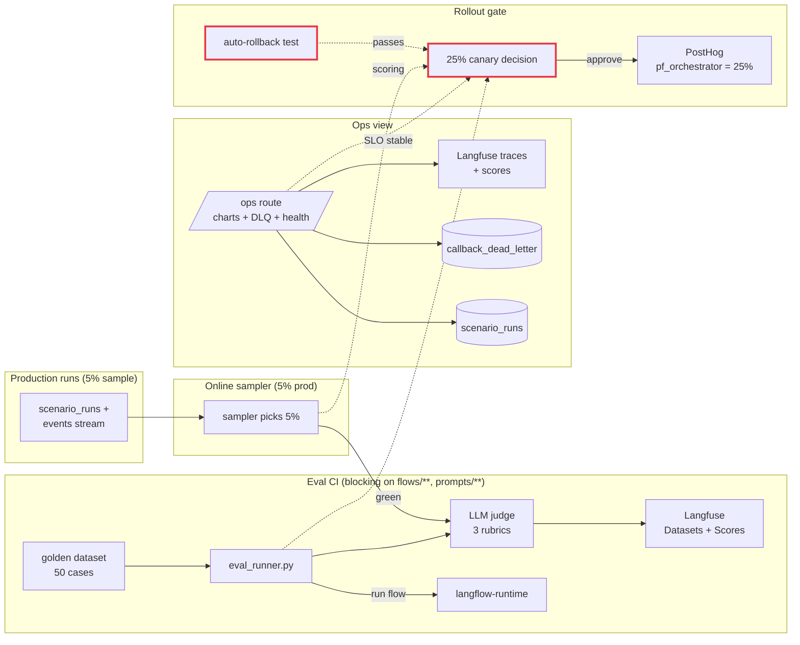

# Sprint 5 — Ops + Eval Control Loop

**Duration:** Weeks 9-10
**Persona promise:** An ops/admin user can detect degraded quality, latency, and runtime health before customers or demo stakeholders do.
**Depends on:** Sprint 4 (HITL UI live, canonical snapshot exists).

---

## Why This Sprint Exists

Sprint 4 made the platform usable; Sprint 5 makes it **operable and evaluable**. Without Eval CI we cannot promote past 5% canary — so this sprint is the gate that unlocks the 25% rollout. Without an Ops view we cannot detect a regression before it reaches stakeholders. Without dead-letter replay we cannot recover gracefully from transient n8n / Langflow failures.

The control loop has three feedback paths: **Ops dashboards** (live signal), **Eval CI** (offline regression catch), and **Online eval sampler** (5% production scoring). All three must work before the 25% canary decision.

---

## Scope Summary

### In Scope

**Ops:**
- `/ops` route (admin/ops role only).
- Live run table/tail with status, orchestrator, p95 step latency, cost, error rate.
- `MetroCanvas` ops mode — same component as S4 but reads aggregate KPIs across active runs.
- Dependency health panel — reuses gateway `/healthz` data; colour-coded badges; click-to-expand.
- Charts (no narrative styling — engineering-grade): error rate, p95 latency, cost/hour, runs/min.
- **Dead-letter queue** list (from `callback_dead_letter`); replay button writes audit + re-enqueues. **Authorization required** (operator+admin only).
- Notification center — list of severity-tagged events (silenced/ack/open).
- Settings shell — notification preferences (per-user), API token visibility (redacted), pilot-level threshold overrides.

**Eval:**
- Golden dataset for property-fast-track in `gateway/eval/datasets/property-fast-track-v1.jsonl` (50 cases, synthetic).
- Three rubrics in `gateway/eval/rubrics/`:
  - `factual-accuracy.md`
  - `policy-compliance.md`
  - `tone.md`
- Eval runner: `gateway/scripts/eval_runner.py` — runs flow against dataset, calls LLM-judge, posts scores to Langfuse Datasets + Scores.
- CI workflow `.github/workflows/eval.yml` triggered on changes to `flows/**`, `prompts/**`, `gateway/eval/**`. Blocking.
- **Bad-prompt fixture PR** must fail CI (negative-control test in CI itself).
- Online eval sampler at **5%** of production runs (configurable).

**Rollout:**
- 25% canary eligibility unlocked **only after**:
  - Eval CI green on `main`.
  - Online sampler is writing scores.
  - Latency/error SLOs stable for 3 consecutive days.
  - Rollback test successful (auto-rollback fires on injected failure).
- Decision record stored in `docs/decisions/2026-XX-25pct-canary.md`.

**Performance:**
- 50-VU k6 test against the **Langflow** path (n8n control test from S2 still passes).
- Langflow checkpoint stress test: 100 concurrent HITL pauses, all resume cleanly.
- Gateway degradation behaviour: drop one dependency, gateway returns structured-error responses with `Retry-After`.

**Runbooks:**
- `docs/runbooks/incident-response.md` — severity matrix, on-call expectations, page/no-page rules.
- `docs/runbooks/restore-drill-execution.md` — full restore drill report from a real exercise.
- `docs/policy/data-retention-draft.md` — first cut, not yet applied.

### Out of Scope

- Executive demo narration (S6).
- Motor-fleet pilot (S7).
- Builder (S8).
- 100% rollout unless 7-day window has elapsed at 25% with green metrics (governance, not engineering).

---

## Implementation Diagram



---

## Technical Implementation

### Eval CI (`.github/workflows/eval.yml`)

Triggered on `pull_request` paths-filter for `flows/**`, `prompts/**`, `gateway/eval/**`.

```yaml
- name: Run flow evals
  run: cd gateway && uv run python scripts/eval_runner.py \
        --flow property-fast-track \
        --dataset eval/datasets/property-fast-track-v1.jsonl \
        --thresholds eval/thresholds.yaml
```

`eval/thresholds.yaml` defines per-rubric pass thresholds (e.g. `factual_accuracy >= 0.85`). Runner exits non-zero if any rubric drops more than the regression band vs the last green main.

The bad-prompt fixture branch (`test/eval-bad-prompt`) must remain red. CI has a `negative-control` job that asserts that branch's eval status is failing — meta-test.

### Online sampler

`gateway/src/gateway/eval/sampler.py` — every completed run is sampled with probability 5%. Sampled runs enqueue to Langfuse Async Worker which calls the same LLM-judge functions and writes scores back to `scenario_runs.eval_scores` + Langfuse Score API.

### Dead-letter replay UI

```python
@router.post("/dlq/{id}/replay")
async def replay_dlq(id: UUID, op: Operator = Depends(require_role("ops"))):
    item = await dlq.get(id, tenant=op.tenant)
    await audit.append(kind="DLQ_REPLAY", actor=op.id, payload={"dlq_id": str(id)})
    await callback_queue.enqueue(item.payload, source=item.source)
    await dlq.mark_replayed(id, by=op.id)
    return {"ok": True}
```

Replay button on `/ops` calls this. RBAC enforced server-side. Failure tests cover unauthorized replay.

### Auto-rollback drill

A scripted fault-injection (`scripts/inject_langflow_5xx.sh`) sets a feature-flag side-channel to fail Langflow responses; auto-rollback (built in S3) must trigger within 10 minutes. Drill report committed.

---

## Testing Plan

**Unit:**
- Threshold evaluator: pass/fail on synthetic score sets.
- Sampler reservoir: probability ≈ 5% over 10k iterations.
- DLQ replay RBAC: viewer rejected, ops accepted.

**Integration:**
- Eval runner: dataset → flow → judge → scores in Langfuse.
- Bad-prompt PR triggers CI failure (smoke a no-op-but-bad branch).
- Online sampler attaches scores to live run rows.

**Performance (k6):**
- 50 VU, 10-min sustained, Langflow path. Report p50/p95/p99 latency, error rate, cost.
- Langflow checkpoint stress: 100 concurrent HITL pauses → 100 resumes; 0 lost runs.

**Failure tests:**
- Langflow down → gateway queues or routes per flag state; ops view shows `langflow: degraded`.
- n8n MCP circuit open → ops view shows degraded tool, not global failure.
- Eval provider unavailable → CI fails safe (does not silently pass).
- DLQ replay without role → 403 + audit row `DLQ_REPLAY_DENIED`.
- Metric API unavailable → cached state shown with explicit `stale-as-of` label.

---

## Acceptance Criteria

| # | Criterion | Evidence |
|---|---|---|
| AC-01 | `/ops` shows current and recent runs | Demo screenshot |
| AC-02 | A selected run drills into spans / events | Demo |
| AC-03 | Bad-prompt PR fails Eval CI; no-op prompt PR passes | Two CI runs |
| AC-04 | Online eval sampler writes scores | Langfuse Score query |
| AC-05 | DLQ replay only by authorised operator/admin | RBAC test |
| AC-06 | 50-user load report committed | `infra/perf/k6-s5-langflow.json` |
| AC-07 | Restore drill report committed | `docs/runbooks/restore-drill-execution.md` |
| AC-08 | 25%-rollout decision record exists with all 4 prerequisites checked | `docs/decisions/...md` |

---

## Sprint Review / Decision Gate

### Demo Script (15 min)

1. **(persona: ops engineer)** Open `/ops`. Show live charts, run table, dependency health.
2. Trigger 5 concurrent runs from a script. Watch throughput rise on the chart.
3. Drill into one run; show spans, events, cost.
4. Open a PR with a deliberately bad prompt fixture. Show Eval CI red. Open the no-op PR — green.
5. Show one production-run row with `eval_scores` populated by the online sampler.
6. Trigger a synthetic n8n callback failure → DLQ row appears. Try to replay as a viewer — denied. Re-login as ops — replay succeeds + audit row.
7. Show k6 50-user report and restore-drill summary.
8. Run `scripts/inject_langflow_5xx.sh`. Watch error rate spike, auto-rollback fire, flag flip back to 100% n8n with audit `AUTO_ROLLBACK`.
9. **Decision ask:** Approve 25% rollout? Which 3 metrics are executive-worthy vs engineering-only? Is rollback automatic at 25% or operator-confirmed?

### Definition of Done

- All AC-01..AC-08 demonstrated.
- Eval CI green on main, bad-prompt branch red.
- Online sampler producing scores for 7 calendar days before 25% decision.
- All runbooks committed.
- `docs/refactor_main_v3.md` §12 updated.

### Readiness for Sprint 6 (Executive Demo + Experimentation)

- ✅ A canonical run with eval scores + audit rows exists, ready for narration.
- ✅ Auto-rollback proven; experiments view in S6 can show real rollback states.
- ✅ Ops surface gives the safety net for stakeholder demos.

---

## Critical User Questions / Experiments

- Which three metrics are executive-worthy vs engineering-only?
- What eval threshold is too strict or too lenient for early pilots?
- Should rollback be automatic at 25%, or require operator confirmation?
- Can ops diagnose a failed run without opening Langfuse directly?

---

## What's Deferred

| Item | Sprint |
|---|---|
| Demo replayer + narration | S6 |
| Experiments UI full functionality | S6 |
| Motor-fleet pilot | S7 |
| Audit bundle generator | S7 |
| Builder | S8 |

---

## References

- `docs/refactor_main_v3.md` §6 (Sprint 5).
- `.agents/skills/langfuse/SKILL.md` — datasets, scores, prompts.
- `.agents/skills/posthog/SKILL.md` — flag governance and rollout.
- `.agents/skills/otel/SKILL.md`.
