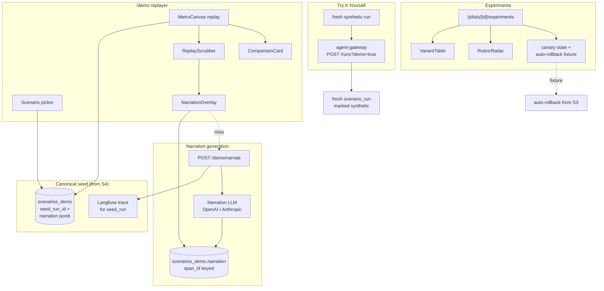

# Sprint 6 — Executive Demo + Experimentation

**Duration:** Weeks 11-12
**Persona promise:** An executive sponsor can open a polished demo, understand the agent value in two minutes, try a safe synthetic run, and see controlled experimentation with rollback.
**Depends on:** Sprint 5 (Ops + Eval green; canonical snapshot from S4 still valid).

---

## Why This Sprint Exists

Engineers love `/ops`; sponsors don't. Sprint 6 builds the **board-safe demo surface** plus the **experimentation control plane** so we can show executive stakeholders that the platform creates value, can be tuned safely, and won't surprise compliance with raw prompts or hostnames. Crucially, narration is **LLM-generated** from the actual Langfuse trace and cached — no hand-curated marketing copy that could drift from reality.

This sprint is also the dress rehearsal for G1 readiness: every claim in the demo must be defensible from a trace.

---

## Scope Summary

### In Scope

**Demo:**
- `/demo` — scenario picker. Lists scenarios with synthetic-data banner.
- `/demo/[scenarioKey]` — replay player.
- `MetroCanvas` **replay mode** — reads `scenarios_demo.seed_run_id`, replays events at adjustable speed.
- `ReplayScrubber` — timeline with span markers, scrub forward/back.
- `NarrationOverlay` — caption per span; "Re-narrate" button per span; streams while generating.
- `ComparisonCard` — "without agent vs with agent" metrics. Source documented (synthetic baseline this sprint, see CUQ).
- Narration generation endpoint: `POST /demo/narrate` → reads trace tree, calls narration LLM, caches in `scenarios_demo.narration` (jsonb keyed by `span_id`).
- "Try It Yourself" button — kicks off a fresh synthetic live run from canonical seed; clearly labeled.
- Synthetic-data banner persistent on every demo route.

**Experimentation:**
- `/pilots/[id]/experiments` (now functional, was placeholder in S1).
- `VariantTable` — shows control vs treatment, sample size, current scores.
- `RubricRadar` — per-rubric radar chart for variant comparison.
- Time-series KPI chart (sample size, p95 latency, error rate, eval scores).
- **Significance explainer** — Bayesian or minimum-sample plain-English text. No p-value gymnastics.
- Canary/shadow state display (current %, last change, last rollback if any).
- **Auto-rollback demo fixture** — a deliberately degraded variant included so the rollback can be shown live.

**Demo quality:**
- Board-safe copy review across all `/demo` routes (no "endpoint", "container", "MCP", etc).
- No in-app text explaining implementation internals.
- No raw trace payloads in executive view (gated to admin role).
- One-click "deep-link to trace + audit" for technical appendix only.

### Out of Scope

- Motor-fleet pilot if not already authored (S7).
- Builder (S8).
- Real-data demo (post-G1, requires G1 promotion).
- Multilingual narration (CUQ — default English; document if Italy/Germany/Spain needed earlier).

---

## Implementation Diagram



---

## Technical Implementation

### Narration cache schema

`scenarios_demo.narration` is a `jsonb` keyed by `span_id`:

```json
{
  "span_<uuid>": {
    "text": "The agent first checked the policy is in force...",
    "model": "claude-sonnet-4-6",
    "prompt_version": "narration-v1",
    "generated_at": "2026-..."
  }
}
```

`POST /demo/narrate` accepts `{scenario_key, span_id?, regenerate?}`:
- If `span_id` omitted → narrate all spans in trace tree (streamed).
- If cached and `!regenerate` → return cached.
- Otherwise: fetch trace, build context, call LLM with `narration` prompt registered in Langfuse Prompts (versioned), cache.

### Comparison source policy

`ComparisonCard` shows "without agent (manual): 14 days, EUR 8 200 average; with agent: 17 minutes, EUR 7 950 average". Source is one of:
- **`synthetic`** — hand-set baseline, banner visible.
- **`measured`** — drawn from actual run data.
- **`mixed`** — both, with inline tooltip.

The `comparison_source` field is required on `scenarios_demo` and surfaced in the UI tooltip. Compliance reviewers can see provenance with one click.

### Auto-rollback fixture

`scripts/inject_bad_variant.sh` sets a fake variant `bad-tone-v1` in the experiments table, with eval scores already below the threshold. The auto-rollback rule from S3/S5 detects it and rolls back. The demo can run this in <30 s.

### Board-safe lexicon

`docs/copy/board-lexicon.md` lists banned words (`endpoint`, `container`, `webhook`, `bucket`, `cookie`) with allowed alternatives. Lint job greps `app/demo/**` and fails if banned terms are found.

---

## Testing Plan

**Unit:**
- Replay deterministically reproduces span order from canonical run.
- Narration cache hit/miss logic.
- Significance explainer text generation for standard sample sizes.

**Integration:**
- Demo replay across the canonical S4 snapshot end-to-end.
- "Try It Yourself" creates a fresh synthetic `scenario_run` with `is_synthetic_demo=true`.
- Auto-rollback fixture reliably fires within 60 s.

**Contract:**
- `POST /demo/narrate` returns streamed JSONL when not cached, full JSON when cached.
- Experiments endpoint returns variant table + radar data.

**E2E (Playwright):**
- Open `/demo`, pick scenario, press Play, see narration appear, scrub backward, re-narrate one span.
- Press Try It Yourself → new run starts, banner persists.
- Open `/pilots/.../experiments`, view variant table, trigger fixture, watch rollback.
- Test on **projector viewport** (1920×1080 fullscreen) and **iPad** (1024×768 landscape).

**Failure tests:**
- No canonical run → guided empty state with "Create canonical run" CTA pointing to S4 docs.
- Narration model unavailable → replay still works without narration; banner says "Narration unavailable".
- Langfuse trace missing → demo falls back to stored events and flags missing trace.
- Rollback event delayed → UI shows "pending rollback" state, not "success".
- Executive view never reveals raw prompts, keys, or internal hostnames (lint check + manual audit).

---

## Acceptance Criteria

| # | Criterion | Evidence |
|---|---|---|
| AC-01 | Demo replay works from canonical S4 snapshot | E2E |
| AC-02 | Narration appears quickly or streams with clear pending state | Demo |
| AC-03 | Re-narrate changes wording without changing factual claims | Diff captured in PR |
| AC-04 | ComparisonCard data source is documented in the row | DB inspection |
| AC-05 | Try It Yourself creates a fresh synthetic run | DB row + UI |
| AC-06 | Experiment page shows control/treatment + rollback state | E2E |
| AC-07 | Degraded variant fixture triggers auto-rollback | Demo |
| AC-08 | Demo works on projector and iPad viewports | Playwright runs |
| AC-09 | Board-lexicon lint passes on `app/demo/**` | CI |

---

## Sprint Review / Decision Gate

### Demo Script (10 min — this **is** the executive demo)

1. **(persona: executive sponsor)** Open `/demo/property-fast-track`. Synthetic-data banner visible.
2. Press **Play**. MetroCanvas animates step by step. NarrationOverlay reads each span aloud (or shows captions).
3. Halfway through, press **Re-narrate** on the ReserveGate span. Watch wording change while facts (amount, evidence) stay constant.
4. Show ComparisonCard: "Without agent: 14 days, manual reserve. With agent: 17 minutes, audited reserve, 99% factual accuracy on golden set." Click the data-source tooltip → "Synthetic baseline + measured agent metrics."
5. Press **Try It Yourself**. A fresh synthetic claim runs in front of the audience.
6. Open `/pilots/property-fast-track/experiments`. Show control vs treatment table.
7. Activate the bad-variant fixture. Within 60 s, watch eval score drop, auto-rollback fire, banner state "Rolled back to control."
8. End with the "View canonical decision + audit trace" link (one-click), demonstrating full traceability.
9. **Decision ask:** Does narration persuade without overclaiming? Should comparison be hand-curated or measured live? Default audience for the demo (claims leader / CTO / risk / CEO)? Multilingual needed for Italy/Germany/Spain?

### Definition of Done

- All AC-01..AC-09 demonstrated.
- Demo script rehearsed at least once with non-engineer present (record feedback).
- Board-lexicon lint enforced.
- `docs/refactor_main_v3.md` §12 updated.

### Readiness for Sprint 7 (Motor-Fleet + Audit Hardening)

- ✅ Demo surface stable and trustworthy.
- ✅ Experiments + rollback proven publicly.
- ✅ Canonical snapshot and narration cache become the test corpus for audit-bundle generator in S7.

---

## Critical User Questions / Experiments

- Does narration persuade without overclaiming?
- Should comparison metrics be hand-curated, generated, or measured live?
- Which audience should the default demo serve: claims leader, CTO, risk/compliance, or CEO?
- Does the demo need multilingual narration for Italy/Germany/Spain?

---

## What's Deferred

| Item | Sprint |
|---|---|
| Motor-fleet pilot | S7 |
| Audit bundle generator | S7 |
| Full restore drill (post G1 readiness) | S7 |
| Builder | S8 |
| Multilingual narration | post-G1 (if needed) |

---

## References

- `docs/refactor_main_v3.md` §6 (Sprint 6).
- `.agents/skills/langfuse/SKILL.md` — Prompts API, trace tree, datasets.
- `.agents/skills/posthog/SKILL.md` — Experiments + flag governance.
- `docs/architecture.md` §15 — Demo replayer + narration.
